# Controller

つづいてMVCのCであるControllerを学んでいきましょう!

## セットアップ

いつものようにリポジトリのセットアップをしましょう。

この章では、リポジトリを一から作っていきます。

`~/code/burning-tech`に移動してください。

```sh
$ cd ~/code/burning-tech
```

教材リポジトリをクローンします。

```sh
$ git clone https://github.com/burning-tech/controller-training.git
$ cd controller-training
```

本チャプターでもいつものように適宜、`git`管理をしてください。

```sh
$ git init
```

そして`~/code/burning-tech/controller-training`をワークスペースとしてVS Codeで開いてください。

すると、右下にウィンドウが表示されますので前チャプター同様`Reopen in Container`を開いてください。

コンテナが立ち上がります。

データベースも作成しておきましょう。

```sh
$ docker compose exec web bin/rails db:create
Created database 'web_development'
Created database 'web_test'
```

この教材リポジトリは[前チャプターで使用した教材リポジトリの最終成果物](https://github.com/burning-tech-dev/model-training/tree/finish)と同一内容です。

マイグレーションを実行してください。

```sh
$ docker compose exec web bin/rails db:migrate
== 20210612014252 CreateUsers: migrating ======================================
-- create_table(:users)
   -> 0.0115s
== 20210612014252 CreateUsers: migrated (0.0116s) =============================

== 20210612044435 CreateIndustries: migrating =================================
-- create_table(:industries)
   -> 0.0114s
== 20210612044435 CreateIndustries: migrated (0.0115s) ========================

== 20210612054636 AddIndustryIdToUsers: migrating =============================
-- add_reference(:users, :industry, {:null=>false, :foreign_key=>true})
   -> 0.0506s
== 20210612054636 AddIndustryIdToUsers: migrated (0.0508s) ====================

== 20210612074702 CreateBanks: migrating ======================================
-- create_table(:banks)
   -> 0.0104s
== 20210612074702 CreateBanks: migrated (0.0105s) =============================

== 20210612080311 CreateBankAccounts: migrating ===============================
-- create_table(:bank_accounts)
   -> 0.0149s
== 20210612080311 CreateBankAccounts: migrated (0.0151s) ======================
```

## MVCアーキテクチャ

あらためてMVCを復習しましょう。

下記のように`Model`、`View`、`Controller`という3つの明確な役割に分離されたアプリケーションアーキテクチャを`MVC`アーキテクチャといいます。

| MVC        | 役割                                                             | 対応ディレクトリ  |
| -          | -                                                                | -                 |
| Model      | データベースとの接続とデータに対する操作、およびビジネスロジック | `app/models`      |
| View       | Modelの内容を参照しHTML等を生成する                              | `app/views`       |
| Controller | Modelのロジック呼び出し、およびModelとViewの接続                 | `app/controllers` |

前のチャプターでは、モデルのの役割の一部、**データベースとの接続とデータに対する操作**を学びました。

本チャプターでは、**Modelのロジック呼び出し、およびModelとViewの接続**を学んでいきます。

そのため、`Controller`だけではなく、`Model`、`View`においても必要な要素を学習していきます。

## 家計簿アプリ

前チャプターで、いくつかモデルを作成しました。

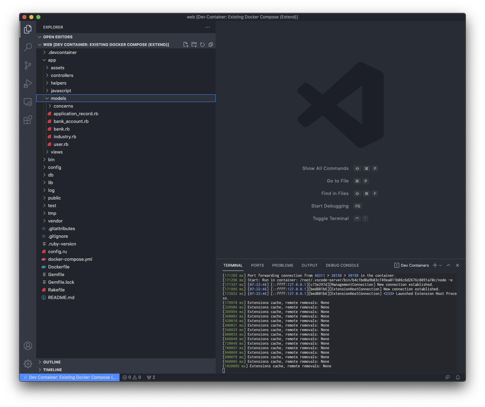

`app/models`ディレクトリを見てわかるように下記のようなモデルを作成しました。

- BankAccount(銀行口座)
- Bank(銀行)
- Industry(業界)
- User(ユーザー)

ここからは特定のユーザーの銀行口座をコントローラーを使って画面上に表示させてみましょう。

## seed

今回は、家計簿アプリに銀行口座を表示する機能を追加します。

あらためて、本チャプターに関連のあるモデルを確認しましょう。

下記の3つです。

- BankAccount(銀行口座)
- Bank(銀行)
- User(ユーザー)

銀行口座モデルは`app/models/bank_account.rb`に定義されています。

```rb
class BankAccount < ApplicationRecord
  belongs_to :user
  belongs_to :bank
end
```

このモデルはユーザーモデルと銀行口座を結びつけています。

`app/models/bank.rb`を開いて、銀行モデルを表示しましょう。

```rb
class Bank < ApplicationRecord
	has_many :bank_accounts
	has_many :users, through: :bank_accounts
end
```

銀行には複数の銀行口座が紐付いていて、それらの銀行口座には複数のユーザーが紐付いていることを表現しています。

`app/models/user.rb`を開いて、ユーザーモデルを表示しましょう。

```rb
class User < ApplicationRecord
	belongs_to :industry
	has_many :bank_accounts
	has_many :banks, through: :bank_accounts
end
```

これらのモデルのデータが本チャプターでは必要なので、データベースにレコードを作成しましょう。

本チャプターでは`irb`でデータを作成するのではなく、**seed**ファイルを使用して作成します。

seedファイルとは初期データを生成してくれるファイルです。

`db/seed.rb`を確認してください。

```rb
# This file should contain all the record creation needed to seed the database with its default values.
# The data can then be loaded with the bin/rails db:seed command (or created alongside the database with db:setup).
#
# Examples:
#
#   movies = Movie.create([{ name: 'Star Wars' }, { name: 'Lord of the Rings' }])
#   Character.create(name: 'Luke', movie: movies.first)
```

モデルを使って、データをデータベースに追加できます。

このファイルを記述して、`rails db:seed`を実行することで、データを追加します。

もちろんデータベースを削除すれば消えてしまいますが、`rails db:seed`を再度実行すれば再度データを追加できます。

開発環境では、データを作って機能を試すことが多々あります。

そんなときに`seed`ファイルがあると、簡単開発用のデータをデータベースに投入できます。

それでは`db/seed.rb`を下記のように修正してください。

```diff
- # This file should contain all the record creation needed to seed the database with its default values.
- # The data can then be loaded with the bin/rails db:seed command (or created alongside the database with db:setup).
- #
- # Examples:
- #
- #   movies = Movie.create([{ name: 'Star Wars' }, { name: 'Lord of the Rings' }])
- #   Character.create(name: 'Luke', movie: movies.first)
-
+ financial_industry = Industry.create({ name: "金融" })
+ transport_industry = Industry.create({ name: "運送" })
+
+ bankA = Bank.create({ name: "A銀行" })
+ bankB = Bank.create({ name: "B銀行" })
+ bankC = Bank.create({ name: "C銀行" })
+
+ tanaka = User.create({
+   name: "田中",
+   email_address: "tanaka@example.com",
+   date_of_birth: Time.parse("1990-01-01"),
+   annual_income: 11000000,
+   industry: financial_industry,
+   banks: [bankA, bankB],
+ })
+ sato = User.create({
+   name: "佐藤",
+   email_address: "sato@example.com",
+   date_of_birth: Time.parse("1990-02-02"),
+   annual_income: 12000000,
+   industry: financial_industry,
+   banks: [bankB, bankB],
+ })
+ suzuki = User.create({
+   name: "鈴木",
+   email_address: "suzuki@example.com",
+   date_of_birth: Time.parse("1990-03-03"),
+   annual_income: 13000000,
+   industry: transport_industry,
+   banks: [bankC],
+ })
+ inoue = User.create({
+   name: "井上",
+   email_address: "inoue@example.com",
+   date_of_birth: Time.parse("1990-04-04"),
+   annual_income: 14000000,
+   industry: transport_industry,
+   banks: [bankA, bankC],
+ })
```

コメントは不要なので削除しています。

では、記述内容を確認しましょう。

```rb
financial_industry = Industry.create({ name: "金融" })
transport_industry = Industry.create({ name: "運送" })
```

まず、業界を作成しています。今回、画面には表示しませんが、ユーザーは業界に必ず所属しなくてはならないので、作成しています。

金融業界と、運送業界を作成しています。

```rb
bankA = Bank.create({ name: "A銀行" })
bankB = Bank.create({ name: "B銀行" })
bankC = Bank.create({ name: "C銀行" })
```

続いて、銀行A、B、Cを作成しています。

```rb
tanaka = User.create({
  name: "田中",
  email_address: "tanaka@example.com",
  date_of_birth: Time.parse("1990-01-01"),
  annual_income: 11000000,
  industry: financial_industry,
  banks: [bankA, bankB],
})
sato = User.create({
  name: "佐藤",
  email_address: "sato@example.com",
  date_of_birth: Time.parse("1990-02-02"),
  annual_income: 12000000,
  industry: financial_industry,
  banks: [bankB, bankB],
})
suzuki = User.create({
  name: "鈴木",
  email_address: "suzuki@example.com",
  date_of_birth: Time.parse("1990-03-03"),
  annual_income: 13000000,
  industry: transport_industry,
  banks: [bankC],
})
inoue = User.create({
  name: "井上",
  email_address: "inoue@example.com",
  date_of_birth: Time.parse("1990-04-04"),
  annual_income: 14000000,
  industry: transport_industry,
  banks: [bankA, bankC],
})
```

田中さん、佐藤さん、鈴木さん、井上さんを作成しています。

少し混乱しそうなので、田中さんの作り方を詳細に見ましょう。

```rb
tanaka = User.create({
  name: "田中",
  email_address: "tanaka@example.com",
  date_of_birth: Time.parse("1990-01-01"),
  annual_income: 11000000,
  industry: financial_industry,
  banks: [bankA, bankB],
})
```

name(名前)、email_address(メールアドレス)、date_of_birth(生年月日、annual_income(年収)は前のチャプターで触れたのでわかると思います。

industry(業界)の`industry: financial_industry`という記述は`User`モデルに`belongs_to :industry`と記述しているため、`Industry`モデルのインスタンスを指定できます。

`User`モデルには下記のような定義をしています。

```rb
	has_many :bank_accounts
	has_many :banks, through: :bank_accounts
```

これらの定義のおかげで、`banks: [bankA, bankB]`と記述ができ、`bank_accounts`テーブルにユーザーと銀行を紐づけたレコードが生成されます。

ではこれらのデータをデータベースに作成してみましょう。

`raild db:seed`で実行できます。

```sh
$ docker compose exec web bin/rails db:seed
```

どんなレコードが作成されるのか実際にデータベースを見てみましょう。

```sh
$ docker compose exec web bin/rails db
Reading table information for completion of table and column names
You can turn off this feature to get a quicker startup with -A

Welcome to the MariaDB monitor.  Commands end with ; or \g.
Your MySQL connection id is 119
Server version: 5.7.25 MySQL Community Server (GPL)

Copyright (c) 2000, 2018, Oracle, MariaDB Corporation Ab and others.

Type 'help;' or '\h' for help. Type '\c' to clear the current input statement.

MySQL [web_development]> SELECT * FROM industries;
+----+--------+----------------------------+----------------------------+
| id | name   | created_at                 | updated_at                 |
+----+--------+----------------------------+----------------------------+
|  1 | 金融   | 2021-06-17 06:22:49.201553 | 2021-06-17 06:22:49.201553 |
|  2 | 運送   | 2021-06-17 06:22:49.211504 | 2021-06-17 06:22:49.211504 |
+----+--------+----------------------------+----------------------------+
2 rows in set (0.001 sec)

MySQL [web_development]> SELECT * FROM banks;
+----+---------+----------------------------+----------------------------+
| id | name    | created_at                 | updated_at                 |
+----+---------+----------------------------+----------------------------+
|  1 | A銀行   | 2021-06-17 06:22:49.225741 | 2021-06-17 06:22:49.225741 |
|  2 | B銀行   | 2021-06-17 06:22:49.238592 | 2021-06-17 06:22:49.238592 |
|  3 | C銀行   | 2021-06-17 06:22:49.248607 | 2021-06-17 06:22:49.248607 |
+----+---------+----------------------------+----------------------------+
3 rows in set (0.001 sec)

MySQL [web_development]> SELECT * FROM users;
+----+--------+--------------------+---------------+---------------+----------------------------+----------------------------+-------------+
| id | name   | email_address      | date_of_birth | annual_income | created_at                 | updated_at                 | industry_id |
+----+--------+--------------------+---------------+---------------+----------------------------+----------------------------+-------------+
|  1 | 田中   | tanaka@example.com | 1990-01-01    |      11000000 | 2021-06-17 06:22:49.349137 | 2021-06-17 06:22:49.349137 |           1 |
|  2 | 佐藤   | sato@example.com   | 1990-02-02    |      12000000 | 2021-06-17 06:22:49.366687 | 2021-06-17 06:22:49.366687 |           1 |
|  3 | 鈴木   | suzuki@example.com | 1990-03-03    |      13000000 | 2021-06-17 06:22:49.382345 | 2021-06-17 06:22:49.382345 |           2 |
|  4 | 井上   | inoue@example.com  | 1990-04-04    |      14000000 | 2021-06-17 06:22:49.393875 | 2021-06-17 06:22:49.393875 |           2 |
+----+--------+--------------------+---------------+---------------+----------------------------+----------------------------+-------------+
4 rows in set (0.001 sec)

MySQL [web_development]> SELECT * FROM bank_accounts;
+----+---------+---------+----------------------------+----------------------------+
| id | user_id | bank_id | created_at                 | updated_at                 |
+----+---------+---------+----------------------------+----------------------------+
|  1 |       1 |       1 | 2021-06-17 06:22:49.354828 | 2021-06-17 06:22:49.354828 |
|  2 |       1 |       2 | 2021-06-17 06:22:49.358214 | 2021-06-17 06:22:49.358214 |
|  3 |       2 |       2 | 2021-06-17 06:22:49.371640 | 2021-06-17 06:22:49.371640 |
|  4 |       2 |       2 | 2021-06-17 06:22:49.375710 | 2021-06-17 06:22:49.375710 |
|  5 |       3 |       3 | 2021-06-17 06:22:49.386865 | 2021-06-17 06:22:49.386865 |
|  6 |       4 |       1 | 2021-06-17 06:22:49.398078 | 2021-06-17 06:22:49.398078 |
|  7 |       4 |       3 | 2021-06-17 06:22:49.406556 | 2021-06-17 06:22:49.406556 |
+----+---------+---------+----------------------------+----------------------------+
7 rows in set (0.001 sec)
```

`db/seed.rb`のどの行がどのレコードを作成したかを把握してみてください。

## ルーティング

それでは、データの準備ができたので、実際にコントローラーの開発に入ります。

`/bank_accounts/1`のように銀行口座のidを指定してアクセスできる銀行口座の画面を作成しましょう。

銀行口座の画面では、ある特定の銀行口座がどの銀行の口座で、どのユーザーのものかを確認できます。

現在のルーティングを確認してみましょう。

```sh
$ docker compose exec web bin/rails routes
You don't have any routes defined!

Please add some routes in config/routes.rb.

For more information about routes, see the Rails guide: https://guides.rubyonrails.org/routing.html.
```

ルーティングがひとつも定義されていないと表示されています。

定義されていないルーティングにアクセスをするとどうなるか確認しましょう。

<localhost:3000/bank_accounts/1>にアクセスしてください。

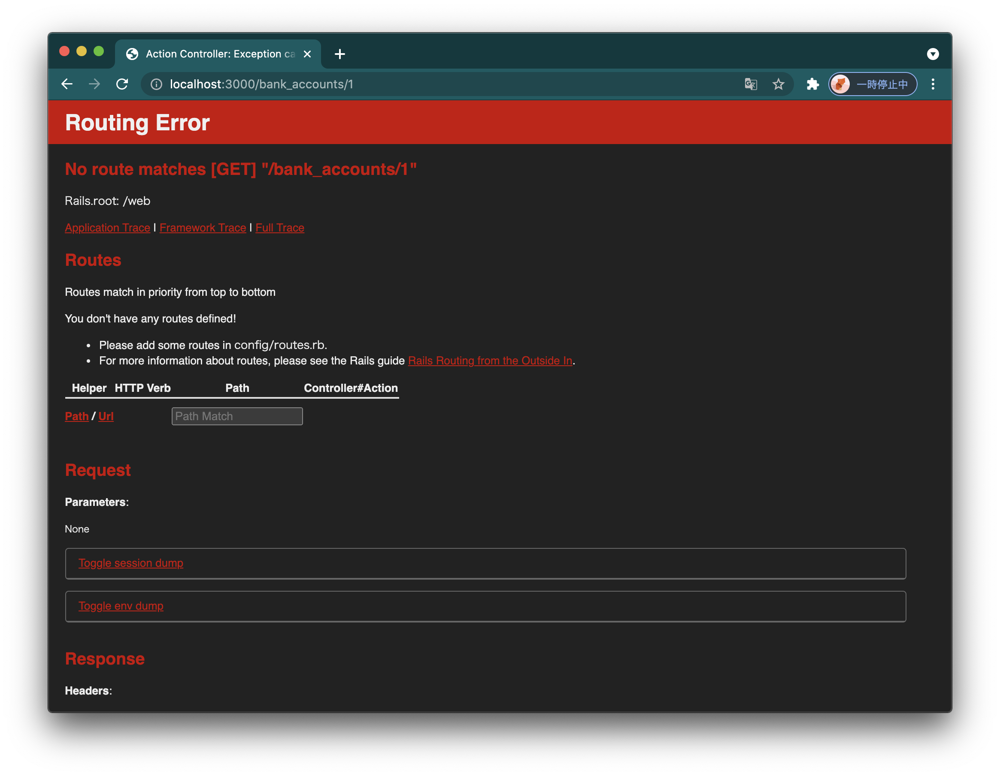

`No route matches [GET] "/bank_accounts/1"`と表示されました。

では、`config/routes.rb`を修正しましょう。

`config/routes.rb`を下記のように修正してください。

```diff
  Rails.application.routes.draw do
-   # For details on the DSL available within this file, see https://guides.rubyonrails.org/routing.html
+   get "/bank_accounts/:id" => "bank_accounts#show"
  end
```

`/bank_accounts/:id`への`GETリクエスト`は`bank_accounts`の`show`メソッドにルーティングすると定義しています。

このようなルーティングとマッピングするコントローラー上のメソッドを**アクション**(**Action**)といいます。

`show`というアクションはRailsの規約で、**ある単一のモデル**を表示するためのアクション名として決められています。

今回は特定の銀行口座を表示するための画面ですので`show`を設定しています。

`show`で表示する、単一のモデルの情報を表示する画面を一般的に**詳細画面**といいます。

<localhost:3000/bank_accounts/1>に再度アクセスしてください。

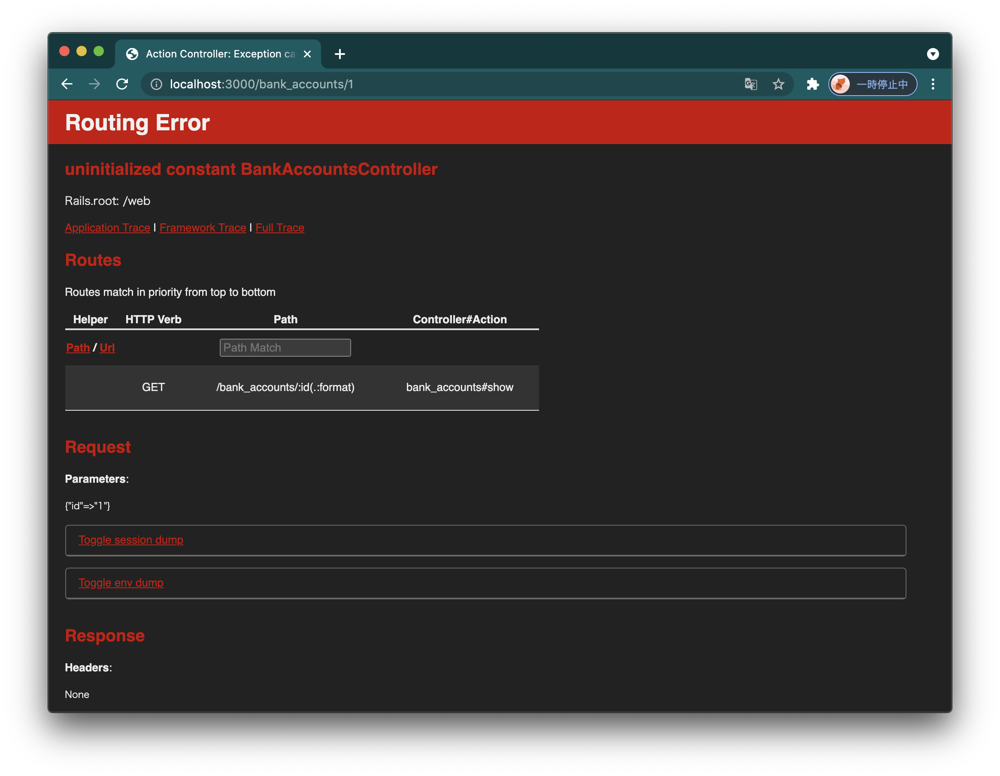

`uninitialized constant UsersController`と表示されました！

つまり、ルーティングに対応したコントローラーがないという意味です。

作成しましょう。

## rails generate controller

`rails generate controller`で、コントローラーを作成できます。

`generate`は`g`と省略なので最初から省略しましょう。

```sh
$ docker compose exec web bin/rails g controller bank_accounts
      create  app/controllers/bank_accounts_controller.rb
      invoke  erb
      create    app/views/bank_accounts
      invoke  test_unit
      create    test/controllers/bank_accounts_controller_test.rb
      invoke  helper
      create    app/helpers/bank_accounts_helper.rb
      invoke    test_unit
      invoke  assets
      invoke    scss
      create      app/assets/stylesheets/bank_accounts.scss
```

複数のファイルが生成されました。

着目すべきは`app/controllers/bank_accounts_controller.rb`です。

開いてください。

```rb
class BankAccountsController < ApplicationController
end
```

作成された`BankAccountsController`は`ApplicationController`を継承したクラスです。

このようなファイルに見覚えないでしょうか。

`app/controllers/application_controller.rb`を開いてください。

```rb
class ApplicationController < ActionController::Base
end
```

`ApplicationController`は`ActionController::Base`を継承しています。

非常にモデルの構造と似通っています。

`app/models/user.rb`を開いてください。あらためて確認しましょう。

```rb
class User < ApplicationRecord
	belongs_to :industry
	has_many :bank_accounts
	has_many :banks, through: :bank_accounts
end
```

`User`は`ApplicationRecord`を継承したクラスです。

`app/models/application_record.rb`を開いてください。

```rb
class ApplicationRecord < ActiveRecord::Base
  self.abstract_class = true
end
```

`ActiveRecord::Base`と同様に`ActionController::Base`に便利なメソッドが定義されています。

そのため、作成された`BankAccountsController`は便利なメソッドを利用できる状態になっています。

では、再び<localhost:3000/bank_accounts/1>にアクセスしてみましょう。

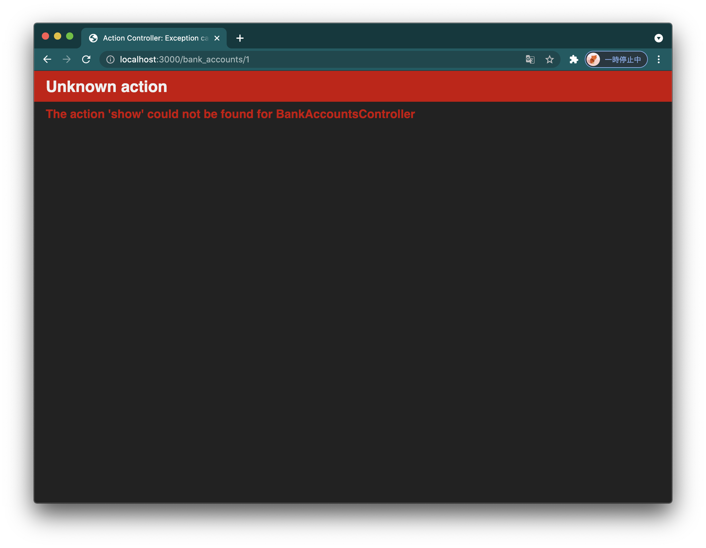

`The action 'show' could not be found for BankAccountsController`と表示されています。

`show`アクションがないためにエラーが起きています。

`show`アクションを`BankAccountsController`に追加しましょう。

`app/controllers/bank_accounts.rb`を開いて、下記のように修正してください。

```diff
  class BankAccountsController < ApplicationController
+   def show
+   end
  end
```

では、再び<localhost:3000/bank_accounts/1>にアクセスしてみましょう。

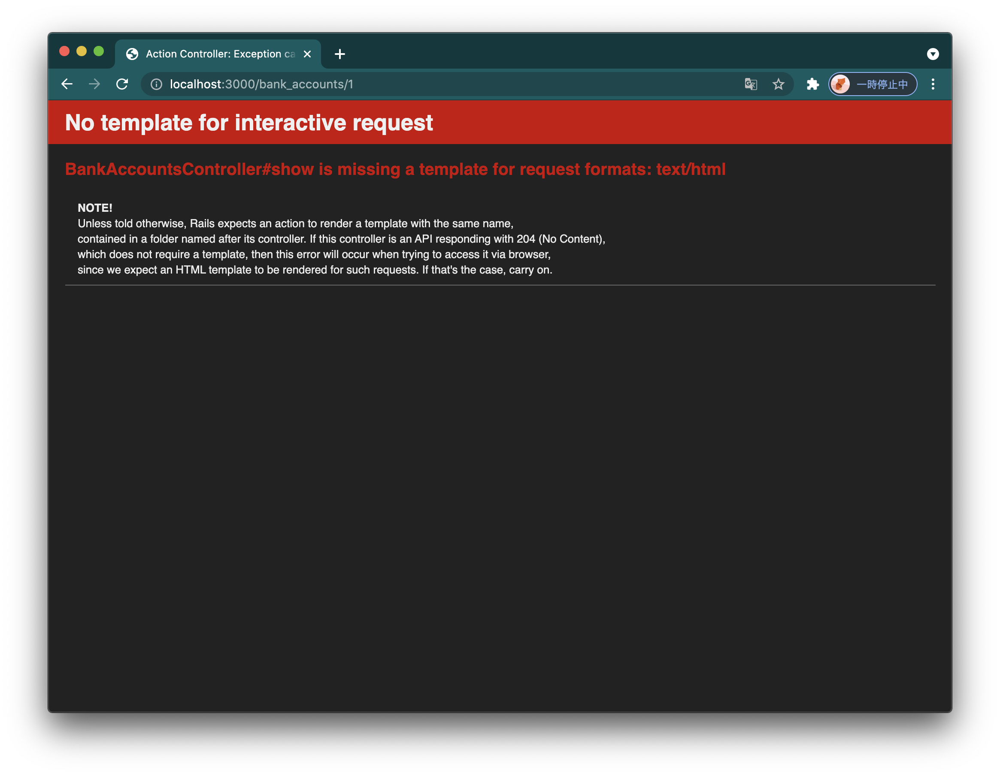

```
BankAccountsController#show is missing a template for request formats: text/html
```

このエラーは`MVC`の`V`である`View`がないために起きているエラーです。

この`View`を**ビューテンプレート**といいます。

特に指示がない限り、Railsはアクションと同名のテンプレートを呼び出します。

`BankAccountsController#show`なので`app/views/bank_accounts/show.html.erb`を呼び出します。

`app/views/bank_accounts/show.html.erb`を作成してください。中身は記述しなくて構いません。

では、再び<localhost:3000/bank_accounts/1>にアクセスしてみましょう。

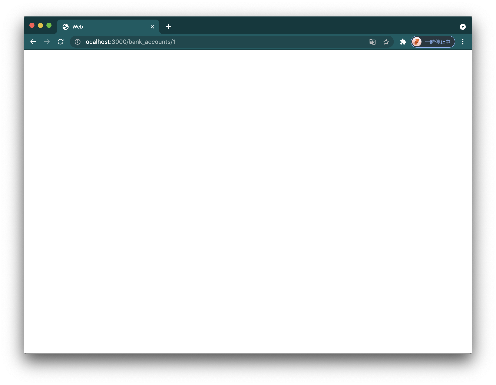

ページが表示されました！

ですが、真っ白です。何も記述していないので当然です。

`/bank_accounts/1`つまり銀行口座id1の情報を表示しましょう。

`app/controllers/bank_accounts.rb`を開いて、下記のように修正してください。

```diff
  class BankAccountsController < ApplicationController
    def show
+     @id = params[:id]
    end
  end
```

`params[:id]`については後ほど説明します。`/bank_accounts/1`の`1`を取得しているとだけ理解してください。

`params[:id]`で取得した値を`@id`インスタンス変数に格納しています。

コントローラーで作成したインスタンス変数はビューテンプレートに受け渡して、表示させることができます。

`app/views/bank_accounts/show.html.erb`を開いて、下記のように修正してください。

```erb
<h1>銀行口座</h1>
<p>id: <%= @id %></p>
```

ビューテンプレートでコントローラーで値を受け取って表示するためには`<%= @インスタンス変数名 %>`と記載します。

表示させてみましょう。

<localhost:3000/bank_accounts/1>にアクセスしてください。

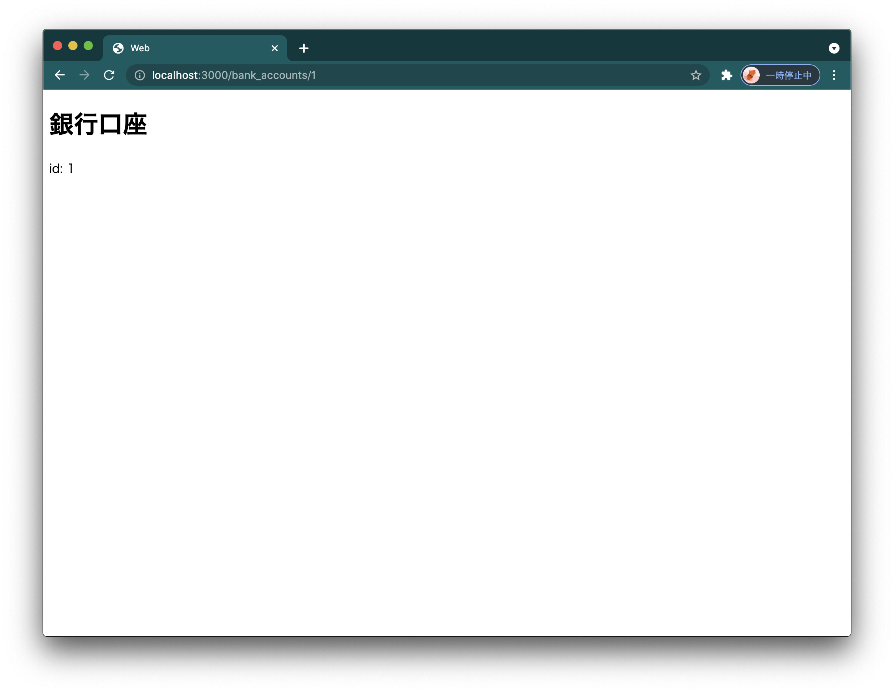

`id: 1`と表示されまています。`localhost:3000/bank_accounts/1`の`1`が反映されています。。

<localhost:3000/bank_accounts/1000000>にアクセスすると下記の通りちゃんと`id: 1000000`と表示されます。

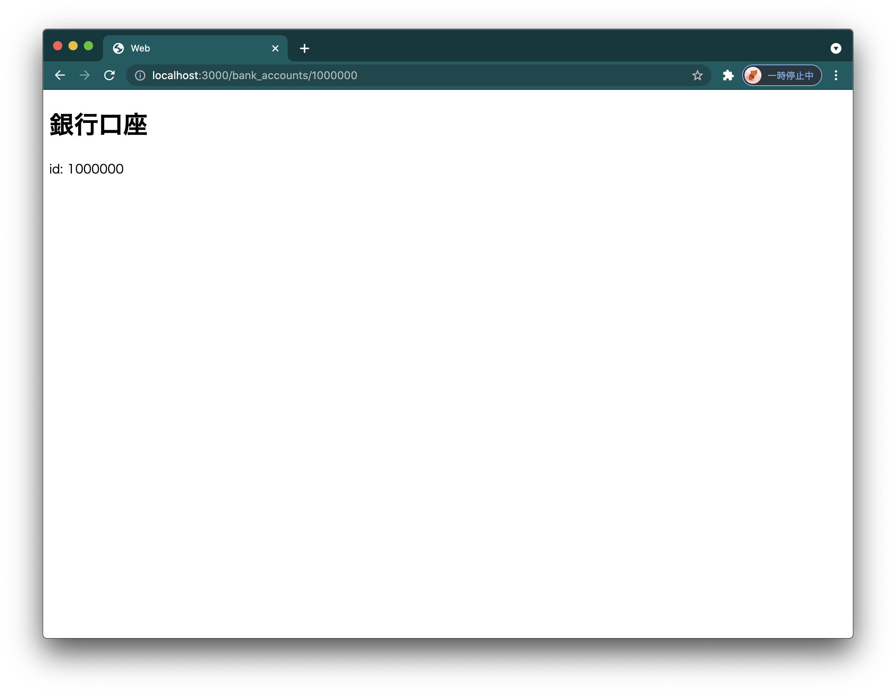

`app/controllers/bank_accounts.rb`をもう一度見てみましょう。

```rb
class BankAccountsController < ApplicationController
  def show
    @id = params[:id]
  end
end
```

`params`とは`Controller`の中で使用できるハッシュです。

パスパラメータ(`/bank_accounts/1/`の`1`)やクエリパラメータ(`/bank_accounts?hoge=1`の`hoge=1`)、フォームで送信されたデータなどが格納される特殊な変数です。

今回は`/bank_accounts/:id`の`:id`を取得したいので`params[:id]`としています。

つまり、`config/routes.rb` の`get "/bank_accounts/:id" => "bank_accounts#show"`からパスパラメータのシンボルを読み取っています。

そのシンボルをキーにして、実際にリクエストで送信されたパスパラメータを`params`ハッシュに格納しています。

それでは、実際に銀行口座に紐づくユーザーと銀行のデータを表示しましょう。

`app/controllers/bank_accounts_controller.rb`を下記のように修正してください。

```diff
  class BankAccountsController < ApplicationController
    def show
-     id = params[:id]
+     @bank_account = BankAccount.find(params[:id])
    end
  end
```

つづいて、`app/views/bank_accounts/show.html.erb`を下記のように修正してください。

```diff
  <h1>銀行口座</h1>
- <p>id: <%= @id %></p>
+ <p>ユーザー: <%= @bank_account.user.name %></p>
+ <p>銀行: <%= @bank_account.bank.name %></p>
```

`BankAccountsController`のインスタンス変数はビューテンプレートに受け渡して、表示させることができますので、上記のように`bank_account`の各フィールドにアクセスして表示できます。

前チャプターにて`irb`上でモデルを操作したようにビューテンプレート上でもモデルを操作できます。

今回、`@bank_account.user`、`@bank_account.bank`と記述できるのは`app/models/bank_account.rb`上に`belongs_to`を定義しているからです。

```rb
class BankAccount < ApplicationRecord
  belongs_to :user
  belongs_to :bank
end
```

<localhost:3000/bank_accounts/1>にアクセスしてください。


表示されました。

## users#index

続いて、口座の一覧画面を作成しましょう。

全口座が一覧で表示される画面です。

一覧画面はRailsでは**index**という名前で定義する規約になっています。

ルーティングの定義、コントローラーのアクション、ビューテンプレートの順に修正しましょう。

`config/routes.rb`を下記のように修正してください。

```diff
  Rails.application.routes.draw do
+   get "/bank_accounts" => "bank_accounts#index"
    get "/bank_accounts/:id" => "bank_accounts#show"
  end
```

続いて、`app/controllers/bank_accounts_controller.rb`を下記のように修正してください。

```diff
  class BankAccountsController < ApplicationController
+   def index
+     @bank_accounts = BankAccount.all
+   end
+
    def show
      @bank_account = BankAccount.find(params[:id])
    end
  end
```

`all`メソッドで全口座を取得して`@bank_accounts`インスタンス変数に代入しています。

`all`で取得できるのは配列ですので、`@bank_accounts`と複数形の変数名を使用しています。

変数名にはどんな値が格納されているかをひと目見てわかるような名前をつけることを心がけてください。

ただし、`@bank_account_array`のように型の名前を変数名につけることは[ハンガリアン記法](https://ja.wikipedia.org/wiki/%E3%83%8F%E3%83%B3%E3%82%AC%E3%83%AA%E3%82%A2%E3%83%B3%E8%A8%98%E6%B3%95)と呼ばれアンチパターンとされています。

続いて、ビューテンプレートを作成しましょう。Railsはアクションと同名のテンプレートを呼び出しますので`app/views/bank_accounts/index.html.erb`を作成してください。

そして、下記のように修正してください。

```erb
<h1>銀行口座一覧</h1>
<table>
   <thead>
      <tr>
         <th>ユーザー名</th>
         <th>銀行</th>
      </tr>
   </thead>
   <tbody>
      <% @bank_accounts.each do |bank_account| %>
      <tr>
         <td><%= bank_account.user.name %></td>
         <td><%= bank_account.bank.name %></td>
      </tr>
      <% end %>
   </tbody>
</table>
```


<localhost:3000/bank_accounts>にアクセスしてみてください。

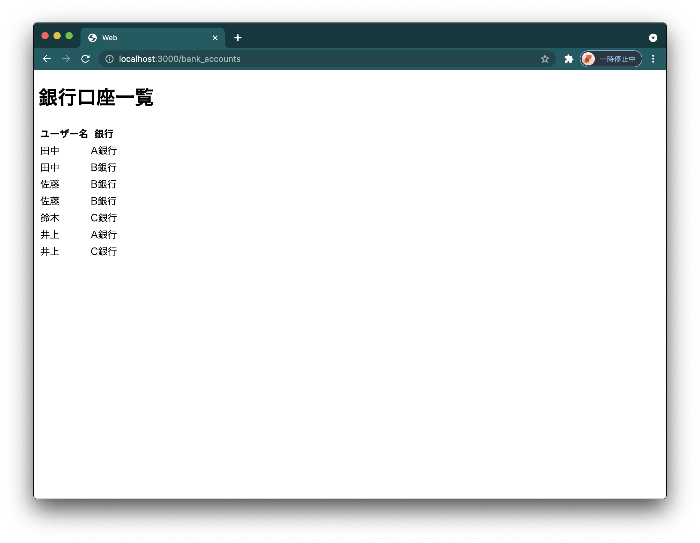

銀行口座の一覧が表示されました。

銀行口座の番号をまだ開発していないため、同一のユーザーが同一銀行の複数口座を持っていると何が何だか分からないですね。

次のチャプター以降で開発していきます。

## 名前付きルーティング

銀行口座覧一覧ページに銀行口座詳細ページへのリンクをつけてみましょう。

まず、`config/routes.rb`を下記のように修正してください。

```diff
  Rails.application.routes.draw do
    get "/bank_accounts" => "bank_accounts#index"
-   get "/bank_accounts/:id" => "bank_accounts#show"
+   get "/bank_accounts/:id" => "bank_accounts#show", as: :bank_account
  end
```

`as: :つけたい名前`を末尾につけることで、コントローラー、ビューでこれらの名前を使ってアクセスできるようになります。

今回は`bank_accounts#show`に名前をつけるので、単数形の`:bank_account`をつけています。

では、リンクをビューテンプレートに付与しましょう。

`app/views/bank_accounts/index.html.erb`を下記のように修正してください。


```diff
  <h1>銀行口座一覧</h1>
  <table>
     <thead>
        <tr>
+          <th>詳細</th>
           <th>ユーザー名</th>
           <th>銀行</th>
        </tr>
     </thead>
     <tbody>
        <% @bank_accounts.each do |bank_account| %>
        <tr>
+          <td><%= link_to 'X', bank_account %></td>
           <td><%= bank_account.user.name %></td>
           <td><%= bank_account.bank.name %></td>
        </tr>
        <% end %>
     </tbody>
  </table>
```

`<%= link_to 表示したい文章, リンク先 %`のように記述することでリンクを付与できます。

`<%= link_to 'X', bank_account %>`は`<a href="/bank_accounts/1">X</a>`のようなHTMLに変換されます。

<localhost:3000/bank_accounts>にアクセスしてください。

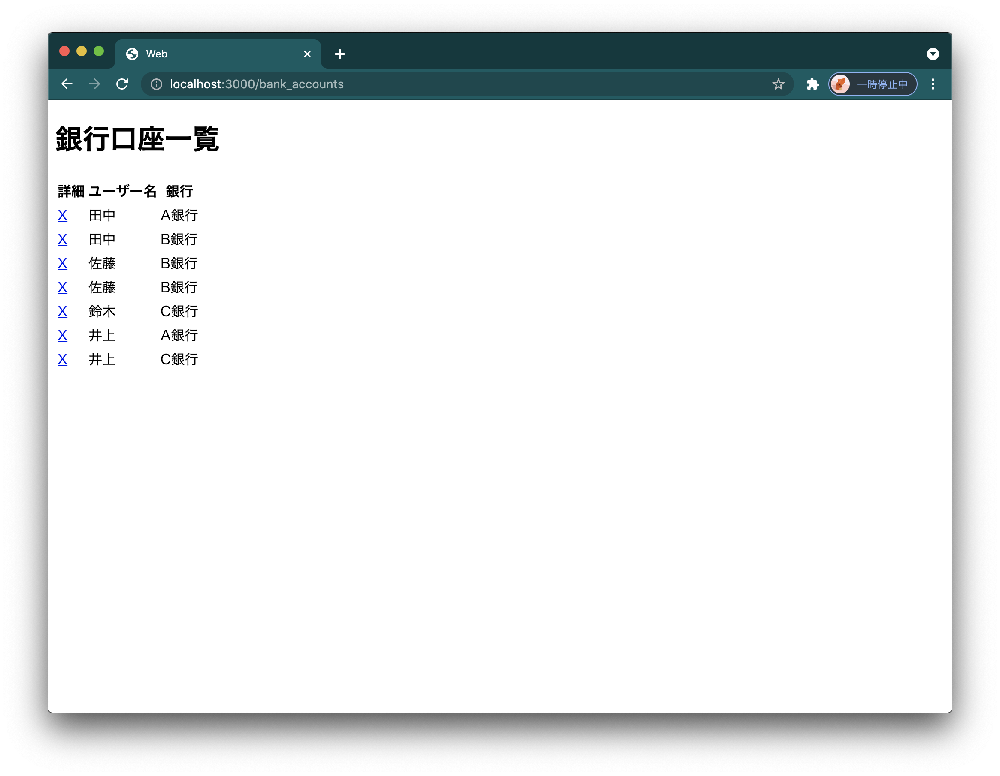

`X`がリンクになりました。銀行口座詳細ページに遷移できることを確認してください。

次のチャプター以降で`X`の箇所に銀行口座番号を表示できるようにしましょう。

## リソース(Resources)

ルーティングのチャプターで学習した`resources`を使って、`config/routes.rb`を修正しましょう。

`config/routes.rb`を下記のように修正してください。

```diff
  Rails.application.routes.draw do
-   get "/bank_accounts" => "bank_accounts#index"
-   get "/bank_accounts/:id" => "bank_accounts#show", as: :bank_account
+   resources :bank_accounts, only: [:index, :show]
  end
```

このように`Rails`の規約に従って記述量を減らすことができます。

## users

ルーティング、コントローラー、ビューテンプレートと記述を学んだのでそれらの知識を元にユーザーの機能も作ってみましょう。

ユーザーの詳細ページを作成します。

`rails g controller users`でコントローラーを作成します。

`rails g controller users show`のようにアクション名を指定することで、ルーティングの追加、コントローラー内にアクションの定義およびビューテンプレートの作成をしてくれます。

```sh
$ docker compose exec web bin/rails g controller users show
      create  app/controllers/users_controller.rb
       route  get 'users/show'
      invoke  erb
      create    app/views/users
      create    app/views/users/show.html.erb
      invoke  test_unit
      create    test/controllers/users_controller_test.rb
      invoke  helper
      create    app/helpers/users_helper.rb
      invoke    test_unit
      invoke  assets
      invoke    scss
      create      app/assets/stylesheets/users.scss
```

`config/routes.rb`を確認してください。

```rb
Rails.application.routes.draw do
  get 'users/show'
  resources :bank_accounts, only: [:index, :show]
end
```

`get 'users/show`が追加されています。

`resources`に統一するために、修正しましょう。

```diff
  Rails.application.routes.draw do
-   get 'users/show'
+   resources :users, only: [:show]
    resources :bank_accounts, only: [:index, :show]
  end
```

続いて、`app/controllers/users_controller.rb`を開いて確認してください。

```rb
class UsersController < ApplicationController
  def show
  end
end
```

`UsersController`に`show`メソッドが定義されています。

続いて、`app/views/users/show.rb`を開いて確認してください。

```erb
<h1>Users#show</h1>
<p>Find me in app/views/users/show.html.erb</p>
```

自動でサンプルのHTMLが記述されています。

<localhost:3000/users/1>にアクセスしてください。

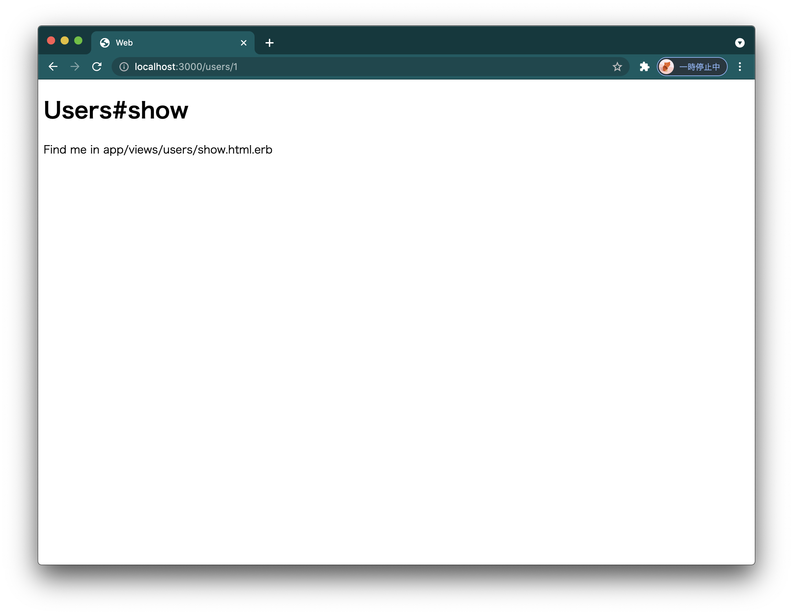

サンプルのHTMLが表示されました。

それでは`app/controllers/users_controller.rb`を下記のように修正してください。

```rb
class UsersController < ApplicationController
  def show
    @user = User.find(params[:id])
  end
end
```

`app/views/users/show.rb`を下記のように修正してください。

```diff
- <h1>Users#show</h1>
- <p>Find me in app/views/users/show.html.erb</p>
+ <h1>ユーザー</h1>
+ <p>名前: <%= @user.name %></p>
+ <p>メールアドレス: <%= @user.email_address %></p>
+ <p>生年月日: <%= @user.date_of_birth %></p>
+ <p>年収: <%= @user.annual_income %></p>
```

<localhost:3000/users/1>に再度アクセスしてください。

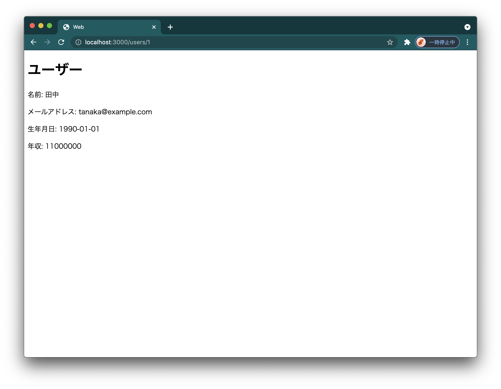

生年月日を日本語表記に変更しましょう。

`app/views/users/show.rb`を下記のように修正してください。

```diff
  <h1>ユーザー</h1>
  <p>名前: <%= @user.name %></p>
  <p>メールアドレス: <%= @user.email_address %></p>
- <p>生年月日: <%= @user.date_of_birth %></p>
+ <p>生年月日: <%= @user.date_of_birth.strftime("%Y年%-m月%-d日") %></p>
  <p>年収: <%= @user.annual_income %></p>
```

`users`テーブルの`date_of_birth`フィールドは`date`型で定義されています。

```sql
$ docker compose exec web bin/rails db
Reading table information for completion of table and column names
You can turn off this feature to get a quicker startup with -A

Welcome to the MariaDB monitor.  Commands end with ; or \g.
Your MySQL connection id is 129
Server version: 5.7.25 MySQL Community Server (GPL)

Copyright (c) 2000, 2018, Oracle, MariaDB Corporation Ab and others.

Type 'help;' or '\h' for help. Type '\c' to clear the current input statement.

MySQL [web_development]> DESC users;
+---------------+--------------+------+-----+---------+----------------+
| Field         | Type         | Null | Key | Default | Extra          |
+---------------+--------------+------+-----+---------+----------------+
| id            | bigint(20)   | NO   | PRI | NULL    | auto_increment |
| name          | varchar(255) | YES  |     | NULL    |                |
| email_address | varchar(255) | YES  |     | NULL    |                |
| date_of_birth | date         | YES  |     | NULL    |                |
| annual_income | bigint(20)   | YES  |     | NULL    |                |
| created_at    | datetime(6)  | NO   |     | NULL    |                |
| updated_at    | datetime(6)  | NO   |     | NULL    |                |
| industry_id   | bigint(20)   | NO   | MUL | NULL    |                |
+---------------+--------------+------+-----+---------+----------------+
```

そのため、`User`モデルの`date_of_birth`フィールドは`Date`クラスです。

```rb
$ docker compose exec web bin/rails c
Loading development environment (Rails 6.1.3.2)
irb(main):001:0> User.find(1).date_of_birth.class
  User Load (0.4ms)  SELECT `users`.* FROM `users` WHERE `users`.`id` = 1 LIMIT 1
=> Date
```

`Date`クラスのインスタンスメソッドに`strftime`というメソッドが定義されています。

そのため、ビューテンプレート上で、`@user.date_of_birth.strftime("%Y年%-m月%-d日")`と呼び出せます。

`strftime`は`string format time`の略です。`String`クラスのインスタンスに変換します。

引数のフォーマット(今回は`%Y年%-m月%-d日`)の表記に変換されます。

続いて、年収を3桁ごとに`,`区切りにし、先頭`￥`を表示しましょう。

`app/views/users/show.rb`を下記のように修正してください。

```diff
  <h1>ユーザー</h1>
  <p>名前: <%= @user.name %></p>
  <p>メールアドレス: <%= @user.email_address %></p>
  <p>生年月日: <%= @user.date_of_birth.strftime("%Y年%-m月%-d日") %></p>
- <p>年収: <%= @user.annual_income %></p>
+ <p>年収: <%= number_to_currency(@user.annual_income, unit: "￥", strip_insignificant_zeros: true) %></p>
```

`number_to_currency`はビューテンプレート専用のメソッドです。Railsが用意してくれています。

数値を通貨表示に変換してくれます。

使用方法は[Railsドキュメント](https://railsdoc.com/page/number_to_currency)を参照してください。

<localhost:3000/users/1>にアクセスしてください。

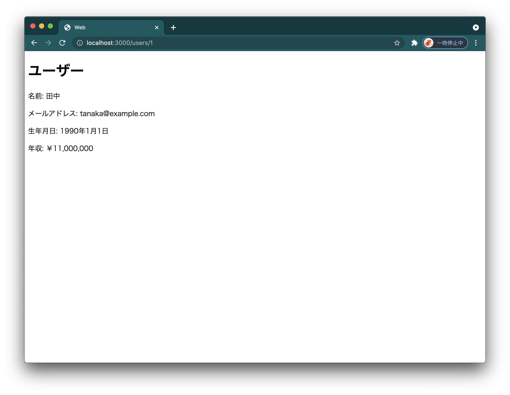

表記が修正できました。

## update

それでは、ユーザー編集ページと、更新処理を作成しましょう。一緒に作成していきます。

編集ページ`users#edit`でユーザーの情報を編集し、`users#update`を呼び出して更新します。

`config/routes.rb`を下記のように修正してください。

```diff
  Rails.application.routes.draw do
-   resources :users, only: [:show]
+   resources :users, only: [:show, :edit, :update]
    resources :bank_accounts, only: [:index, :show]
  end
```

`app/controllers/users_controller.rb`を下記のように修正してください。

```diff
class UsersController < ApplicationController
	def show
    @user = User.find(params[:id])
	end
+
+ def edit
+   @user = User.find(params[:id])
+ end
+
+ def update
+   @user = User.find(params[:id])
+   param = params.require(:user).permit(:name, :email_address)
+   @user.update(param)
+   redirect_to :user
+ end
end
```

`edit`アクションは`show`アクションと全く同じです。

`@user`をビューテンプレートに受け渡します。

`update`アクションはユーザーの情報をフォームから受け付けた値で更新する処理です。

```rb
param = params.require(:user).permit(:name, :email_address)
```

これはリクエストデータをあらかじめ、許可したものだけに制限するための処理です。

フォームからの送られてくるデータを`:user`という名前で受け付ける際に`:name`と`:email_addrees`だけ許可(`permit`)しています。

`id`のような変更してはいけないデータが不正に送られてきた際もそれらを無視して安全に更新できます。

後ほど詳細に説明します。

```rb
redirect_to :user
```

更新後に`redirect_to :user`でユーザーページにリダイレクトします。

`app/views/users/edit.html.erb`を作成して、開き、下記のように修正してください。

```erb
<h1>ユーザー</h1>
<%= form_with(model: @user, local: true) do |form| %>
<div>
   <%= form.label :name, '名前' %><br>
   <%= form.text_field :name %>
</div>
<div>
   <%= form.label :email_address, 'メールアドレス' %><br>
   <%= form.text_field :email_address %>
</div>
<div><%= form.submit "更新する" %></div>
<% end %>
```

`form_width`を使用して、更新をフォームから行えるようにしています。

`form_with`はフォームを構成してリクエスト時にフォームに入力されたデータを送信するためのビューテンプレート専用の記法です。

`form_with(model: 何かのモデルのインスタンス変数)`と記述することでそのモデルをリクエストのフォームデータとして送信できます。

`|form|`はブロック引数です。そのため、`<%= form_with ... %>`から`<% end %>`で囲われた部分でだけ使用できます。

このブロック引数にフォームデータのラベルや属性を与えることでフォームデータを送信できます。

```erb
<%= form_with(model: @user, local: true) do |form| %>
...
<% end %>
```

このタグで囲むと下記のようなHTMLに変換されます。

```html
<form action="/users/1" accept-charset="UTF-8" method="post"><input type="hidden" name="_method" value="patch"><input type="hidden" name="authenticity_token" value="...">
...
</form>
```

`form_with(model: @user`と記述することでは`action="/users/1"`に自動で変換されます。

```erb
<%= form.label :name, '名前' %>
```

このコードは下記のようなHTMLに変換されます。

```html
<label for="user_name">名前</label>
```

モデル名(`@user`)と指定したシンボル(`:name`)を`_`でつなげた`user_name`が`for`の値として設定されます。

```erb
<%= form.text_field :name %>
```

このコードは下記のようなHTMLに変換されます。

```html
<input type="text" value="田中" name="user[name]" id="user_name">
```

モデル名(`@user`)と指定したシンボル(`:name`)を`_`でつなげた`user_name`が`id`の値として設定されます。

`name="user[name]"`も同様の理由です。

`value="田中"`は`:name`としていることで`@user.name`の値を展開して表示してくれます。

```erb
<div><%= form.submit "更新する" %></div>
```

このコードは下記のようなHTMLに変換されます。

```html
<input type="submit" name="commit" value="更新する" data-disable-with="更新する">
```

<localhost:3000/users/1/edit>にアクセスしてください。

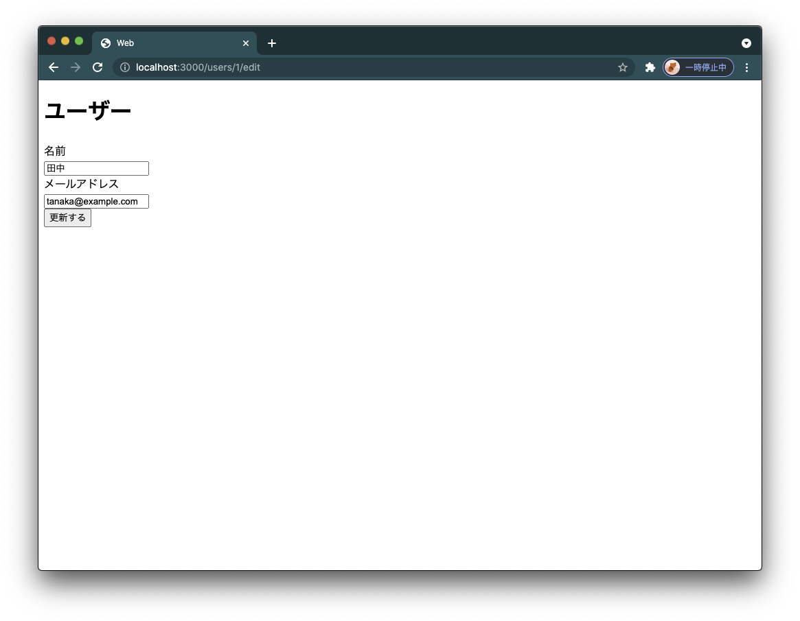

名前とメールアドレスの更新をしてみてください。

## link

それでは、ユーザー詳細ページからユーザー編集ページへのリンクを付与しましょう。

まず、ユーザーページに編集ページへのリンクを付けましょう。

`app/views/users/show.html.erb`を開いてください。

編集ページへのリンクを作成しましょう。

```diff
  <h1>ユーザー</h1>
  <p>名前: <%= @user.name %></p>
  <p>メールアドレス: <%= @user.email_address %></p>
  <p>生年月日: <%= @user.date_of_birth.strftime("%Y年%-m月%-d日") %></p>
  <p>年収: <%= number_to_currency(@user.annual_income, unit: "￥", strip_insignificant_zeros: true) %></p>
+ <p><%= link_to '編集', edit_user_path %></p>
```

<localhost:3000/users/1>にアクセスしてください。

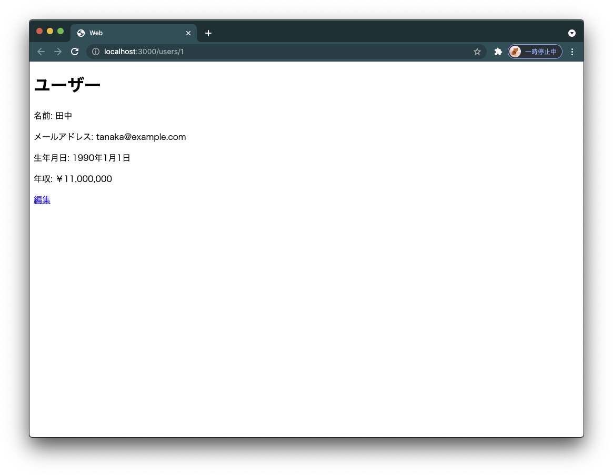

ビューテンプレートにはこのような便利な機能が数え切れないほどあります。

HTMLのあれはどのように実現するのだろうと思ったらグーグルで検索しましょう。簡単に見つかります。

[Railsガイド](https://railsguides.jp/layouts_and_rendering.html)も参考にしてみてください。

## コントローラーの機能

ここで、作成したコントローラーを少し眺めてみましょう。

`app/controllers/users_controller.rb`を開いてください。

```rb
class UsersController < ApplicationController
  def show
    @user = User.find(params[:id])
  end

  def edit
    @user = User.find(params[:id])
  end

  def update
    @user = User.find(params[:id])
    param = params.require(:user).permit(:name, :email_address)
    user.update(param)
    redirect_to :user
  end
end
```

`@user = User.find(params[:id])`が重複していることに気づくと思います。

以前触れた**DRY**原則に違反しています。

これらをメソッドとして定義して、呼び出すことにしましょう。

`app/controllers/users_controller.rb`を下記のように修正してください。

```diff
  class UsersController < ApplicationController
    def show
-     @user = User.find(params[:id])
+     set_user
    end

    def edit
-     @user = User.find(params[:id])
+     set_user
    end

    def update
-     @user = User.find(params[:id])
+     set_user
      param = params.require(:user).permit(:name, :email_address)
      @user.update(param)
      redirect_to :user
    end
+
+   private
+
+   def set_user
+     @user = User.find(params[:id])
+   end
  end
```

ここで新しく`private`と記述しています。

`private`と記述した以降で定義することにメソッドはこのクラスの中でしか使用できなくなります。

ここで定義している`set_user`はクラス外部で使用することがないので`private`を指定しています。

このようなメソッドを**privateメソッド**といいます。

まだ改善できます。

`set_user`は`UsersController`のすべてのアクションで使用しています。

このようなアクション実行の前に必ず実行する処理は`before_action`を使用すること、よりDRYにできます。

`app/controllers/users_controller.rb`を下記のように修正してください。

```diff
  class UsersController < ApplicationController
+   before_action :set_user

    def show
-     set_user
    end

    def edit
-     set_user
    end

    def update
-     set_user
      param = params.require(:user).permit(:name, :email_address)
      @user.update(param)
      redirect_to :user
    end

    private

    def set_user
      @user = User.find(params[:id])
    end
  end
```

`before_action`を指定することで、記述されたコントローラー内のアクションの実行前に自動的に指定されたメソッドを実行してくれます。

この反対の機能として`after_action`、前あとで実行する`around_action`もあります。

このような機能はコントローラーに複数ありますので今後触れていきます。

## StrongParameter

`app/controllers/users_controller.rb`を開いてください。

```rb
class UsersController < ApplicationController
  before_action :set_user
  def show
  end

  def edit
  end

  def update
    param = params.require(:user).permit(:name, :email_address)
    @user.update(param)
    redirect_to :user
  end

  private

  def set_user
    @user = User.find(params[:id])
  end
end
```

下記の箇所を見てください。

```rb
params.require(:user).permit(:name, :email_address)
```

このコードは**MassAssingment**の際に起こりうるセキュリティ上の脆弱性の対策を行なうためのコードです。

MassAssignmentとはモデルの生成、更新時にRubyのハッシュを使って一括で保存できる仕組みです。今までも使ってきました。

`irb`を使って確認しましょう。

```sh
$ docker compose exec web bin/rails c
irb(main):001:0>
```

田中さんのデータを取得してデータを更新してみます。

下記のようなコードを実行しましょう。

```rb
tanaka = User.find(1)
tanaka.name = "タナカ"
tanaka.email_address = "tanaka_katakana@example.com"
tanaka.save
User.find_by(name: "タナカ")
```

下記は実行結果です。

```rb
irb(main):001:0> tanaka = User.find_by(name: "田中")
  User Load (0.5ms)  SELECT `users`.* FROM `users` WHERE `users`.`name` = '田中' LIMIT 1
=>
#<User:0x000056171340d550
...
irb(main):002:0> tanaka.name = "タナカ"
=> "タナカ"
irb(main):003:0> tanaka.email_address = "tanaka_katakana@example.com"
=> "tanaka_katakana@example.com"
irb(main):004:0> tanaka.save
  TRANSACTION (0.4ms)  BEGIN
  Industry Load (0.4ms)  SELECT `industries`.* FROM `industries` WHERE `industries`.`id` = 1 LIMIT 1
  User Update (0.6ms)  UPDATE `users` SET `users`.`name` = 'タナカ', `users`.`email_address` = 'tanaka_katakana@example.com', `users`.`updated_at` = '2021-06-17 13:52:46.637728' WHERE `users`.`id` = 1
  TRANSACTION (4.5ms)  COMMIT
=> true
irb(main):005:0> User.find_by(name: "タナカ")
  User Load (0.7ms)  SELECT `users`.* FROM `users` WHERE `users`.`name` = 'タナカ' LIMIT 1
=>
#<User:0x0000561713b1e3a8
 id: 1,
 name: "タナカ",
 email_address: "tanaka_katakana@example.com",
 date_of_birth: Mon, 01 Jan 1990,
 annual_income: 11000000,
 created_at: Thu, 17 Jun 2021 06:22:49.349137000 UTC +00:00,
 updated_at: Thu, 17 Jun 2021 13:52:46.637728000 UTC +00:00,
 industry_id: 1>
```

それぞれのフィールドにもとの値と異なった値を代入して、最後に`save`を実行することでデータベースに更新結果を反映しています。

ではMassAsignmentで更新をしましょう。

```rb
attr = {name: "不正な田中", email_address: "husei_tanaka@example.com", "annual_income": 10}
tanaka.update(attr)
```

```rb
irb(main):006:0> attr = {name: "不正な田中", email_address: "husei_tanaka@example.com", "annual_income": 10}
=> {:name=>"不正な田中", :email_address=>"husei_tanaka@example.com", :annual_income=>10}
irb(main):007:0> tanaka.update(attr)
  TRANSACTION (0.3ms)  BEGIN
  User Update (1.2ms)  UPDATE `users` SET `users`.`name` = '不正な田中', `users`.`email_address` = 'husei_tanaka@example.com', `users`.`annual_income` = 10, `users`.`updated_at` = '2021-06-25 16:38:10.535843' WHERE `users`.`id` = 1
  TRANSACTION (2.3ms)  COMMIT
=> true
```

このように`update`メソッドはハッシュを引数に受け取ります。

非常にシンプルに複数のフィールドを一括で更新できるので便利ですが、セキュリティ上の脆弱性も生み出しています。

`app/controllers/users_controller.rb`を見てください。

```rb
class UsersController < ApplicationController
  before_action :set_user
  def show
  end

  def edit
  end

  def update
    param = params.require(:user).permit(:name, :email_address)
    @user.update(param)
    redirect_to :user
  end

  private

  def set_user
    @user = User.find(params[:id])
  end
end
```


```rb
    @user.update(param)
```

`update`を実行しています。

フォームでは、ユーザー名とメールアドレスを受け付けていました。

仮に`update`で受け取るハッシュの値すべてを受け付けてしまっていたらどうなるでしょうか?

リクエストの際にフォームデータに`user[annual_income]`を不正に追加することで年収も更新できてしまいます。

これがMassAsignment脆弱性です。

これを防ぐための機能がRailsには備わっています。**StrongParamters**です。

デフォルトで、StrongParamterを使用しないとエラーになるようになっています。

```rb
param = params.require(:user).permit(:name, :email_address)
```

上記のように記述することで、`require`で`:usre`の属性を必須とし、その中の`:name`、`:email_address`を許可します。

許可された属性以外は無視した、ハッシュを返却するので、 MassAsignment脆弱性から守られます。

このようなStrongParamterを使用するコードは慣例として、`private`メソッドにすることになっています。コードを修正しましょう。

`app/controllers/users_controller.rb`を下記のように修正してください。

```diff
  class UsersController < ApplicationController
    before_action :set_user
    def show
    end

    def edit
    end

    def update
-     param = params.require(:user).permit(:name, :email_address)
      @user.update(param)
      redirect_to :user
    end

    private

    def set_user
      @user = User.find(params[:id])
    end
+
+   def user_params
+     params.require(:user).permit(:name, :email_address)
+   end
  end
```

## N+1問題

`app/views/bank_accounts/index.html.erb`を見てください。

```erb
<h1>銀行口座一覧</h1>
<table>
   <thead>
      <tr>
         <th>詳細</th>
         <th>ユーザー名</th>
         <th>銀行</th>
      </tr>
   </thead>
   <tbody>
      <% @bank_accounts.each do |bank_account| %>
      <tr>
         <td><%= link_to 'X', bank_account %></td>
         <td><%= bank_account.user.name %></td>
         <td><%= bank_account.bank.name %></td>
      </tr>
      <% end %>
   </tbody>
</table>
```

コントローラーから受け取った`@bank_accounts`を`each`で一つづつ取り出して、`bank_account.user.name`と`bank_account_bank.name`にアクセスしています。

この処理は非常に非効率です。どんなSQLがループごとに実行されてしまいます。

<http://localhost:3000/bank_accounts>にアクセスするとどのようなSQLが実行されるのか`irb`を用いて確認してみましょう。

```sh
$ docker compose exec web bin/rails c
Loading development environment (Rails 6.1.3.2)
irb(main):001:0>
```

`app/controllers/bank_accounts_controller.rb`の`index`アクションでは`@bank_accounts = BankAccount.all`で銀行口座を全件取得しています。

これを`app/views/bank_accounts/index.html.erb`に渡しているので、まずはこれを実行します。

```rb
irb(main):001:0> bank_accounts = BankAccount.all
  BankAccount Load (0.5ms)  SELECT `bank_accounts`.* FROM `bank_accounts`
=>
[#<BankAccount:0x00005568536a5458 id: 1, user_id: 1, bank_id: 1, created_at: Thu, 17 Jun 2021 06:22:49.354828000 UTC +00:00, updated_at: Thu, 17 Jun 2021 06:22:49.354828000 UTC +00:00>,
...
irb(main):002:0>
```

`bank_accounts`を`each`で一つづつ取り出して、`bank_account.user.name`と`bank_account_bank.name`にアクセスしてみましょう。

下記のようなコードを実行しましょう。

```rb
bank_accounts.each do |bank_account|
  puts bank_account.user.name
  puts bank_account.bank.name
end
```

```rb
irb(main):002:1* bank_accounts.each do |bank_account|
irb(main):003:1*   puts bank_account.user.name
irb(main):004:1*   puts bank_account.bank.name
irb(main):005:0> end
  User Load (0.4ms)  SELECT `users`.* FROM `users` WHERE `users`.`id` = 1 LIMIT 1
不正な田中
  Bank Load (0.5ms)  SELECT `banks`.* FROM `banks` WHERE `banks`.`id` = 1 LIMIT 1
A銀行
  User Load (0.5ms)  SELECT `users`.* FROM `users` WHERE `users`.`id` = 1 LIMIT 1
不正な田中
  Bank Load (1.3ms)  SELECT `banks`.* FROM `banks` WHERE `banks`.`id` = 2 LIMIT 1
B銀行
  User Load (1.2ms)  SELECT `users`.* FROM `users` WHERE `users`.`id` = 2 LIMIT 1
佐藤
  Bank Load (0.8ms)  SELECT `banks`.* FROM `banks` WHERE `banks`.`id` = 2 LIMIT 1
B銀行
  User Load (0.7ms)  SELECT `users`.* FROM `users` WHERE `users`.`id` = 2 LIMIT 1
佐藤
  Bank Load (0.7ms)  SELECT `banks`.* FROM `banks` WHERE `banks`.`id` = 2 LIMIT 1
B銀行
  User Load (1.6ms)  SELECT `users`.* FROM `users` WHERE `users`.`id` = 3 LIMIT 1
鈴木
  Bank Load (1.0ms)  SELECT `banks`.* FROM `banks` WHERE `banks`.`id` = 3 LIMIT 1
C銀行
  User Load (0.6ms)  SELECT `users`.* FROM `users` WHERE `users`.`id` = 4 LIMIT 1
井上
  Bank Load (0.6ms)  SELECT `banks`.* FROM `banks` WHERE `banks`.`id` = 1 LIMIT 1
A銀行
  User Load (0.6ms)  SELECT `users`.* FROM `users` WHERE `users`.`id` = 4 LIMIT 1
井上
  Bank Load (0.8ms)  SELECT `banks`.* FROM `banks` WHERE `banks`.`id` = 3 LIMIT 1
C銀行
=>
[#<BankAccount:0x000055cb541e4b30 id: 1, user_id: 1, bank_id: 1, created_at: Thu, 17 Jun 2021 06:22:49.354828000 UTC +00:00, updated_at: Thu, 17 Jun 2021 06:22:49.354828000 UTC +00:00>,
 #<BankAccount:0x000055cb542c1fd0 id: 2, user_id: 1, bank_id: 2, created_at: Thu, 17 Jun 2021 06:22:49.358214000 UTC +00:00, updated_at: Thu, 17 Jun 2021 06:22:49.358214000 UTC +00:00>,
 #<BankAccount:0x000055cb542c19b8 id: 3, user_id: 2, bank_id: 2, created_at: Thu, 17 Jun 2021 06:22:49.371640000 UTC +00:00, updated_at: Thu, 17 Jun 2021 06:22:49.371640000 UTC +00:00>,
 #<BankAccount:0x000055cb542c18a0 id: 4, user_id: 2, bank_id: 2, created_at: Thu, 17 Jun 2021 06:22:49.375710000 UTC +00:00, updated_at: Thu, 17 Jun 2021 06:22:49.375710000 UTC +00:00>,
 #<BankAccount:0x000055cb542c1738 id: 5, user_id: 3, bank_id: 3, created_at: Thu, 17 Jun 2021 06:22:49.386865000 UTC +00:00, updated_at: Thu, 17 Jun 2021 06:22:49.386865000 UTC +00:00>,
 #<BankAccount:0x000055cb542c15a8 id: 6, user_id: 4, bank_id: 1, created_at: Thu, 17 Jun 2021 06:22:49.398078000 UTC +00:00, updated_at: Thu, 17 Jun 2021 06:22:49.398078000 UTC +00:00>,
 #<BankAccount:0x000055cb542c13f0 id: 7, user_id: 4, bank_id: 3, created_at: Thu, 17 Jun 2021 06:22:49.406556000 UTC +00:00, updated_at: Thu, 17 Jun 2021 06:22:49.406556000 UTC +00:00>]
```

ループごとに下記のようなユーザーテーブルと銀行テーブルのレコードを取得するSQLが発行されています。

```sql
SELECT `users`.* FROM `users` WHERE `users`.`id` = 1 LIMIT 1
SELECT `banks`.* FROM `banks` WHERE `banks`.`id` = 1 LIMIT 1
```

`BankAccount.all`で取得するレコードは`bank_accounts`テーブル上のデータのみを取得します。

そのため、ループごとに`users`テーブルのデータと`banks`テーブルのデータをデータベースに問い合わせ必要があります。

これを防ぐために、`includes`を使用して、`Bank.all`でデータを取得する際に、`users`テーブル、`banks`テーブルのデータも合わせて取得しましょう。

下記のように記述します。

```rb
BankAccount.all.includes(:user, :bank)
```

```rb
irb(main):007:0> bank_accounts = BankAccount.all.includes(:user, :bank)
  BankAccount Load (0.5ms)  SELECT `bank_accounts`.* FROM `bank_accounts`
  User Load (0.6ms)  SELECT `users`.* FROM `users` WHERE `users`.`id` IN (1, 2, 3, 4)
  Bank Load (0.7ms)  SELECT `banks`.* FROM `banks` WHERE `banks`.`id` IN (1, 2, 3)
=>
[#<BankAccount:0x000055cb53924630 id: 1, user_id: 1, bank_id: 1, created_at: Thu, 17 Jun 2021 06:22:49.354828000 UTC +00:00, updated_at: Thu, 17 Jun 2021 06:22:49.354828000 UTC +00:00>,
...
```

`bank_accounts`テーブルのデータ取得とともに`users`テーブルと`banks`テーブルへもSQLが実行されていることが確認できます。

ループを回して、無駄なSQLが実行されないことを確認しましょう。

```rb
irb(main):008:1* bank_accounts.each do |bank_account|
irb(main):009:1*   puts bank_account.user.name
irb(main):010:1*   puts bank_account.bank.name
irb(main):011:0> end
不正な田中
A銀行
不正な田中
B銀行
佐藤
B銀行
佐藤
B銀行
鈴木
C銀行
井上
A銀行
井上
C銀行
=>
[#<BankAccount:0x000055cb53924630 id: 1, user_id: 1, bank_id: 1, created_at: Thu, 17 Jun 2021 06:22:49.354828000 UTC +00:00, updated_at: Thu, 17 Jun 2021 06:22:49.354828000 UTC +00:00>,
 #<BankAccount:0x000055cb5390b220 id: 2, user_id: 1, bank_id: 2, created_at: Thu, 17 Jun 2021 06:22:49.358214000 UTC +00:00, updated_at: Thu, 17 Jun 2021 06:22:49.358214000 UTC +00:00>,
 #<BankAccount:0x000055cb5390a370 id: 3, user_id: 2, bank_id: 2, created_at: Thu, 17 Jun 2021 06:22:49.371640000 UTC +00:00, updated_at: Thu, 17 Jun 2021 06:22:49.371640000 UTC +00:00>,
 #<BankAccount:0x000055cb539091c8 id: 4, user_id: 2, bank_id: 2, created_at: Thu, 17 Jun 2021 06:22:49.375710000 UTC +00:00, updated_at: Thu, 17 Jun 2021 06:22:49.375710000 UTC +00:00>,
 #<BankAccount:0x000055cb53908bd8 id: 5, user_id: 3, bank_id: 3, created_at: Thu, 17 Jun 2021 06:22:49.386865000 UTC +00:00, updated_at: Thu, 17 Jun 2021 06:22:49.386865000 UTC +00:00>,
 #<BankAccount:0x000055cb53908020 id: 6, user_id: 4, bank_id: 1, created_at: Thu, 17 Jun 2021 06:22:49.398078000 UTC +00:00, updated_at: Thu, 17 Jun 2021 06:22:49.398078000 UTC +00:00>,
 #<BankAccount:0x000055cb538fc478 id: 7, user_id: 4, bank_id: 3, created_at: Thu, 17 Jun 2021 06:22:49.406556000 UTC +00:00, updated_at: Thu, 17 Jun 2021 06:22:49.406556000 UTC +00:00>]
```

SQLがループ内で実行されませんでした！

このような、レコードの件数分だけループ中にSQLを実行してしまうような問題を**N+1問題**といいます。

これは、注意していないとベテランのエンジニアでもうっかりやってしまうので、モデルをループさせて、フィールドにアクセスする際は思い出してください。

それでは、`app/controllers/bank_accounts_controller.rb`を修正しましょう。

```diff
  class BankAccountsController < ApplicationController
    def index
-     @bank_accounts = BankAccount.all
+     @bank_accounts = BankAccount.all.includes(:user, :bank)
    end

    def show
      @bank_account = BankAccount.find(params[:id])
    end
  end
```

## おわりに

コントローラーの基本的な動作について学んできました。

**Modelのロジック呼び出し、およびModelとViewの接続**という意味が理解できたのではないでしょうか。

まだまだ知識としては不足しています。

家計簿アプリの機能を追加しながら、学習しましょう！

(VS Codeで立ち上げたコンテナは以前やったように左下の`Dev Container: Existing Docker Compose (...`をクリックし、`Close Remote Connection`で閉じておきましょう。)

途中でコード全体がよくわからなくなってしまった場合は[finish](https://github.com/burning-tech-dev/controller-training/tree/finish)ブランチに最後の状態のコードがあるので見てみてください。

