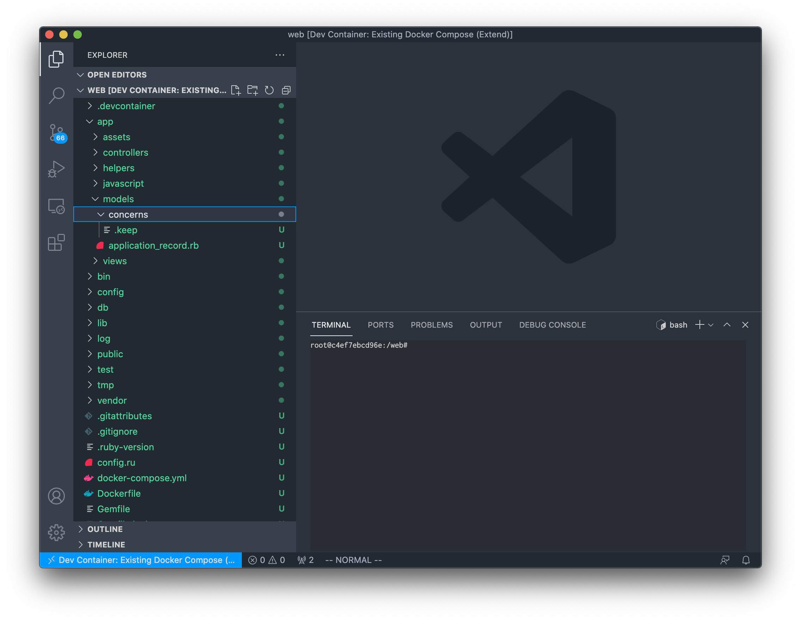
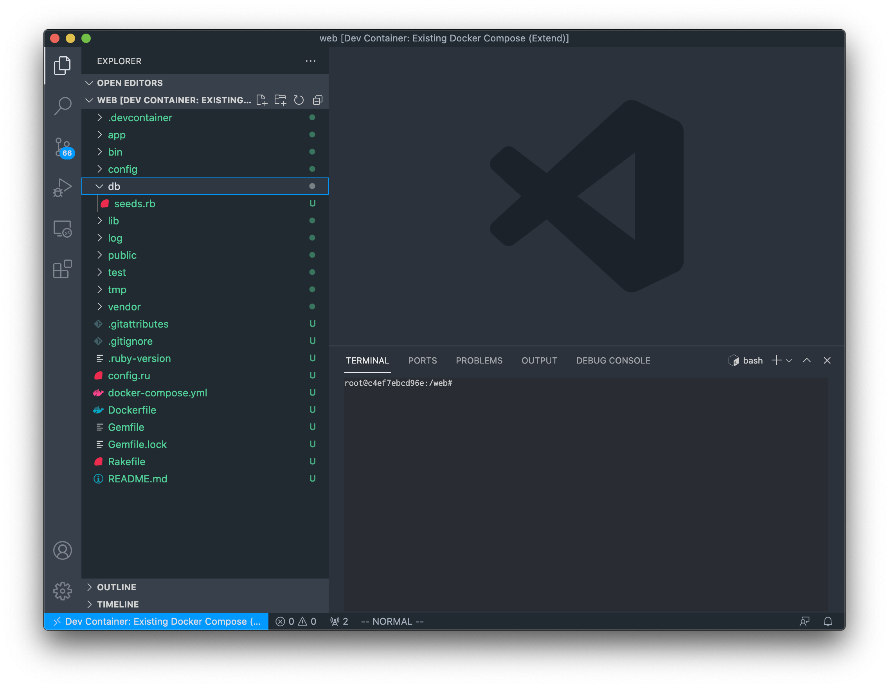

# Model

本チャプターからはMVCアーキテクチャを学んでいきます。

まずはMのModelです!

## セットアップ

いつものようにリポジトリのセットアップをしましょう。

この章では、リポジトリを一から作っていきます。

`~/code/burning-tech`に移動してください。

```sh
$ cd ~/code/burning-tech
```

教材リポジトリをクローンします。

```sh
$ git clone https://github.com/burning-tech/model-training.git
$ cd model-training
```

本チャプターでもいつものように適宜、`git`管理をしてください。

```sh
$ git init
```

そして`~/code/burning-tech/model-training`をワークスペースとしてVS Codeで開いてください。

すると、右下にウィンドウが表示されますので前チャプター同様`Reopen in Container`を開いてください。

コンテナが立ち上がります。

データベースも作成しておきましょう。

```sh
$ docker compose exec web bin/rails db:create
Created database 'web_development'
Created database 'web_test'
```

この教材リポジトリは`rails new`をして、データベースに接続できるように設定したのみです。

`app/models`ディレクトリを見てください。



まだデフォルトのファイルしかない状態です。

`db`ディレクトリも見てください。



こちらもデフォルトのファイルしかありません。

今はデフォルトのファイルしかないことを覚えておいてください。

## MVCアーキテクチャ

あらためてMVCを復習しましょう。

下記のように`Model`、`View`、`Controller`という3つの明確な役割に分離されたアプリケーションアーキテクチャを`MVC`アーキテクチャといいます。

| MVC        | 役割                                                             | 対応ディレクトリ  |
| -          | -                                                                | -                 |
| Model      | データベースとの接続とデータに対する操作、およびビジネスロジック | `app/models`      |
| View       | Modelの内容を参照しHTML等を生成する                              | `app/views`       |
| Controller | Modelのロジック呼び出し、およびModelとViewの接続                 | `app/controllers` |

このチャプターからは、家計簿アプリの作成を通じてRailsアプリケーショとMVCについて学習していきます。

## 家計簿アプリ

このチャプターで家計簿アプリを作り切るわけではなく、少しずつ作っていきますが、ざっと全体像を把握しましょう。

- 銀行の情報
- 銀行の口座情報
- 銀行の残高情報
- 購入履歴
- ユーザー情報

こういった情報が必要になりそうです。

少しずつ必要な要素を付与していき、家計簿アプリを作っていきましょう。

## モデリング

アプリケーションは、それを使用するユーザーの、何らかの活動と結びついています。

その何らかの活動にプラスの働きをしなければ、アプリケーションとしての価値ありません。

家計簿アプリの場合は家計簿をつける作業を非常に楽にしてくれるでしょう。

仮に家計簿を手動でつけるよりも面倒な作業が発生してしまうならば、家計簿アプリは誰も使わないはずです。

有効に利用されるアプリを作るためには、エンジニアはその活動について体系的な知識を持つことが不可欠です。

複雑なユーザーの活動を正確に理解するのは非常に大変です。モデルはその理解を助けてくれる心強いツールです。

ユーザーの活動から不要な情報を削ぎ落とし、磨いて、理解しやすい形で再構築されたものがモデルです。

このモデルを作成する作業を**モデリング**といいます。

Railsアプリケーションの開発工程でもっとも重要と言っても良いでしょう。

なんのことかさっぱりわからなくても大丈夫です。少しずつ学んでいきましょう。

## 最初のモデル

まず、皆さんが理解するのがもっとも簡単そうな**ユーザー**モデルをピックアップして、モデルについて学んでいきましょう。

家計簿アプリを使用するユーザーは下記のような情報を持つ必要があります。

- 名前
- メールアドレス
- 生年月日
- 年収
...

このユーザーモデルを作成してみましょう。

## rails generate model

`rails generate`コマンドを使って、モデルを作成します。

```sh
$ docker compose exec web bin/rails generate model User
      invoke  active_record
      create    db/migrate/20210612013255_create_users.rb
      create    app/models/user.rb
      invoke    test_unit
      create      test/models/user_test.rb
      create      test/fixtures/users.yml
```

下記の4つのファイルが生成されました。

| ファイル                                    | 役割                                                                   |
| -                                           | -                                                                      |
| `db/migrate/20210612013255_create_users.rb` | マイグレーションファイル(バージョンは実行時によって異なる)             |
| `app/models/user.rb`                        | ユーザーモデル                                                         |
| `test/models/user_test.rb`                  | ユーザーモデルのテストを書くファイル                                   |
| `test/fixtures/users.yml`                   | テスト用のサンプルデータを用意するためのファイル(フィクスチャーという) |

まずは、`app/models/user.rb`を見てください。

```rb
class User < ApplicationRecord
end
```

`ApplicationRecord`クラスを継承した`User`クラスが定義されています。

では、この`ApplicationRecord`クラスを見てみましょう。

`app/models/application_record.rb`に定義されています。

```rb
class ApplicationRecord < ActiveRecord::Base
  self.abstract_class = true
end
```

`ApplicationRecord`クラスは`ActiveRecord::Base`クラスを継承しています。

この`ActiveRecord::Base`クラスがデータベースとの接続とデータに対する操作を可能にする便利なメソッドを持っています。

そのため、`ActiveRecord::Base`を継承した`ApplicationRecord`を継承した`User`クラスもデータベースとの接続とデータに対する操作が可能になります。

## migration

`User`クラスに対応した`users`テーブルを準備しましょう。

`db/migrate/20210612013255_create_users.rb`を開いてください。`20210612013255`は皆さんが`rails generate model`を実行した時間です。

なのでここに書いてあるものとは違うはずなので注意してください。

```rb
class CreateUsers < ActiveRecord::Migration[6.1]
  def change
    create_table :users do |t|

      t.timestamps
    end
  end
end
```

`ActiveRecord::Migration`を継承した`CreateUsers`に`change`メソッドが定義されています。

`change`メソッドの中に記述されたテーブルの追加、変更、削除の内容はSQLに変換、実行されます。

```rb
    create_table :users do |t|

      t.timestamps
    end
```

`Rails`ではモデル名をスネークケースの複数形したものをテーブル名とするという規約があると説明しました。

`User`モデル => `users`テーブルと対応するため、`create_table :users`となっています。

`:users`とシンボルが使われています。

前のチャプターで説明したように名前に使われていますね。


```rb
t.timestamps
```

これは`Rails`が自動で全テーブルに付与する`created_at`と`updated_at`というカラムでした。

現状は`created_at`と`updated_at`しかないので下記を追加しましょう。

- 名前
- メールアドレス
- 生年月日
- 年収

`db/migrate/20210612013255_create_users.rb`を下記のように修正してください。


```diff
  class CreateUsers < ActiveRecord::Migration[6.1]
    def change
      create_table :users do |t|
+       t.string :name
+       t.string :email_address
+       t.date :date_of_birth
+       t.bigint :annual_income

        t.timestamps
      end
    end
  end
```

`カラムの型 :カラム名`と記述することでカラムを定義するマイグレーションファイルを作成できます。

対応は下記です。

| カラム名      | 概要           | 型     |
| -             | -              | -      |
| name          | 名前           | string |
| email_address | メールアドレス | string |
| date_of_birth | 生年月日       | date   |
| annual_income | 年収           | bigint |

それではマイグレーションを実行して、`users`テーブルを作成しましょう。

```sh
docker compose exec web bin/rails db:migrate
== 20210612014252 CreateUsers: migrating ======================================
-- create_table(:users)
   -> 0.0160s
== 20210612014252 CreateUsers: migrated (0.0161s) =============================
```

では、テーブルに`users`テーブルが追加されたか確認してみましょう。

`rails db`でデータベースにアクセスできます。`MySQL`クライアントが立ち上がります。

```sh
$ docker compose exec web bin/rails db
Reading table information for completion of table and column names
You can turn off this feature to get a quicker startup with -A

Welcome to the MariaDB monitor.  Commands end with ; or \g.
Your MySQL connection id is 25
Server version: 5.7.25 MySQL Community Server (GPL)

Copyright (c) 2000, 2018, Oracle, MariaDB Corporation Ab and others.

Type 'help;' or '\h' for help. Type '\c' to clear the current input statement.

MySQL [web_development]>
```

`MySQL`のコマンドが実行できるので`SHOW TABLES`でテーブルを一覧しましょう。

```sql
MySQL [web_development]> SHOW TABLES;
+---------------------------+
| Tables_in_web_development |
+---------------------------+
| ar_internal_metadata      |
| schema_migrations         |
| users                     |
+---------------------------+
3 rows in set (0.001 sec)
```

`users`テーブルが作成されています。

`users`テーブルの定義を見てみましょう。

```sql
MySQL [web_development]> DESCRIBE users;
+---------------+--------------+------+-----+---------+----------------+
| Field         | Type         | Null | Key | Default | Extra          |
+---------------+--------------+------+-----+---------+----------------+
| id            | bigint(20)   | NO   | PRI | NULL    | auto_increment |
| name          | varchar(255) | YES  |     | NULL    |                |
| email_address | varchar(255) | YES  |     | NULL    |                |
| date_of_birth | date         | YES  |     | NULL    |                |
| annual_income | bigint(20)   | YES  |     | NULL    |                |
| created_at    | datetime(6)  | NO   |     | NULL    |                |
| updated_at    | datetime(6)  | NO   |     | NULL    |                |
+---------------+--------------+------+-----+---------+----------------+
```

期待通り作成できています。

```rb
class CreateUsers < ActiveRecord::Migration[6.1]
  def change
    create_table :users do |t|
      t.string :name
      t.string :email_address
      t.date :date_of_birth
      t.bigint :annual_income

      t.timestamps
    end
  end
end
```

つまり、上記のようなマイグレーションファイルは下記の`SQL`に変換されて実行されたことがわかります。

```sql
CREATE TABLE `users` (
  `id` bigint(20) NOT NULL AUTO_INCREMENT,
  `name` varchar(255) DEFAULT NULL,
  `email_address` varchar(255) DEFAULT NULL,
  `date_of_birth` date DEFAULT NULL,
  `annual_income` bigint(20) DEFAULT NULL,
  `created_at` datetime(6) NOT NULL,
  `updated_at` datetime(6) NOT NULL,
  PRIMARY KEY (`id`)
)
```

`Ctrl` + `C`でクライアントを閉じてください。

## Active Record

モデルがデータベースの操作を行なうことができるのかを確認してみましょう。

`rails console`でモデル等を諸々使用可能な状態にして`irb`が起動します。

```rb
$ docker compose exec web bin/rails console
Loading development environment (Rails 6.1.3.2)
irb(main):001:0>
```

下記のようにテーブルのカラムにフィールドが定義されていることがわかります。

```rb
irb(main):001:0> User.new
=> #<User:0x00005564e3d38130 id: nil, name: nil, email_address: nil, date_of_birth: nil, annual_income: nil, created_at: nil, updated_at: nil>
irb(main):002:0> User
=> User(id: integer, name: string, email_address: string, date_of_birth: date, annual_income: integer, created_at: datetime, updated_at: datetime)
```

一度、`app/models/user.rb`を開いてください。

```rb
class User < ApplicationRecord
end
```

マイグレーション実行後も何も変更されていません。

モデルのファイルに直接テーブルのカラム名と対応したフィールドが定義されるわけではありません。

Railsアプリケーションの実行時に、データベースの中のモデルとマッチしたテーブルのカラムを調べて、クラスを再定義していると考えてください。

モデルは`ActiveRecord::Base`を継承していると述べました。

ここからは**Active Record**を使ってデータベースを操作していきます。

[**Active Record**](https://www.martinfowler.com/eaaCatalog/activeRecord.html)

Active Recordの定義は下記です。

> データベースのテーブルの行をラップして、そのデータにドメインロジックを追加したオブジェクト。

ドメインロジックとはここではビジネスロジックと同じと考えてもらって構いません。

つまり、RailsにおけるMVCのMの定義`データベースとの接続とデータに対する操作、およびビジネスロジック`と同じです。

本チャプターはこれ以降、`データベースとの接続とデータに対する操作`のみに着目して学習します。

## CRUD

`ActiveRecord::Base`を継承することで、データベースへの基本操作を行なうメソッドが利用できるようになります。

| -      | 概要         | メソッド                          | SQL                         |
| -      | -            | -                                 | -                           |
| Create | レコード作成 | User.create                       | INSERT INTO \`users\` ...   |
| Read   | レコード読取 | User.find, User.all               | SELECT * FROM \`users\` ... |
| Update | レコード更新 | User.save, User.update_attributes | UPDATE \`users\` SET ...    |
| Delete | レコード削除 | User.delete, User.destroy         | DELETE FROM  \`users\`      |

これらの操作(Create、Read、Update、Delete)の頭文字を取って、`CRUD`といいましたね。

`CRUD`を操作を体感していきましょう。

### create

`irb`の操作に戻りましょう。

```rb
irb(main):003:0>
```

`create`メソッドを使って`users`レコードを作成しましょう。

下記のように作成します。

```rb
User.create(
  name: "taro",
  email_address: "taro@example.com",
  date_of_birth: Time.parse("20010319"),
  annual_income: 9_000_000,
)
```

引数を`引数名: 引数の値`のように設定しています。

これをキーワード引数といいます。

```rb
def create(id: null, name: null, email_address: null)
  ...
end
```

のように定義することで使用できます。キーワード引数を渡さないとデフォルト値(上記の`id`の場合は`null`)が渡されたことになります。

`date_of_birth`は`date`型なので、`Time.parse`で文字列`"20010319"`から`Time`オブジェクトに変換しています。

`annual_income`の`9_000_000`は`9000000`と同じです。大きな数値の場合、このように`_`で区切って表現できます。

では実行してみましょう。

```rb
irb(main):001:1* User.create(
irb(main):002:1*   name: "taro",
irb(main):003:1*   email_address: "taro@example.com",
irb(main):004:1*   date_of_birth: Time.parse("20010319"),
irb(main):005:1*   annual_income: 9_000_000,
irb(main):006:0> )
  TRANSACTION (0.4ms)  BEGIN
  User Create (1.1ms)  INSERT INTO `users` (`name`, `email_address`, `date_of_birth`, `annual_income`, `created_at`, `updated_at`) VALUES ('taro', 'taro@example.com', '2001-03-19', 9000000, '2021-06-12 03:20:42.294015', '2021-06-12 03:20:42.294015')
  TRANSACTION (1.5ms)  COMMIT
=>
#<User:0x000055a722736080
 id: 1,
 name: "taro",
 email_address: "taro@example.com",
 date_of_birth: Mon, 19 Mar 2001,
 annual_income: 9000000,
 created_at: Sat, 12 Jun 2021 03:20:42.294015000 UTC +00:00,
 updated_at: Sat, 12 Jun 2021 03:20:42.294015000 UTC +00:00>
```

`INSERT`が実行されています。

```sql
INSERT INTO `users` (`name`, `email_address`, `date_of_birth`, `annual_income`, `created_at`, `updated_at`)
VALUES ('taro', 'taro@example.com', '2001-03-19', 9000000, '2021-06-12 03:20:42.294015', '2021-06-12 03:20:42.294015')
```

`created_at`と`updated_at`は自動的に現在時刻が設定でされます。

### find

では、今作成したレコードを取得してみましょう。

```rb
User.find(1)
```

`find`の引数はレコードの`id`です。

```rb
irb(main):007:0> User.find(1)
  User Load (0.6ms)  SELECT `users`.* FROM `users` WHERE `users`.`id` = 1 LIMIT 1
=>
#<User:0x000055a722a612f0
 id: 1,
 name: "taro",
 email_address: "taro@example.com",
 date_of_birth: Mon, 19 Mar 2001,
 annual_income: 9000000,
 created_at: Sat, 12 Jun 2021 03:20:42.294015000 UTC +00:00,
 updated_at: Sat, 12 Jun 2021 03:20:42.294015000 UTC +00:00>
```

### find_by

idではなく、条件で検索してみましょう。

`find_by`を使用します。

```rb
irb(main):008:0> User.find_by(name: "taro")
  User Load (0.7ms)  SELECT `users`.* FROM `users` WHERE `users`.`name` = 'taro' LIMIT 1
=>
#<User:0x000055a7212d08c0
 id: 1,
 name: "taro",
 email_address: "taro@example.com",
 date_of_birth: Mon, 19 Mar 2001,
 annual_income: 9000000,
 created_at: Sat, 12 Jun 2021 03:20:42.294015000 UTC +00:00,
 updated_at: Sat, 12 Jun 2021 03:20:42.294015000 UTC +00:00>
```

`WHERE`指定したキーワード引数になります。

### where

より複雑な条件も指定できます。

```rb
irb(main):009:0> User.where("annual_income > ?", 5_000_000)
  User Load (2.8ms)  SELECT `users`.* FROM `users` WHERE (annual_income > 5000000)
=>
[#<User:0x000055a7220a55b8
  id: 1,
  name: "taro",
  email_address: "taro@example.com",
  date_of_birth: Mon, 19 Mar 2001,
  annual_income: 9000000,
  created_at: Sat, 12 Jun 2021 03:20:42.294015000 UTC +00:00,
  updated_at: Sat, 12 Jun 2021 03:20:42.294015000 UTC +00:00>]
```

`?`を**プレースホルダー**といいます。

`5_000_000`が`?`に代入されて実行されます。

`where`は下記のようにさらにメソッドをつなげて条件をどんどん追加していくことができます。

```rb
irb(main):010:0> User.where("annual_income > ?", 5_000_000).limit(2).order(:email_address)
  User Load (0.8ms)  SELECT `users`.* FROM `users` WHERE (annual_income > 5000000) ORDER BY `users`.`email_address` ASC LIMIT 2
=>
[#<User:0x000055a7229db6f0
  id: 1,
  name: "taro",
  email_address: "taro@example.com",
  date_of_birth: Mon, 19 Mar 2001,
  annual_income: 9000000,
  created_at: Sat, 12 Jun 2021 03:20:42.294015000 UTC +00:00,
  updated_at: Sat, 12 Jun 2021 03:20:42.294015000 UTC +00:00>]
```

実際に実行されているSQLを見てください。

`ORDER BY `users`.`email_address` ASC LIMIT 2`

条件が追加されていますね。

`where`メソッドは`ActiveRecord::Relation`というオブジェクトを返却します。

このオブジェクトは上記で使用した`limit`や`order`だけでなく、他にも多くのクエリを組み立てていくためのメソッドを持っています。

そして、それらのメソッドも`ActiveRecord:Relation`オブジェクトを返却します。そのため、メソッド呼び出しの結果にさらにメソッドを呼び出せるのです。

`where`、`limit`、`order`が`ActiveRecord:Relation`を返却することを確認してみましょう。

```rb
irb(main):002:0> relation = User.where("annual_income > ?", 5_000_000)
  User Load (0.6ms)  SELECT `users`.* FROM `users` WHERE (annual_income > 5000000)
=>
[#<User:0x000055a4e0e6cfa0
...
irb(main):003:0> relation.class
=> User::ActiveRecord_Relation
irb(main):004:0> relation2 = relation.limit(2)
  User Load (0.7ms)  SELECT `users`.* FROM `users` WHERE (annual_income > 5000000) LIMIT 2
=>
[#<User:0x000055a4df855dc0
...
irb(main):005:0> relation2.class
=> User::ActiveRecord_Relation
irb(main):006:0> relation3 = relation2.order(:email_address)
  User Load (1.4ms)  SELECT `users`.* FROM `users` WHERE (annual_income > 5000000) ORDER BY `users`.`email_address` ASC LIMIT 2
=>
[#<User:0x000055a4e0f07a28
...
irb(main):007:0> relation3.class
=> User::ActiveRecord_Relation
```

`.class`で確認してみると`User::ActiveRecord_Relation`を返却していることがわかります。

このようなメソッドをどんどんつなげる記法を**メソッドチェーン**といいます。

クラスを簡略化して書くとこんな感じになっていると理解してください。

```rb
class Relation
  def where(args)
    self.add_where_condition(args)
    self
  end

  def limit(args)
    self.add_limit_condition(args)
    self
  end
end
```

すると`where(a).limit(1)`と記述できるようになります。

## リレーション

いまはユーザーモデルしかありません。


ユーザーの会社がどの業界に所属しているかを表現するために、業界モデルを追加してみましょう。


業界には複数のユーザーが所属します。

逆に、ユーザーは副業ができないため、一つの業界にしか所属しない世知辛いケースを考えます。

まず、業界モデル(Industryモデルを作成しましょう。)

```sh
$ docker compose exec web bin/rails g model Industry name:string
      invoke  active_record
      create    db/migrate/20210612044435_create_industries.rb
      create    app/models/industry.rb
      invoke    test_unit
      create      test/models/industry_test.rb
      create      test/fixtures/industries.yml
```

上記のように`generate`は`g`と省略できます。

そして、`generate model`コマンド上でカラム名と型を設定できます。


`db/migrate/20210612044435_create_industries.rb`が生成されるので確認しましょう。

```rb
class CreateIndustries < ActiveRecord::Migration[6.1]
  def change
    create_table :industries do |t|
      t.string :name

      t.timestamps
    end
  end
end
```

マイグレーションを実行しましょう。

```sh
$ docker compose exec web bin/rails db:migrate
== 20210612044435 CreateIndustries: migrating =================================
-- create_table(:industries)
   -> 0.0178s
== 20210612044435 CreateIndustries: migrated (0.0181s) ========================
```

作成されたテーブル定義を確認しましょう。

```sh
docker compose exec web bin/rails db
Reading table information for completion of table and column names
You can turn off this feature to get a quicker startup with -A

Welcome to the MariaDB monitor.  Commands end with ; or \g.
Your MySQL connection id is 44
Server version: 5.7.25 MySQL Community Server (GPL)

Copyright (c) 2000, 2018, Oracle, MariaDB Corporation Ab and others.

Type 'help;' or '\h' for help. Type '\c' to clear the current input statement.

MySQL [web_development]> DESC industries;
+------------+--------------+------+-----+---------+----------------+
| Field      | Type         | Null | Key | Default | Extra          |
+------------+--------------+------+-----+---------+----------------+
| id         | bigint(20)   | NO   | PRI | NULL    | auto_increment |
| name       | varchar(255) | YES  |     | NULL    |                |
| created_at | datetime(6)  | NO   |     | NULL    |                |
| updated_at | datetime(6)  | NO   |     | NULL    |                |
+------------+--------------+------+-----+---------+----------------+
4 rows in set (0.001 sec)
```

## 1対多

では、業界モデルとユーザーモデルに関係を作成しましょう。

- 業界には複数のユーザーが所属
- ユーザーは一つの業界に所属

このように関係性を持った２つのモデルにおいて、一方は単一、一方は複数の関係を**1対多**(**one-to-many**)といいます。

では、UserモデルとIndustryモデルに1対多の関係を定義します。

1対多の関係の場合は、1の方のモデルに多のモデルのidをもたせることで表現します。

多のモデルに1のモデルのidを複数持たせるのは良い設計とは言えません。

その場合、industriesテーブルにカンマ区切りでidを持つことになります。

下記のようなテーブルに`user_ids`というフィールドを持つことになると思います。

```sql
+------------+--------------+------+-----+---------+----------------+
| Field      | Type         | Null | Key | Default | Extra          |
+------------+--------------+------+-----+---------+----------------+
| id         | bigint(20)   | NO   | PRI | NULL    | auto_increment |
| name       | varchar(255) | YES  |     | NULL    |                |
| user_ids   | varchar(255) | YES  |     | NULL    |                |
| created_at | datetime(6)  | NO   |     | NULL    |                |
| updated_at | datetime(6)  | NO   |     | NULL    |                |
+------------+--------------+------+-----+---------+----------------+
```

`user_ids`には`1,3,4`のような形で格納されます。

こうすると下記のようなSQLでユーザーの所属する業界を取得することになります。

```sql
SELECT * FROM industries
 WHERE
  user_ids LIKE '%,1,%' -- カンマ区切りの内部にuser_id 1を含む
 OR
  user_ids LIKE '1,%' -- カンマ区切りの先頭にuser_id 1を含む
 OR
  user_ids LIKE '%,1' -- カンマ区切りの末尾にuser_id 1を含む
```

SQLは複雑化します。その上、非常に低速です。

`user_ids`に格納できるidの量も限られてしまいます。

しかし、1の方のモデルに多のモデルのidをもたせるとすべて解決します。

`users`テーブルに`industry_id`というフィールドを持たせます。

```sql
+---------------+--------------+------+-----+---------+----------------+
| Field         | Type         | Null | Key | Default | Extra          |
+---------------+--------------+------+-----+---------+----------------+
| id            | bigint(20)   | NO   | PRI | NULL    | auto_increment |
| industry_id   | bigint(20)   | NO   | MUL | NULL    |                |
| name          | varchar(255) | YES  |     | NULL    |                |
| email_address | varchar(255) | YES  |     | NULL    |                |
| date_of_birth | date         | YES  |     | NULL    |                |
| annual_income | bigint(20)   | YES  |     | NULL    |                |
| created_at    | datetime(6)  | NO   |     | NULL    |                |
| updated_at    | datetime(6)  | NO   |     | NULL    |                |
+---------------+--------------+------+-----+---------+----------------+
```

こうすると下記のようなSQLでユーザーの所属する業界を取得できます。

```sql
SELECT industry_id FROM users WHERE id = 1
```

逆に業界に所属する全ユーザーを取得することも容易です。

```sql
SELECT id FROM users WHERE industry_id = 1
```

これらの理由から1対多のリレーションを作成したい場合は、1の方に多のidをもたせましょう。

では、1対多のリレーションを作成しましょう。

今回はモデルを作成するのではなく、関係性のみを定義するので、マイグレーションファイルを直接作成します。

`rails generate migration`で作成できます。

```sh
$ docker compose exec web bin/rails g migration AddIndustryIDToUsers industry:references
      invoke  active_record
      create    db/migrate/20210612054636_add_industry_id_to_users.rb
```

作成された`db/migrate/20210612054636_add_industry_id_to_users.rb`を開いてください。

```rb
class AddIndustryIdToUsers < ActiveRecord::Migration[6.1]
  def change
    add_reference :users, :industry, null: false, foreign_key: true
  end
end
```

`add_reference`が参照を作るメソッドです。

`:users, :industry`と記述することで、 `users`テーブルに`industry`テーブルのidへの参照(`industry_id`)を作成します。

`null: false`で必ずいずれかの業界に所属するようにし、`foreign_key: true`で`industry_id`を`industry`テーブルの外部キーとして設定します。

マイグレーションを実行しましょう。このままマイグレーションを実行すると`users`テーブルに入っているレコード1件が`industry_id = null`となってしまい、マイグレーションエラーになってしまいます。

なので、すべてのテーブルを削除し、最初からマイグレーションを行なうように`rails db:migrate:reset`を実行しましょう。

実際の開発では、本番のデータを削除できませんので、 これを吸収したマイグレーションファイルを書くことになりますが、ここでは触れません。

```sh
docker compose exec web bin/rails db:migrate:reset
Dropped database 'web_development'
Dropped database 'web_test'
Created database 'web_development'
Created database 'web_test'
== 20210612014252 CreateUsers: migrating ======================================
-- create_table(:users)
   -> 0.0122s
== 20210612014252 CreateUsers: migrated (0.0123s) =============================

== 20210612044435 CreateIndustries: migrating =================================
-- create_table(:industries)
   -> 0.0133s
== 20210612044435 CreateIndustries: migrated (0.0139s) ========================

== 20210612054636 AddIndustryIdToUsers: migrating =============================
-- add_reference(:users, :industry, {:null=>false, :foreign_key=>true})
   -> 0.0605s
== 20210612054636 AddIndustryIdToUsers: migrated (0.0606s) ====================
```

マイグレーションが完了しました。

`users`テーブルの定義を再度、確認しましょう。

```sh
docker compose exec web bin/rails db
Reading table information for completion of table and column names
You can turn off this feature to get a quicker startup with -A

Welcome to the MariaDB monitor.  Commands end with ; or \g.
Your MySQL connection id is 83
Server version: 5.7.25 MySQL Community Server (GPL)

Copyright (c) 2000, 2018, Oracle, MariaDB Corporation Ab and others.

Type 'help;' or '\h' for help. Type '\c' to clear the current input statement.

MySQL [web_development]> DESC users;
+---------------+--------------+------+-----+---------+----------------+
| Field         | Type         | Null | Key | Default | Extra          |
+---------------+--------------+------+-----+---------+----------------+
| id            | bigint(20)   | NO   | PRI | NULL    | auto_increment |
| name          | varchar(255) | YES  |     | NULL    |                |
| email_address | varchar(255) | YES  |     | NULL    |                |
| date_of_birth | date         | YES  |     | NULL    |                |
| annual_income | bigint(20)   | YES  |     | NULL    |                |
| created_at    | datetime(6)  | NO   |     | NULL    |                |
| updated_at    | datetime(6)  | NO   |     | NULL    |                |
| industry_id   | bigint(20)   | NO   | MUL | NULL    |                |
+---------------+--------------+------+-----+---------+----------------+
8 rows in set (0.001 sec)

MySQL [web_development]> SHOW CREATE TABLE users\G
*************************** 1. row ***************************
       Table: users
Create Table: CREATE TABLE `users` (
  `id` bigint(20) NOT NULL AUTO_INCREMENT,
  `name` varchar(255) DEFAULT NULL,
  `email_address` varchar(255) DEFAULT NULL,
  `date_of_birth` date DEFAULT NULL,
  `annual_income` bigint(20) DEFAULT NULL,
  `created_at` datetime(6) NOT NULL,
  `updated_at` datetime(6) NOT NULL,
  `industry_id` bigint(20) NOT NULL,
  PRIMARY KEY (`id`),
  KEY `index_users_on_industry_id` (`industry_id`),
  CONSTRAINT `fk_rails_29b3f2bd12` FOREIGN KEY (`industry_id`) REFERENCES `industries` (`id`)
) ENGINE=InnoDB DEFAULT CHARSET=utf8mb4
1 row in set (0.001 sec)
```

SQLの末尾の`;`の代わりに`\G`をつけるとレコードを縦に表示できます。

```sql
| industry_id   | bigint(20)   | NO   | MUL | NULL    |                |
```

`users`テーブルに`industry_id`カラムが作成されています。

```sql
  KEY `index_users_on_industry_id` (`industry_id`),
  CONSTRAINT `fk_rails_29b3f2bd12` FOREIGN KEY (`industry_id`) REFERENCES `industries` (`id`)
```

`industry_id`に外部キーが設定されています。

外部キー制約もマイグレーションを通じて作成できることを確認できました。

## has_many / belongs_to

それでは、Active Recordで1対多の関係を利用するためにモデルを修正しましょう。

まず、`app/models/industry.rb`を下記のように修正してください。

```diff
  class Industry < ApplicationRecord
+   has_many :users
  end
```

`app/models/user.rb`を下記のように修正してください。

```diff
  class User < ApplicationRecord
+   belongs_to :industry
  end
```

業界が複数のユーザーを持つ(`has_many`)、ユーザーは業界に所属する(`belongs_to`)と考えるとわかりやすいと思います。

`has_many`は複数持つので複数系(`users`)、`belongs_to`は単数系(`industry`)となります。

`has_many: users`ではなく、`has_many :users`であることに注意してください。(`has_many`メソッドの引数に`:users`シンボルを引数として渡しています。)

これによってどのようなことができるようになったのか確認しましょう。

`irb`を開いてください。

```sh
docker compose exec web bin/rails console
Loading development environment (Rails 6.1.3.2)
irb(main):001:0>
```

まず、金融業界と運送業界を作成しましょう。

`["金融", "運送"].each {|name| Industry.create(name: name)}`で作成します。

["金融", "運送"]というArrayオブジェクトを作成し、`each`でループします。

ループの中で`name`に`"金融`、`"運送"`が代入され`Industry.create`を使って業界を作成しています。

```rb
irb(main):001:0> ["金融", "運送"].each {|name| Industry.create(name: name)}
  TRANSACTION (0.4ms)  BEGIN
  Industry Create (0.5ms)  INSERT INTO `industries` (`name`, `created_at`, `updated_at`) VALUES ('金融', '2021-06-12 07:25:46.461193', '2021-06-12 07:25:46.461193')
  TRANSACTION (1.5ms)  COMMIT
  TRANSACTION (0.3ms)  BEGIN
  Industry Create (0.4ms)  INSERT INTO `industries` (`name`, `created_at`, `updated_at`) VALUES ('運送', '2021-06-12 07:25:46.506412', '2021-06-12 07:25:46.506412')
  TRANSACTION (2.1ms)  COMMIT
=> ["金融", "運送"]
```

では、これらの業界に所属するユーザーを作成しましょう。

金融業界に所属するユーザーを2名作成します。

```rb
financial_users = [1, 2].map do |number|
  User.create(
    name: "user#{number}",
    email_address: "user#{number}@example.com",
    date_of_birth: Time.parse("2001031#{number}"),
    annual_income: "#{number}000000".to_i,
  )
end
```

`each`ではなく、`map`を使用することで、`User.create`の結果を格納した配列を作成できます。


```rb
irb(main):002:1* financial_users = [1, 2].map do |number|
irb(main):003:2*   User.create(
irb(main):004:2*     name: "user#{number}",
irb(main):005:2*     email_address: "user#{number}@example.com",
irb(main):006:2*     date_of_birth: Time.parse("2001031#{number}"),
irb(main):007:2*     annual_income: "#{number}000000".to_i,
irb(main):008:1*   )
irb(main):009:0> end
=>
[#<User:0x000055b13f7da028
...
```

`Industry.create`で作成した場合は、`INSERT`が実行され、レコードが作成されました。

しかし、`User.create`では`INSERT`が実行されていません。

これは`users`テーブルには`industry_id`に外部キーが設定されていますが、今回実行した`User.create`では設定していません。

このため、`INSERT`の実行がされませんでした。

このようにRailsがモデルの関係性を解釈して実行タイミングをコントロールしてくれます。

`financial_users`を確認してみると、`id`カラム等に値が入っていない状態になっています。(ちゃんと配列になっていますね。)

```rb
irb(main):010:0> financial_users
=>
[#<User:0x000055b13f7da028
  id: nil,
  name: "user1",
  email_address: "user1@example.com",
  date_of_birth: Sun, 11 Mar 2001,
  annual_income: 1000000,
  created_at: nil,
  updated_at: nil,
  industry_id: nil>,
 #<User:0x000055b1403a3378
  id: nil,
  name: "user2",
  email_address: "user2@example.com",
  date_of_birth: Mon, 12 Mar 2001,
  annual_income: 2000000,
  created_at: nil,
  updated_at: nil,
  industry_id: nil>]
```

では、金融業界に所属させましょう。

まず、金融業界を取得し、変数に代入します。

```rb
irb(main):011:0> financial_industry = Industry.find_by(name: "金融")
  Industry Load (1.1ms)  SELECT `industries`.* FROM `industries` WHERE `industries`.`name` = '金融' LIMIT 1
=>
#<Industry:0x000055b140f68a50
...
```

`financial_industry.users  = financial_users`とすることで金融業界にユーザーを所属させることができます。

```rb
irb(main):012:0> financial_industry.users  = financial_users
  User Load (0.6ms)  SELECT `users`.* FROM `users` WHERE `users`.`industry_id` = 1
  TRANSACTION (0.4ms)  BEGIN
  User Create (0.5ms)  INSERT INTO `users` (`name`, `email_address`, `date_of_birth`, `annual_income`, `created_at`, `updated_at`, `industry_id`) VALUES ('user1', 'user1@example.com', '2001-03-11', 1000000, '2021-06-12 07:28:20.877782', '2021-06-12 07:28:20.877782', 1)
  User Create (0.6ms)  INSERT INTO `users` (`name`, `email_address`, `date_of_birth`, `annual_income`, `created_at`, `updated_at`, `industry_id`) VALUES ('user2', 'user2@example.com', '2001-03-12', 2000000, '2021-06-12 07:28:20.882837', '2021-06-12 07:28:20.882837', 1)
  TRANSACTION (2.0ms)  COMMIT
=>
[#<User:0x000055b13f7da028
...
```

`financial_industry.users`に`financial_users`を代入しています。

これによって、`financial_users`の`industry_id`が`financial_industry`の`id`であるとRailsが解釈して、`INSERT`を実行しています。

金融業界にユーザーが所属しているか確認してみましょう。

```rb
irb(main):013:0> financial_industry.reload.users
  Industry Load (0.8ms)  SELECT `industries`.* FROM `industries` WHERE `industries`.`id` = 1 LIMIT 1
  User Load (0.8ms)  SELECT `users`.* FROM `users` WHERE `users`.`industry_id` = 1
=>
[#<User:0x000055b140278750
  id: 1,
  name: "user1",
  email_address: "user1@example.com",
  date_of_birth: Sun, 11 Mar 2001,
  annual_income: 1000000,
  created_at: Sat, 12 Jun 2021 07:28:20.877782000 UTC +00:00,
  updated_at: Sat, 12 Jun 2021 07:28:20.877782000 UTC +00:00,
  industry_id: 1>,
 #<User:0x000055b140267f40
  id: 2,
  name: "user2",
  email_address: "user2@example.com",
  date_of_birth: Mon, 12 Mar 2001,
  annual_income: 2000000,
  created_at: Sat, 12 Jun 2021 07:28:20.882837000 UTC +00:00,
  updated_at: Sat, 12 Jun 2021 07:28:20.882837000 UTC +00:00,
  industry_id: 1>]
```

`reload`を実行すると再度SQLを実行して、オブジェクトを取得しなおすことができます。

二人のユーザーが金融業界に所属していることを確認できました。

## 多対多

- ユーザー
- 業界

これらのモデルを作成できました。

では、ユーザーの銀行の口座を管理できるように、新しいモデルを作成しましょう。

ここでは、ユーザーは複数の銀行に複数の口座をもつことができることとします。

まずは銀行モデル`Bank`を作成しましょう。(`irb`を閉じるか、別のターミナルを開いて実行してください。)

```sh
$ docker compose exec web bin/rails g model Bank name:string
      invoke  active_record
      create    db/migrate/20210612074702_create_banks.rb
      create    app/models/bank.rb
      invoke    test_unit
      create      test/models/bank_test.rb
      create      test/fixtures/banks.yml
```

マイグレーションを実行しましょう。

```sh
docker compose exec web bin/rails db:migrate
== 20210612074702 CreateBanks: migrating ======================================
-- create_table(:banks)
   -> 0.0166s
== 20210612074702 CreateBanks: migrated (0.0167s) =============================
```

テーブル`banks`を確認しましょう。

```sh
$ docker compose exec web bin/rails db
Reading table information for completion of table and column names
You can turn off this feature to get a quicker startup with -A

Welcome to the MariaDB monitor.  Commands end with ; or \g.
Your MySQL connection id is 172
Server version: 5.7.25 MySQL Community Server (GPL)

Copyright (c) 2000, 2018, Oracle, MariaDB Corporation Ab and others.

Type 'help;' or '\h' for help. Type '\c' to clear the current input statement.

MySQL [web_development]> DESC banks;
+------------+--------------+------+-----+---------+----------------+
| Field      | Type         | Null | Key | Default | Extra          |
+------------+--------------+------+-----+---------+----------------+
| id         | bigint(20)   | NO   | PRI | NULL    | auto_increment |
| name       | varchar(255) | YES  |     | NULL    |                |
| created_at | datetime(6)  | NO   |     | NULL    |                |
| updated_at | datetime(6)  | NO   |     | NULL    |                |
+------------+--------------+------+-----+---------+----------------+
4 rows in set (0.001 sec)
```

続いて、口座モデル`BankAccount`を作成します。

`User`は`BankAccount`を複数もつことができ、`Bank`も`BankAccount`を複数もつことができます。

このような関係を**多対多**(**many-to-many**)といいます。

`BankAccount`は`User`も`Bank`もそれぞれ一つずつにしか所属できません。

- `BankAccount`から見ると`User`も`Bank`も1ずつしか所属しない
- `User`からは`BankAccount`は複数持てる
- `Bank`からは`BankAccount`は複数持てる

`User` < 1 - 多 > `BankAccount` < 多 - 1 > `Bank`

のような関係性です。

`BankAccount`のような多対多を表現するためのテーブルを**交差テーブル**または**中間テーブル**等といいます。

交差テーブルには多対多のリレーションを持つそれぞれのテーブルの外部キーを持ちます。(`user_id`と`bank_id`)

それでは`BankAccount`を作成しましょう。

```sh
$ docker compose exec web bin/rails g model BankAccount user:references bank:references

      invoke  active_record
      create    db/migrate/20210612080311_create_bank_accounts.rb
      create    app/models/bank_account.rb
      invoke    test_unit
      create      test/models/bank_account_test.rb
      create      test/fixtures/bank_accounts.yml
```

`users`テーブルと`banks`テーブルへの参照を指定しています。

`db/migrate/20210612080311_create_bank_accounts.rb`を開いてください。

```rb
class CreateBankAcconts < ActiveRecord::Migration[6.1]
  def change
    create_table :bank_accounts do |t|
      t.references :user, null: false, foreign_key: true
      t.references :bank, null: false, foreign_key: true

      t.timestamps
    end
  end
end
```

ユーザーと銀行へのリレーションが定義されています。

`app/models/bank_account.rb`を開いてください。

```rb
class BankAccount < ApplicationRecord
  belongs_to :user
  belongs_to :bank
end
```

今回はモデルの作成時にリレーション指定していたので、`belongs_to`がすでに設定されています。

銀行モデルを修正しましょう。

`app/models/bank.rb`を開いて、下記のように修正してください。

```diff
  class Bank < ApplicationRecord
+   has_many :bank_accounts
+   has_many :users, through: :bank_accounts
  end
```

`BankAccount`を複数持つので`has_many`を指定しています。

`has_many :users, through: :bank_accounts`を見てください。

銀行に所属するユーザーを直接取得可能にするために、この行を記述しています。

`has_many :users`は`bank_accounts`を通して(`through`)取得するということを示しています。

続いて、`app/models/user.rb`を開いて、下記のように修正してください。

```diff
  class User < ApplicationRecord
    belongs_to :industry
+   has_many :bank_accounts
+   has_many :banks, through: :bank_accounts
  end
```

これも銀行と同様の定義です。

`has_many :banks`は`bank_accounts`を通して(`through`)取得するということを示すことで、ユーザーが契約している全銀行を取得できます。

`User` < 1 - 多 > `BankAccount` < 多 - 1 > `Bank`

の関係を定義できました。

それではマイグレーションを実行しましょう。

```rb
docker compose exec web bin/rails db:migrate
== 20210612080311 CreateBankAcconts: migrating ================================
-- create_table(:bank_accounts)
   -> 0.0351s
== 20210612080311 CreateBankAcconts: migrated (0.0355s) =======================
```

`irb`を開いてください。

`rails console`は`rails c`で省略できます。

```sh
docker compose exec web bin/rails c
Loading development environment (Rails 6.1.3.2)
irb(main):001:0>
```

まず銀行を作成しましょう。

```rb
irb(main):001:1* banks = ["A", "B"].map do |name|
irb(main):002:1*   Bank.create(name: name)
irb(main):003:0> end
  TRANSACTION (0.3ms)  BEGIN
  Bank Create (0.5ms)  INSERT INTO `banks` (`name`, `created_at`, `updated_at`) VALUES ('A', '2021-06-12 08:31:52.686628', '2021-06-12 08:31:52.686628')
  TRANSACTION (1.9ms)  COMMIT
  TRANSACTION (0.3ms)  BEGIN
  Bank Create (3.1ms)  INSERT INTO `banks` (`name`, `created_at`, `updated_at`) VALUES ('B', '2021-06-12 08:31:52.737930', '2021-06-12 08:31:52.737930')
  TRANSACTION (1.9ms)  COMMIT
=>
[#<Bank:0x0000564908af4928
...
```

ユーザー1にA銀行の口座を作成しましょう。

まず、ユーザー1とA銀行を取得しましょう。

```rb
irb(main):035:0> bank_a = banks[0]
=>
#<Bank:0x000055b5a2d3d760
...
irb(main):038:0> user_1 = User.find(1)
  User Load (0.7ms)  SELECT `users`.* FROM `users` WHERE `users`.`id` = 1 LIMIT 1
=>
#<User:0x000055b5a2d7d568
...
```

では`bank_a`に`user_1`を所属させるという形でリレーションを作ってみましょう。

```rb
irb(main):040:0> bank_a.users << user_1
  TRANSACTION (0.4ms)  BEGIN
  BankAccount Create (0.9ms)  INSERT INTO `bank_accounts` (`user_id`, `bank_id`, `created_at`, `updated_at`) VALUES (1, 1, '2021-06-12 08:56:45.192746', '2021-06-12 08:56:45.192746')
  TRANSACTION (2.9ms)  COMMIT
=>
[#<User:0x000055b5a2d7d568
  id: 1,
  name: "user1",
  email_address: "user1@example.com",
  date_of_birth: Sun, 11 Mar 2001,
  annual_income: 1000000,
  created_at: Sat, 12 Jun 2021 08:53:31.721384000 UTC +00:00,
  updated_at: Sat, 12 Jun 2021 08:53:31.721384000 UTC +00:00,
  industry_id: 1>]
```

Railsが交差テーブルをモデルから読み取って`INSERT`しています。

次はユーザー2にB銀行の口座を作成しましょう。

まず、ユーザー2とB銀行を取得しましょう。

```rb
irb(main):041:0> bank_b = banks[1]
=>
#<Bank:0x000055b5a2d2ceb0
...
irb(main):042:0>
irb(main):043:0> user_2 = User.find(2)
  User Load (0.7ms)  SELECT `users`.* FROM `users` WHERE `users`.`id` = 2 LIMIT 1
=>
#<User:0x000055b5a2c6ede8
...
```

今回は逆に`user_2`に`bank_b`を所属させるという形でリレーションを作ってみましょう。

```rb
irb(main):044:0> user_2.banks << bank_b
  TRANSACTION (0.5ms)  BEGIN
  BankAccount Create (1.1ms)  INSERT INTO `bank_accounts` (`user_id`, `bank_id`, `created_at`, `updated_at`) VALUES (2, 2, '2021-06-12 09:02:41.271257', '2021-06-12 09:02:41.271257')
  TRANSACTION (3.6ms)  COMMIT
  Bank Load (0.7ms)  SELECT `banks`.* FROM `banks` INNER JOIN `bank_accounts` ON `banks`.`id` = `bank_accounts`.`bank_id` WHERE `bank_accounts`.`user_id` = 2
=>
[#<Bank:0x000055b5a2d2ceb0
  id: 2,
  name: "B",
  created_at: Sat, 12 Jun 2021 08:54:23.739391000 UTC +00:00,
  updated_at: Sat, 12 Jun 2021 08:54:23.739391000 UTC +00:00>]
```

多対多のリレーションを構築できました。

## おわりに

モデルの作成やモデル同士のリレーションの作成方法を学びました。

まだまだ、モデルの作成には多くの知識を必要とします。

次のチャプター以降でもコツコツと学んでいきましょう。

(VS Codeで立ち上げたコンテナは以前やったように左下の`Dev Container: Existing Docker Compose (...`をクリックし、`Close Remote Connection`で閉じておきましょう。)

途中でコード全体がよくわからなくなってしまった場合は[finish](https://github.com/burning-tech-dev/model-training/tree/finish)ブランチに最後の状態のコードがあるので見てみてください。
