# Model2

本チャプターでは、再びモデルの学習に戻ります。

家計簿アプリにログイン機能を追加して、より詳細に理解をしましょう。

## セットアップ

いつものようにリポジトリのセットアップをしましょう。

この章では、リポジトリを一から作っていきます。

`~/code/burning-tech`に移動してください。

```sh
$ cd ~/code/burning-tech
```

教材リポジトリをクローンします。

```sh
$ git clone https://github.com/burning-tech/model2-training.git
$ cd model2-training
```

本チャプターでもいつものように適宜、`git`管理をしてください。

```sh
$ git init
```

そして`~/code/burning-tech/model2-training`をワークスペースとしてVS Codeで開いてください。

すると、右下にウィンドウが表示されますので前チャプター同様`Reopen in Container`を開いてください。

コンテナが立ち上がります。

データベースも作成しておきましょう。

```sh
$ docker compose exec web bin/rails db:create
Created database 'web_development'
Created database 'web_test'
```

この教材リポジトリは[前チャプターで使用した教材リポジトリの最終成果物](https://github.com/burning-tech-dev/controller-training/tree/finish)と同一内容です。

マイグレーションを実行しておきましょう。

```sh
$ docker compose exec web bin/rails db:migrate
```

シードデータも投入しましょう。

```sh
docker compose exec web bin/rails db:seed
```

## 家計簿アプリ

家計簿アプリは下記の機能があります。

- ユーザー編集ページ
- ユーザー更新
- ユーザー詳細ページ
- 銀行口座一覧ページ
- 銀行口座詳細ページ

どんな機能があるか確認するにはルーティングを確認するのが良いでしょう。

```sh
$ docker compose exec web bin/rails routes
       Prefix Verb  URI Pattern                  Controller#Action
    edit_user GET   /users/:id/edit(.:format)    users#edit
         user GET   /users/:id(.:format)         users#show
              PATCH /users/:id(.:format)         users#update
              PUT   /users/:id(.:format)         users#update
bank_accounts GET   /bank_accounts(.:format)     bank_accounts#index
 bank_account GET   /bank_accounts/:id(.:format) bank_accounts#show
```

現状、全機能が誰でも使用できるようになっています。

これでは、情報漏洩になってしまいます。

ログイン機能を追加して、ログインしているユーザーだけが自身の情報にのみ、アクセスできるようにしましょう。

## ハッシュ化

ユーザーのログイン機能を実装するために、パスワードをモデルに追加します。

ただ単純に`users`テーブルに`password`というフィールドを作成するのは、好ましくありません。

ログイン時に入力されたパスワードと保存されたパスワードを比較することでログイン機能の実装は可能ですが、大きな脆弱性を生んでしまいます。

仮にデータベースの内容が漏洩した場合、パスワードがわかってしまうと、不正なユーザーによってアプリを操作されてしまいます。

これを防ぐために、パスワードを**ハッシュ化**した状態でデータベースに保存します。

ハッシュ化は**暗号化**と非常に似ています。

暗号化もハッシュ化もデータの内容を他人には分からなくするための方法です。

暗号化したデータは、**復号化**をすることで、元のデータに戻すことができます。

しかし、ハッシュ化したデータは元に戻すことができません。

ハッシュ化したパスワードをデータベースに保存しておき、ログイン時に入力されたパスワードをハッシュ化して、同一の値かを比較します。

ハッシュ化を行なうための関数を**ハッシュ関数**、ハッシュ化されたパスワードを**パスワードダイジェスト**といいます。

これで、仮にハッシュ化されたパスワードを盗まれても、それを使ってログインはできないため、アプリは安全に保たれます。

## has_secure_password

Railsにはパスワードのハッシュ化に関する非常に便利な機能が用意されています。

`app/models/user.rb`を下記のように修正してください。

```diff
  class User < ApplicationRecord
    belongs_to :industry
    has_many :bank_accounts
    has_many :banks, through: :bank_accounts

+   has_secure_password
  end
```

この一行を追加するだけで、ほとんどのモデルの修正が完了します。

この一行を追加すると下記が可能になります。

- `password`フィールドパスワードを代入して、モデルを保存すると、データベース上`users`テーブルの`password_digest`フィールドにハッシュ化されたパスワードが保存される
  - ユーザー登録、パスワード更新時に使用する
- `password`フィールドと`password_confirmation`フィールドが使えるようになる
  - ログイン時に使用する
- `authenticate`メソッドが使えるようになる
  - ログイン時に使用する

実際にやってみるのが、一番理解が早いので試してみましょう。

まず、`password_digest`カラムを`users`テーブルに追加する必要があるので、マイグレーションファイルを作成します。

下記を実行してください。

```sh
$ docker compose exec web bin/rails generate migration add_password_digest_to_users password_digest:string
      invoke  active_record
      create    db/migrate/20210621113035_add_password_digest_to_users.rb
```

`db/migrate/20210621113035_add_password_digest_to_users.rb`を開いてください。(versionは違うので注意！)

```rb
class AddPasswordDigestToUsers < ActiveRecord::Migration[6.1]
  def change
    add_column :users, :password_digest, :string
  end
end
```

`users`テーブルに`password_digest`カラムを`string`型で作成すると定義しています。

パスワードは必須にしたいので、`null: false`を追加します。


`db/migrate/20210621113035_add_password_digest_to_users.rb`を下記のように修正してください。

```diff
  class AddPasswordDigestToUsers < ActiveRecord::Migration[6.1]
    def change
-     add_column :users, :password_digest, :string
+     add_column :users, :password_digest, :string, null: false
    end
  end
```

マイグレーションを実行しましょう。

```sh
$ docker compose exec web bin/rails db:migrate
== 20210621113035 AddPasswordDigestToUsers: migrating =========================
-- add_column(:users, :password_digest, :string, {:null=>false})
   -> 0.0510s
== 20210621113035 AddPasswordDigestToUsers: migrated (0.0513s) ================
```

データベースを確認してみましょう。

```sh
$ docker compose exec web bin/rails db
Reading table information for completion of table and column names
You can turn off this feature to get a quicker startup with -A

Welcome to the MariaDB monitor.  Commands end with ; or \g.
Your MySQL connection id is 37
Server version: 5.7.25 MySQL Community Server (GPL)

Copyright (c) 2000, 2018, Oracle, MariaDB Corporation Ab and others.

Type 'help;' or '\h' for help. Type '\c' to clear the current input statement.

MySQL [web_development]> DESC users;
+-----------------+--------------+------+-----+---------+----------------+
| Field           | Type         | Null | Key | Default | Extra          |
+-----------------+--------------+------+-----+---------+----------------+
| id              | bigint(20)   | NO   | PRI | NULL    | auto_increment |
| name            | varchar(255) | YES  |     | NULL    |                |
| email_address   | varchar(255) | YES  |     | NULL    |                |
| date_of_birth   | date         | YES  |     | NULL    |                |
| annual_income   | bigint(20)   | YES  |     | NULL    |                |
| created_at      | datetime(6)  | NO   |     | NULL    |                |
| updated_at      | datetime(6)  | NO   |     | NULL    |                |
| industry_id     | bigint(20)   | NO   | MUL | NULL    |                |
| password_digest | varchar(255) | NO   |     | NULL    |                |
+-----------------+--------------+------+-----+---------+----------------+
9 rows in set (0.001 sec)
MySQL [web_development]> exit
Bye
$
```

`password_digest`フィールドが追加されています。

モデルがうまく使用できるか確認してみましょう。

`irb`を起動しましょう。

どんなふうに使用できるかを実際に操作して理解しましょう。

```sh
$ docker compose exec web bin/rails c
Loading development environment (Rails 6.1.3.2)
irb(main):001:0>
```

`User.new`を実行してみましょう。

```sh
irb(main):001:0> User.new
You don't have bcrypt installed in your application. Please add it to your Gemfile and run bundle install
/usr/local/bundle/gems/zeitwerk-2.4.2/lib/zeitwerk/kernel.rb:34:in `require': cannot load such file -- bcrypt (LoadError)
```

`bcrypt`がインストールされていないと言われています。

`bcrypt`は`gem`の一つです。

まだこのアプリケーション上にインストールされていないので、インストールしましょう。

`Gemfile`を開いてください。

`bcrypt`は`Rails`アプリケーションで使用すること可能性が非常に高いのでデフォルトでコメントアウトした状態になっています。

下記のように修正しましょう。

```diff
  source 'https://rubygems.org'
  git_source(:github) { |repo| "https://github.com/#{repo}.git" }

  ruby '3.0.1'

  # Bundle edge Rails instead: gem 'rails', github: 'rails/rails', branch: 'main'
  gem 'rails', '~> 6.1.3', '>= 6.1.3.2'
  # Use mysql as the database for Active Record
  gem 'mysql2', '~> 0.5'
  # Use Puma as the app server
  gem 'puma', '~> 5.0'
  # Use SCSS for stylesheets
  gem 'sass-rails', '>= 6'
  # Use Active Model has_secure_password
- # gem 'bcrypt', '~> 3.1.7'
+ gem 'bcrypt', '~> 3.1.7'

  group :development, :test do
    # Call 'byebug' anywhere in the code to stop execution and get a debugger console
    gem 'byebug', platforms: [:mri, :mingw, :x64_mingw]
  end

  group :development do
    gem 'listen', '~> 3.3'
  end

  # Windows does not include zoneinfo files, so bundle the tzinfo-data gem
  gem 'tzinfo-data', platforms: [:mingw, :mswin, :x64_mingw, :jruby]
```

それでは`bundle`コマンドで`bcrypt gem`をインストールしましょう。

```sh
$ docker compose exec web bin/bundle
Fetching gem metadata from https://rubygems.org/............
Resolving dependencies...
Using rake 13.0.3
Using concurrent-ruby 1.1.9
...
Using rails 6.1.3.2
Installing bcrypt 3.1.16 with native extensions
Bundle complete! 8 Gemfile dependencies, 53 gems now installed.
Use `bundle info [gemname]` to see where a bundled gem is installed.
```

完了したら、`irb`の実行を一度終了し、再度開き直しましょう。

```sh
$ docker compose exec web bin/rails c
Loading development environment (Rails 6.1.3.2)
irb(main):001:0>
```

`User.new`を実行しましょう。

```rb
irb(main):001:0> User.new
=>
#<User:0x000055dca2cc3150
 id: nil,
 name: nil,
 email_address: nil,
 date_of_birth: nil,
 annual_income: nil,
 created_at: nil,
 updated_at: nil,
 industry_id: nil,
 password_digest: nil>
```

`bcrypt`をインストールしたので、実行できています。

`password_digest`フィールドも新たに追加されていますね。

では`seed`ですでに追加されているユーザーのパスワードを更新して、パスワードがどのように修正されるか確認していきましょう。

田中さんのデータを確認します。

```rb
tanaka = User.find_by(name: "田中")
tanaka
```

```rb
irb(main):001:0> tanaka = User.find_by(name: "田中")
  User Load (0.5ms)  SELECT `users`.* FROM `users` WHERE `users`.`name` = '田中' LIMIT 1
=>
#<User:0x00005574fdb60108
...
irb(main):002:0> tanaka
=>
#<User:0x00005574fdb60108
 id: 1,
 name: "田中",
 email_address: "tanaka@example.com",
 date_of_birth: Mon, 01 Jan 1990,
 annual_income: 11000000,
 created_at: Mon, 21 Jun 2021 11:34:48.941739000 UTC +00:00,
 updated_at: Mon, 21 Jun 2021 11:34:48.941739000 UTC +00:00,
 industry_id: 5,
 password_digest: "[FILTERED]">
```

`password_digest`に`[FILTERED]`と表示されています。

実際に保存されている。値を確認しましょう。

再び、MySQLクライアントを開いてください。

`irb`は開いたままにしてください。

`Cmd` + `N`等でターミナルを別で開いて、MySQLクライアントを立ち上げましょう。

```sh
$ docker compose exec web bin/rails db
Reading table information for completion of table and column names
You can turn off this feature to get a quicker startup with -A

Welcome to the MariaDB monitor.  Commands end with ; or \g.
Your MySQL connection id is 39
Server version: 5.7.25 MySQL Community Server (GPL)

Copyright (c) 2000, 2018, Oracle, MariaDB Corporation Ab and others.

Type 'help;' or '\h' for help. Type '\c' to clear the current input statement.

MySQL [web_development]>
```

田中さんのデータを確認しましょう。

```sql
MySQL [web_development]> SELECT * FROM users WHERE name = '田中';
+----+--------+--------------------+---------------+---------------+----------------------------+----------------------------+-------------+-----------------+
| id | name   | email_address      | date_of_birth | annual_income | created_at                 | updated_at                 | industry_id | password_digest |
+----+--------+--------------------+---------------+---------------+----------------------------+----------------------------+-------------+-----------------+
|  1 | 田中   | tanaka@example.com | 1990-01-01    |      11000000 | 2021-06-21 11:34:48.941739 | 2021-06-21 11:34:48.941739 |           5 |                 |
+----+--------+--------------------+---------------+---------------+----------------------------+----------------------------+-------------+-----------------+
```

`password_digest`フィールドは空文字列です。

Rails上では何が保存されているかをフィルターしてくれているためです。

`irb`で`password_digest`フィールドを直接指定して確認しましょう。

```rb
irb(main):003:0> tanaka.password_digest
=> ""
```

こうすると実際の値が表示できます。

これは、ログにユーザーの情報を出力した際に、パスワードは表示されないようにするためにRailsがやってくれています。

それでは、田中さんのパスワードを変更しましょう。

`this is password`というパスワードでユーザーを更新します。

`irb`で下記を実行しましょう。

```rb
tanaka.password = "this is password"
tanaka.save
tanaka.password_digest
```

```rb
irb(main):004:0> tanaka.password = "this is password"
=> "this is password"
irb(main):005:0> tanaka.save
  TRANSACTION (0.5ms)  BEGIN
  Industry Load (1.3ms)  SELECT `industries`.* FROM `industries` WHERE `industries`.`id` = 5 LIMIT 1
  User Update (3.5ms)  UPDATE `users` SET `users`.`updated_at` = '2021-06-21 12:21:09.996976', `users`.`password_digest` = '$2a$12$BY1TG/Uets5sk1A1AoimLu/gOsczOd1ovXlHOPBtRLrVy94ftSOZ6' WHERE `users`.`id` = 1
  TRANSACTION (3.2ms)  COMMIT
=> true
irb(main):006:0> tanaka.password_digest
=> "$2a$12$BY1TG/Uets5sk1A1AoimLu/gOsczOd1ovXlHOPBtRLrVy94ftSOZ6"
```

パスワードがハッシュ化され、`password_digest`フィールドに`$2a$12$BY1TG/Uets5sk1A1AoimLu/gOsczOd1ovXlHOPBtRLrVy94ftSOZ6`という値が保存されています。

```rb
tanaka.password = "this is password2"
tanaka.save
tanaka.password_digest
```

```rb
irb(main):007:0> tanaka.password = "this is password2"
=> "this is password2"
irb(main):008:0> tanaka.save
irb(main):009:0> tanaka.password_digest
  TRANSACTION (0.4ms)  BEGIN
  User Update (1.3ms)  UPDATE `users` SET `users`.`updated_at` = '2021-06-21 12:26:24.478989', `users`.`password_digest` = '$2a$12$6XwRek7U1W23TYIJQuShVe5Pz.tN/eIpUgjhwleGFYGmZ8dPiKxu.' WHERE `users`.`id` = 1
  TRANSACTION (1.9ms)  COMMIT
=> "$2a$12$6XwRek7U1W23TYIJQuShVe5Pz.tN/eIpUgjhwleGFYGmZ8dPiKxu."
```

`this is password2`に変更しました。

このように、`password`フィールドに値を代入して、保存することでハッシュ化された値が`password_digest`フィールドに保存されます。

田中さんのデータを取得しなおして、パスワードを確認しましょう。

```rb
tanaka = User.find_by(name: "田中")
tanaka.password
```

```rb
irb(main):019:0> tanaka = User.find_by(name: "田中")
  User Load (1.4ms)  SELECT `users`.* FROM `users` WHERE `users`.`name` = '田中' LIMIT 1
=>
#<User:0x00005574fbaf7b28
...
irb(main):020:0> tanaka.password
=> nil
```

`nil`です。つまり、データベースに保存されている`password_digest`の値からパスワードに復号化ができないことを意味します。

パスワードを復号化できないので、入力されたパスワードはハッシュ化し`password_digest`フィールドの値と突合する必要があります。

そのためのメソッド`authenticate`が用意されています。

`authenticate`メソッドはパスワードを受け取り、突合の結果が正しければ、モデルのインスタンスを返却します。

突合の結果が誤っていれば、`false`を返却します。

実行してみましょう。

```rb
tanaka.authenticate("this is password2")
tanaka.authenticate("this is password")
```

```rb
irb(main):031:0> tanaka.authenticate("this is password2")
=>
#<User:0x00005574fbaf7b28
 id: 1,
 name: "田中",
 email_address: "tanaka@example.com",
 date_of_birth: Mon, 01 Jan 1990,
 annual_income: 11000000,
 created_at: Mon, 21 Jun 2021 11:34:48.941739000 UTC +00:00,
 updated_at: Mon, 21 Jun 2021 12:26:24.478989000 UTC +00:00,
 industry_id: 5,
 password_digest: "[FILTERED]">
irb(main):032:0> tanaka.authenticate("this is password")
=> false
```

`authenticate`メソッドを使用することで、ログイン機能を実装できます。

`seed`データ上のユーザーに、パスワードを設定して終わりましょう。

```diff
  financial_industry = Industry.create({ name: "金融" })
  transport_industry = Industry.create({ name: "運送" })

  bankA = Bank.create({ name: "A銀行" })
  bankB = Bank.create({ name: "B銀行" })
  bankC = Bank.create({ name: "C銀行" })

  tanaka = User.create({
    name: "田中",
    email_address: "tanaka@example.com",
    date_of_birth: Time.parse("1990-01-01"),
    annual_income: 11000000,
    industry: financial_industry,
    banks: [bankA, bankB],
+   password: 'tanaka@TANAKA@1234',
  })
  sato = User.create({
    name: "佐藤",
    email_address: "sato@example.com",
    date_of_birth: Time.parse("1990-02-02"),
    annual_income: 12000000,
    industry: financial_industry,
    banks: [bankB, bankB],
+   password: 'sato@SATO@1234',
  })
  suzuki = User.create({
    name: "鈴木",
    email_address: "suzuki@example.com",
    date_of_birth: Time.parse("1990-03-03"),
    annual_income: 13000000,
    industry: transport_industry,
    banks: [bankC],
+   password: 'suzuki@SUZUKI@1234',
  })
  inoue = User.create({
    name: "井上",
    email_address: "inoue@example.com",
    date_of_birth: Time.parse("1990-04-04"),
    annual_income: 14000000,
    industry: transport_industry,
    banks: [bankA, bankC],
+   password: 'inoue@INOUE@1234',
  })
```

`rails db:reset`を実行しましょう。

これは、`db/schema.rb`を元にデータベースを作り直し、その後、`db/seeds.rb`のデータを投入します。

`db/schema.rb`はマイグレーションを実行すると、実行後にデータベースのテーブルを表現したファイルとして生成されます。

そのため、`rails db:reset`はマイグレーションファイルの追加はせずに、シードデータを入れ直したいときに便利です。

マイグレーションファイルを追加した際は`rails db:migrate`や`rails db:migrate:reset`を実行しましょう。

## コンテナイメージのリビルド

`bcrypt`をインストールしたので、それをDockerイメージに取り込みましょう。

皆さんはいまVS Code上で、Dockerコンテナを立ち上げているでしょう。(`Reopen in Container`を押して、コンテナを立ち上げましたよね。)

一度、コンテナを再度ビルドします。

左下の`Dev Container: Existing Docker Compose (...`をクリックし、`Rebuild Container`で実行できます。

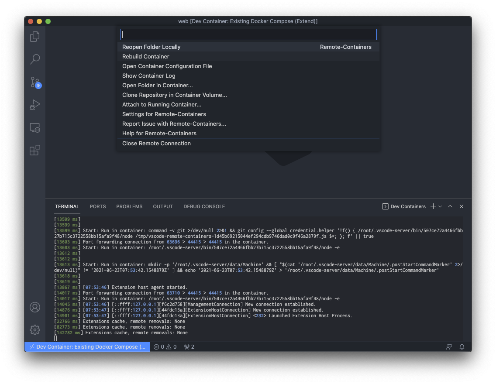

## ユーザー登録画面

それでは、ユーザー登録画面および、作成機能を作りましょう。

今まで学習した内容と殆ど変わらないため、サクッと学んでいきます。

`config/routes.rb`を開いて、下記のように修正してください。

```diff
  Rails.application.routes.draw do
-   resources :users, only: [:show, :edit, :update]
+   resources :users, only: [:new, :create, :show, :edit, :update]
    resources :bank_accounts, only: [:index, :show]
  end
```

`new`アクションがユーザー登録画面用、`create`アクションがユーザー登録機能用です。

続いて、`app/controllers/users_controller.rb`を開いて、下記のように修正しましょう。

```diff
  class UsersController < ApplicationController
-   before_action :set_user
+   before_action :set_user, except: [:new, :create]
    def show
    end

+   def new
+     @user = User.new
+   end
+
+   def create
+     @user = User.new(user_params)
+
+     if @user.save
+       redirect_to @user
+     else
+       render :new
+     end
+   end
+
    def update
      @user.update(user_params)
      redirect_to :user
    end

    private

    def set_user
      @user = User.find(params[:id])
    end

    def user_params
-     params.require(:user).permit(:name, :email_address)
+     params.require(:user).permit(
+       :name,
+       :email_address,
+       :date_of_birth,
+       :annual_income,
+       :industry_id,
+       :password,
+       :password_confirmation
+     )
    end
  end
```

差分が多いので説明していきます。

```rb
before_action :set_user, except: [:new, :create]
```

`set_user`は`id`からユーザーデータ取得する処理なので、作成を行なうための`new`、`create`には不要です。

なので、`except: [:new, :create]`と記述することで、`before_action`を実行するアクションから除外しています。

```rb
def new
  @user = User.new
end
```

ユーザーモデルのインスタンスを作成して、`@user`に代入することで、ユーザー登録画面に渡します。

それぞれのフィールド(`name`、`email_address`等)が空のまま渡します。

ルーティングは`GET /users/new`です。

```rb
def create
  @user = User.new(user_params)

  if @user.save
    redirect_to @user
  else
    render :new
  end
end
```

`create`アクションはユーザーモデルをデータベースに保存します。

ルーティングは`POST /users`です。

```rb
  @user = User.new(user_params)
```

まず、リクエストから`StrongParameter`を使用して、取得したハッシュでユーザーモデルを作成します。

```rb
  if @user.save
    redirect_to @user
  else
    render :new
  end
```

`save`メソッドはデータベースの作成が成功すると`true`を返却します。

失敗すると、`false`を返却します。なので、`if`で条件分岐をします。

```rb
    redirect_to @user
```

`redirect_to`メソッドは特定のアクションからリクエストを送信します。

`redirect_to @user`は`redirect_to user_url(@user)`の省略です。

つまり、`user_url(@user)`に対してリクエストを送信します。

`user_url(@user)`は`GET /users/1`のような`@user`の詳細画面へのルーティングを表しています。

ルーティングを確認しましょう。

```sh
$ docker compose exec web bin/rails routes
       Prefix Verb  URI Pattern                  Controller#Action
        users POST  /users(.:format)             users#create
     new_user GET   /users/new(.:format)         users#new
    edit_user GET   /users/:id/edit(.:format)    users#edit
         user GET   /users/:id(.:format)         users#show
              PATCH /users/:id(.:format)         users#update
              PUT   /users/:id(.:format)         users#update
bank_accounts GET   /bank_accounts(.:format)     bank_accounts#index
 bank_account GET   /bank_accounts/:id(.:format) bank_accounts#show
```

`users#show`をアクションの`Prefix`を見てください。`user`と記載されています。

`user_url`の`user`はこの`Prefix`の`user`です。

これらの規約から`redirect_to @user`と記載することで、`GET /users/:id`にリクエストを送信します。

```rb
    render :new
```

特に指示がない限り、Railsはアクションと同名のテンプレートを呼び出すと説明しました。

この`render`を使用することで、テンプレートを指定します。

`render :new`と記載することで`new.html.erb`を呼び出します。

`users_controller`から呼び出しているので`app/views/users/new.html.erb`が呼び出されます。

```rb
params.require(:user).permit(
       :name,
       :email_address,
       :date_of_birth,
       :annual_income,
       :industry_id,
       :password,
       :password_confirmation
     )
```

`Strong Parameter`で許可しているフィールドを増やしています。

ここで注目すべきは`password_confirmation`フィールドです。

これはよくWebページで使われるユーザー確認のためのフィールドです。`has_secure_password`によって自動で追加されます。

`has_secure_password`は、`password`フィールドと`password_confirmation`フィールドの値が異なるときに保存をブロックします。

コントローラーの変更は以上です。

`create`アクションのフローを再度確認しましょう。

1. リクエストからユーザーモデルを生成する
2. ユーザーモデルを保存する
3. 保存が成功すれば`GET /users/:id`にリダイレクトする
4. 保存が失敗すれば`app/views/users/new.html.erb`を表示する。

続いて、`app/views/users/new.html.erb`を追加して、下記のように修正してください。

```erb
<h1>ユーザー登録</h1>
<%= form_with(model: @user, local: true) do |form| %>
<div>
   <%= form.label :name, "名前" %><br>
   <%= form.text_field :name %>
</div>

<div>
   <%= form.label :email_address, "メールアドレス" %><br>
   <%= form.text_field :email_address %>
</div>

<div>
  <%= form.label :date_of_birth, "生年月日" %><br>
  <%= form.date_field(:date_of_birth, value: Date.new(1989, 1, 1)) %>
</div>

<div>
  <%= form.label :annual_income, "年収" %><br>
  <%= form.number_field :annual_income, step: "1000000" %>
</div>

<div>
  <%= form.label :industry_id, "業界" %><br>
  <%= form.collection_select :industry_id, Industry.all, :id, :name %>
</div>

<div>
   <%= form.label :password, "パスワード" %><br>
   <%= form.password_field :password %>
</div>
<div>
   <%= form.label :password_confirmation, "パスワード(確認)" %><br>
   <%= form.password_field :password_confirmation %>
</div>
<div><%= form.submit "登録する" %></div>
<% end %>
```

`app/views/users/new.html.erb`に生年月日、年収、年収、業界、パスワード、パスワード確認を追加したようなファイルになっています。

```erb
  <%= form.label :date_of_birth, "生年月日" %><br>
  <%= form.date_field(:date_of_birth, value: Date.new(1989, 1, 1)) %>
```

`date_field`は、`<input type="date" />`で日付ピッカーを作成します。

```erb
  <%= form.label :annual_income, "年収" %><br>
  <%= form.number_field :annual_income, step: "1000000" %>
```

`form.number_field`は、`<input type="number">`で数値フォームを作成します。

```erb
  <%= form.label :industry_id, "業界" %><br>
  <%= form.collection_select :industry_id, Industry.all, :id, :name %>
```

`form.collection_select`は、セレクトボックスを作成します。

下記のように使用します。

`collection_select(オブジェクトのフィールド名, オブジェクトの配列, value属性の項目に指定したいフィールド名, 表示したいフィールド名)`

```erb
   <%= form.label :password, "パスワード" %><br>
   <%= form.password_field :password %>
```

`form.password_field`は`<input type="password">`でマスクされたフォームを作成します。

それでは、<localhost:3000/users/new>を開いて確認してみましょう。

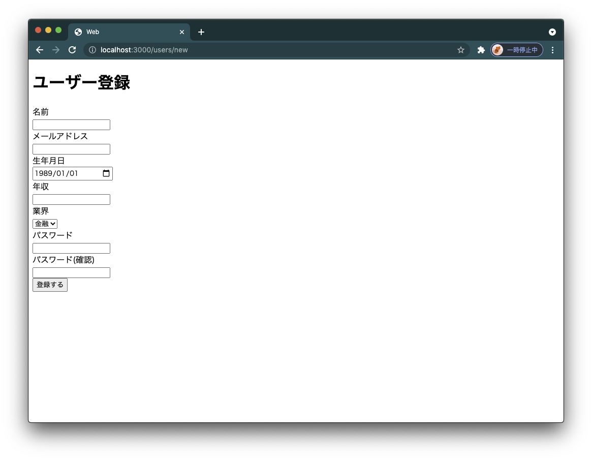

表示されました。

入力をして、ユーザーを作成してみてください。

データベースを`rails db`で見てみても良いでしょう。

## 表示の修正1

パスワードフォームとパスワード確認フォームで異なった値を入力して、`登録する`を押すとユーザーの保存はブロックされて、同一の画面が表示されます。

現状、登録が失敗したことを表示から判断できないので確認できるようにしましょう。

`app/controllers/users_controller.rb`を開いて、下記のように修正してください。(変更箇所以外を省略して表示しています。)

```diff
...
    def create
      @user = User.new(user_params)

      if @user.save
+       flash[:success] = "登録が完了しました"
        redirect_to @user
      else
+       flash[:error] = "登録が失敗しました"
        render :new
      end
    end
...
```

`flash`はページ上に表示するメッセージを格納するためのハッシュ変数です。

`redirect_to`や`render`の後に表示されるページ上で参照されます。

ここでは、成功時にもハッシュにメッセージを格納しています。

使い方を見てみましょう。

`app/views/users/new.html.erb`を下記のように修正してください。

```diff
+ <% flash.each do |message_type, message| %>
+   <div><%= message %></div>
+ <% end %>
  <h1>ユーザー登録</h1>
  ...
```

`flash`変数をループさせ、メッセージが格納されていれば、表示されます。

では、パスワードとパスワード確認を異なった値にして保存してみてください。

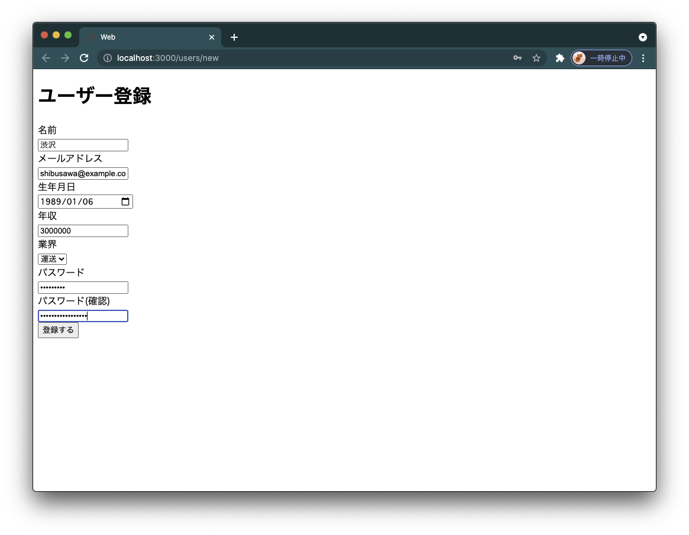

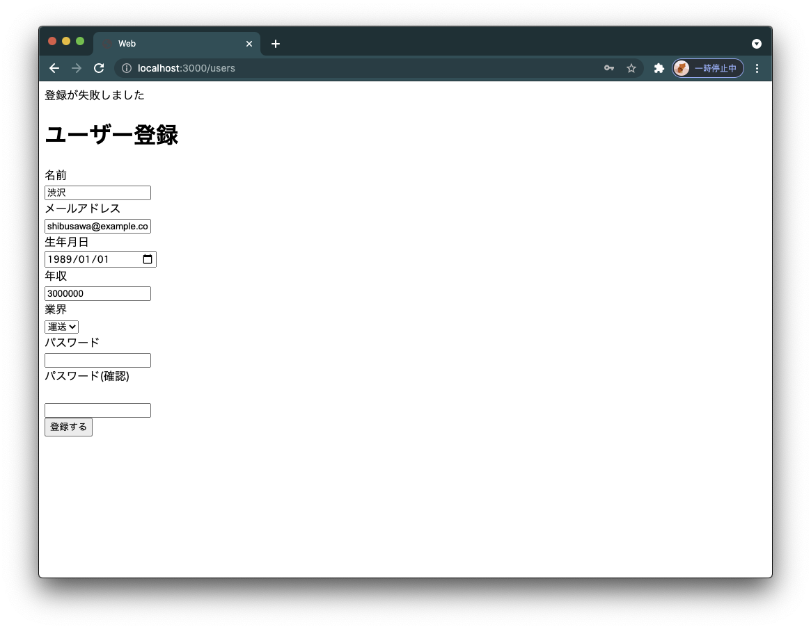

画面の最上部にメッセージが表示されました。

## 表示の修正2

続いて、成功時にリダイレクトされ、表示される`app/views/users/show.html.erb`も修正しましょう。

```diff
+ <% flash.each do |message_type, message| %>
+   <p><%= message %></p>
+ <% end %>
  <h1>ユーザー</h1>
  <p>名前: <%= @user.name %></p>
  <p>メールアドレス: <%= @user.email_address %></p>
  <p>生年月日: <%= @user.date_of_birth.strftime("%Y年%-m月%-d日") %></p>
  <p>年収: <%= number_to_currency(@user.annual_income, unit: "￥", strip_insignificant_zeros: true) %></p>
  <p><%= link_to '編集', edit_user_path %></p>
```

登録成功時に成功メッセージが表示されます。

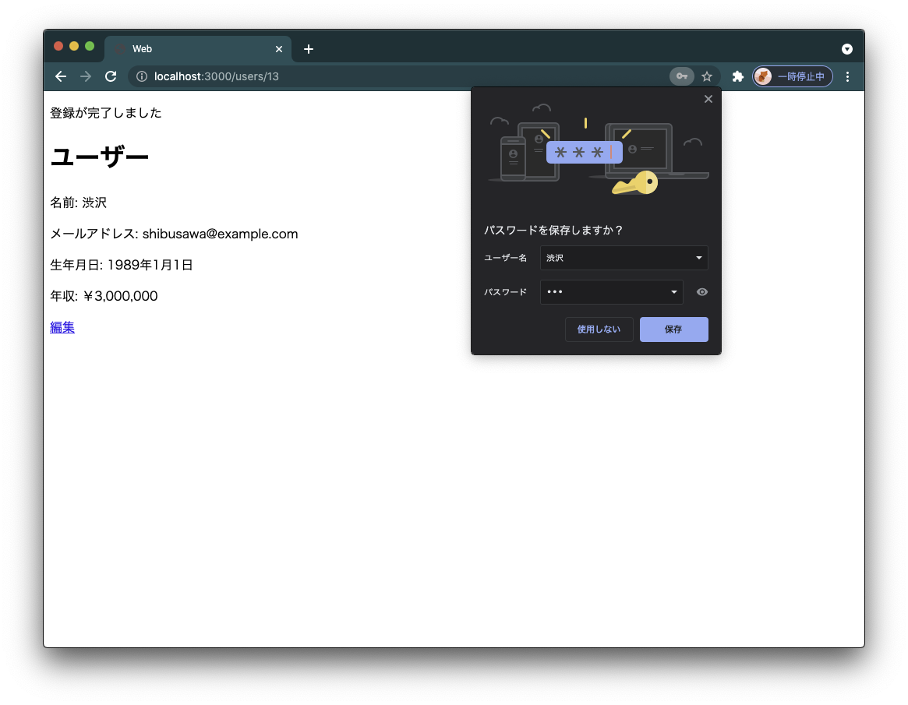

続いて、編集ページも登録ページに合わせておきましょう。

`app/views/users/edit.html.erb`を下記のように修正してください。

```diff
- <h1>ユーザー</h1>
+ <% flash.each do |message_type, message| %>
+   <div><%= message %></div>
+ <% end %>
+ <h1>ユーザー更新</h1>
  <%= form_with(model: @user, local: true) do |form| %>
  <div>
     <%= form.label :name, "名前" %><br>
     <%= form.text_field :name %>
  </div>

  <div>
     <%= form.label :email_address, "メールアドレス" %><br>
     <%= form.text_field :email_address %>
  </div>
+
+ <div>
+   <%= form.label :date_of_birth, "生年月日" %><br>
+   <%= form.date_field(:date_of_birth, value: Date.new(1989, 1, 1)) %>
+ </div>
+
+ <div>
+   <%= form.label :annual_income, "年収" %><br>
+   <%= form.number_field :annual_income, step: "1000000" %>
+ </div>
+
+ <div>
+   <%= form.label :industry_id, "業界" %><br>
+   <%= form.collection_select :industry_id, Industry.all, :id, :name %>
+ </div>
+
+ <div>
+    <%= form.label :password, "パスワード" %><br>
+    <%= form.password_field :password %>
+ </div>
+ <div>
+    <%= form.label :password_confirmation, "パスワード(確認)" %><br>
+    <%= form.password_field :password_confirmation %>
+ </div>
  <div><%= form.submit "更新する" %></div>
  <% end %>
```

`登録`という文言が`更新`という文言になっているだけです。

`app/controllers/users_controller.rb`を下記のように修正してください。

```diff
...
   def update
-    @user.update(user_params)
-    redirect_to :user
+    if @user.update(user_params)
+      flash[:success] = "更新が完了しました"
+      redirect_to @user
+    else
+      flash[:error] = "更新が失敗しました"
+      render :edit
+    end
   end
...
```

更新時にメッセージが表示されるか確認してください。

## ログイン機能

現状の実装だと、他人の口座情報や、購入の履歴を閲覧できてしまいます。

これを防ぐために、ブラウザを操作しているユーザーと閲覧しているデータの持ち主が同一かを確認する必要があります。

すべての画面でユーザー名とパスワードを入力し、認証しても良いですが、これは非常に使い勝手が悪いです。

そのため、操作の最初にログインを行って、その後のアクセスする複数のページの間でログイン情報を共有する必要があります。

このような、クライアントとサーバー間で情報を保持し、アクセスを制御するする仕組みを**セッション**といいます。

## Restful API

Railsアプリケーションはブラウザとの通信を`Resftful API`によって実現していると説明しました。

この`Restful API`の主要な特徴に**ステートレス**があります。

サーバーはURLとHTTPメソッドによって、操作をユニークに特定するため、サーバーはブラウザを記憶しません。

この理由から、「操作の最初にログインを行って、その後のアクセスする複数のページの間でログイン情報を共有する」というのは実現不可能です。

では、どのように実現するのでしょうか。

## HTTP Cookie

ログイン機能を実現するために、Railsアプリケーションでは、**Cookie**を使用します。

Cookieはサーバーからユーザーのブラウザに送信するデータです。

ブラウザに保存され、その後の送信されるリクエストと共にサーバーへ送信されます。

セッションの実現のために**Cookie**はよく使用されます。

それ以外にもユーザーの行動をトラッキングする目的などにも使用されます。

## Cookieを使用したログイン機能の流れ

Cookieを使用してどのようにログインを実装するのか確認しましょう。

1. (ブラウザ) ユーザー情報をログイン画面で入力し、サーバーにリクエストを送信します。

2. (サーバー) そのリクエスト内のユーザー情報(メールアドレス)を元にユーザーが実際に存在するかを確認します。

3. (サーバー) ユーザーが存在したら、パスワードが一致するかを確認することで、認証します。

4. (サーバー) 認証に成功したら、ユーザー情報を含んだCookieを作成します。

5. (サーバー) ブラウザにCookieを含んだHTTPレスポンスを返却します。

6. (ブラウザ) HTTPレスポンスからCookieを取り出して、ブラウザに保存します。

ここまでが、ログイン処理です。

続いて、ログインしていないとアクセスできない画面間の遷移の際にどんな処理が行われるかを確認しましょう。

1. (ブラウザ) ブラウザに保存しているCookieを取り出す

2. (ブラウザ) HTTPリクエストにCookieを含めてサーバーに送信する

3. (サーバー) Cookieからユーザー情報を取り出す

4. (サーバー) ユーザー情報を元にアクセス可能ならばHTTPレスポンスを返却する

ログアウトも確認しましょう。

1. (ブラウザ) ブラウザに保存しているCookieを取り出す

2. (ブラウザ) HTTPリクエストにCookieを含めてサーバーに送信する

3. (サーバー) Cookieからユーザー情報を削除する

4. (ブラウザ) HTTPレスポンスからCookieを取り出して、ブラウザに保存します。

ユーザーの情報がCookieから取り除かれるので、ログアウトの状態になります。

このようにCookieを使用することでセッションを実現しています。

だいたいの流れが理解できたでしょうか。

それでは実装していきましょう。

## ログイン機能に必要なルーティング

ログイン機能を実装するのに必要なルーティングは下記です。

- ログイン画面
- ログイン機能
- ログアウト機能

作成していきましょう。

Railsでは、ログインに関連するリソースを`sessions`(セッション)という名前で取り扱います。

下記を実行してください。

```sh
$ docker compose exec web bin/rails db:reset
Database 'web_development' does not exist
Database 'web_test' does not exist
Created database 'web_development'
Created database 'web_test'
$ docker compose exec web bin/rails g controller Sessions new
      create  app/controllers/sessions_controller.rb
       route  get 'sessions/new'
      invoke  erb
      create    app/views/sessions
      create    app/views/sessions/new.html.erb
      invoke  test_unit
      create    test/controllers/sessions_controller_test.rb
      invoke  helper
      create    app/helpers/sessions_helper.rb
      invoke    test_unit
      invoke  assets
      invoke    scss
      create      app/assets/stylesheets/sessions.scss
```

まず、`config/routes.rb`を確認しましょう。

```diff
  Rails.application.routes.draw do
+   get 'sessions/new'
    resources :users , only: [:new, :create, :show, :edit, :update]
    resources :bank_accounts, only: [:index, :show]
  end
```

`get 'sessions/new'`という行が追加されています。

`/login`をURLとしたいので変更しましょう。

Railsの規約から外れるため、`resources`は使用できません。

なので、`config/routes.rb`を下記のように修正します。

```diff
  Rails.application.routes.draw do
-   get 'sessions/new'
+   get 'login', to: 'sessions#new'
+   post 'login', to: 'sessions#create'
+   delete 'logout', to: 'sessions#destroy'
    resources :users , only: [:new, :create, :show, :edit, :update]
    resources :bank_accounts, only: [:index, :show]
  end
```

ログイン画面、ログイン機能、ログアウト機能すべてのルーティングを作成しました。

`sessions#destroy`は`logout`であることに注意してください。

## Login View Template

`app/views/sessions/new.html.erb`を開いてください。

```erb
<h1>Sessions#new</h1>
<p>Find me in app/views/sessions/new.html.erb</p>
```

`app/views/sessions/new.html.erb`を下記のように修正しましょう。

```diff
- <h1>Sessions#new</h1>
- <p>Find me in app/views/sessions/new.html.erb</p>
+ <% flash.each do |message_type, message| %>
+   <div><%= message %></div>
+ <% end %>
+ <h1>ログイン</h1>
+ <%= form_with(scope: :session, url: login_path, local: true) do |form| %>
+ <div>
+   <%= form.label :email_address, "メールアドレス" %><br>
+   <%= form.email_field :email_address %>
+ </div>
+ <div>
+   <%= form.label :password, "パスワード" %><br>
+   <%= form.password_field :password %>
+ </div>
+ <div><%= form.submit "ログイン" %></div>
+ <% end %>
```

今まで、`form_with`にはモデルを指定していました。

モデルを指定することで、`input`タグの`name`フィールドが`user[email_address]`のように指定されていました。

今回はモデルを指定していないため、`scope: :指定したい名前`と記載することで指定できます。

`session[email_address]`のように`name`フィールドを指定したいので、`scope: :session`としています。

`login_path`というのはルーティングで設定した、`post 'login', to: 'sessions#create'`の`Prefix+_path`の表現です。

`rails routes`を実行してみましょう。

```sh
$ docker compose exec web bin/rails routes
       Prefix Verb   URI Pattern                  Controller#Action
        login GET    /login(.:format)             sessions#new
              POST   /login(.:format)             sessions#create
              DELETE /login(.:format)             sessions#destroy
        users POST   /users(.:format)             users#create
     new_user GET    /users/new(.:format)         users#new
    edit_user GET    /users/:id/edit(.:format)    users#edit
         user GET    /users/:id(.:format)         users#show
              PATCH  /users/:id(.:format)         users#update
              PUT    /users/:id(.:format)         users#update
bank_accounts GET    /bank_accounts(.:format)     bank_accounts#index
 bank_account GET    /bank_accounts/:id(.:format) bank_accounts#show
```

```sh
       Prefix Verb   URI Pattern                  Controller#Action
        login GET    /login(.:format)             sessions#new
              POST   /login(.:format)             sessions#create
              DELETE /login(.:format)             sessions#destroy
```

`login`というPrefixが`/login`に対して設定されているのがわかると思います。

`POST /login`、`DELETE /login`に記載されていないのは上と同じことを表しています。

`/login_path`というのは`/login`を表しています。

`/login_url`というのは`http://www.example.com/login`のような完全なURLを表します。

使い分けは複雑なので、`redirect_to`は`Prefix+_url`を使用し、それ以外は`Prefix+path`を使用しましょう。

`app/views/sessions/new.html.erb`を下記のように記述しています。

```erb
...
<%= form_with(scope: :session, url: login_path, local: true) do |form| %>
...
```

この行以降は今まで学習した`form_with`の使用方法と変わりません。

## SessionController

`app/controllers/sessions_controller.rb`を開いてください。

```rb
class SessionsController < ApplicationController
  def new
  end
end
```

`new`アクションのみ生成されています。

`new`アクションからビューテンプレートになにか値を渡したり、処理をする必要はないので作成されたままの空の状態で大丈です。

続いて、`create`アクションを作成しましょう。


`app/controllers/sessions_controller.rb`を下記のように修正してください。

```diff
  class SessionsController < ApplicationController
    def new
    end

+   def create
+     user = User.find_by(email_address: session_params[:email_address])
+
+     if user&.authenticate(session_params[:password])
+       session[:user_id] = user.id
+       flash[:success] = "ログインしました"
+       redirect_to user
+     else
+       flash[:error] = "失敗しました"
+       render :new
+     end
+   end
+
+   private
+
+   def session_params
+     params.require(:session).permit(:email_address, :password)
+   end
  end
```

`session_params`は以前作成した`user_params`とやっていることは変わりません。

メールアドレスとパスワードだけを受け付けるようになっています。

このように大概のコントローラーに`**_params`と名付けて用意します。

`require`しているのが`session`であることに注意してください。

`create`アクションを見てみましょう。

```rb
user = User.find_by(email_address: session_params[:email_address])
```

まず、一行目で、受け取ったメールアドレスでユーザーが存在するかを確認します。

```rb
if user&.authenticate(session_params[:password])
```

この行ではユーザーモデルの`authenticate`メソッドを呼び出しています。

`&`が付与されています。これは`safe navigation operator`というものです。

`User.find_by(email_address: session_params[:email_address])`の結果が`nil`だったとします。(つまりユーザーがいなかった)

その場合に`user.authenticate`を呼び出した場合`nil`には`authenticate`はないので、`NoMethodError`というエラーが起こってしまいます。

それを防ぐためのものです。`&`をつけておくと、`nil`が返却されます。

下記のように記載するのと同義です。

```rb
if user.nil?
  render :new
else user&.authenticate(session_params[:password])
  session[:user_id] = user.id
  flash[:success] = "ログインしました"
  redirect_to user
else
  flash[:error] = "失敗しました"
  render :new
end
```

次の行では`session`という特殊なハッシュ変数に`user.id`を格納しています。

```rb
session[:user_id] = user.id
```

この`session`という変数がCookieに変換されてHTTPレスポンスに付与されると考えてください。

どのよう`session`を使用して、ログイン、ログアウトを実装するかは実装者次第です。

ですが、Railsアプリケーションでは一般的に、`session[:user_id]`に値が入っているときに、ログイン状態として取り扱います。

`session[:user_id]`に値が入っていない(`nil`)のときはログアウトしている状態として取り扱います。

ここで作成する、家計簿アプリでもそのように取り扱うこととします。

```rb
  redirect_to user
else
  flash[:error] = "失敗しました"
  render :new
```

成功時は、`/user/:id`にリダイレクトし、失敗時は`login`画面を再描画します。

それでは、ログインを行ってみましょう。

田中さんでログインしてみます。

メールアドレスとパスワードは`db/seeds.rb`に記載されています。

```rb
...
tanaka = User.create({
  name: "田中",
  email_address: "tanaka@example.com",
  date_of_birth: Time.parse("1990-01-01"),
  annual_income: 11000000,
  industry: financial_industry,
  banks: [bankA, bankB],
  password: 'tanaka@TANAKA@1234',
})
...
```

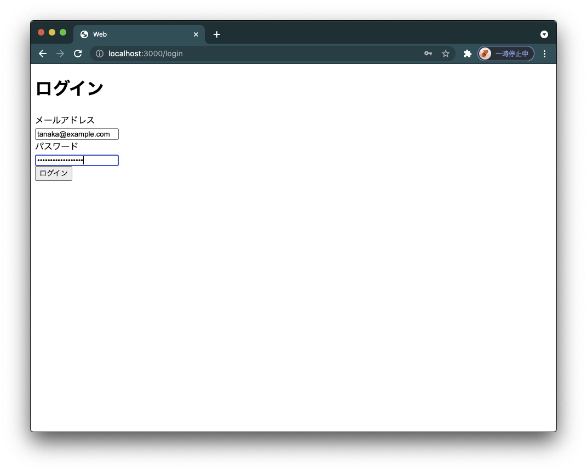

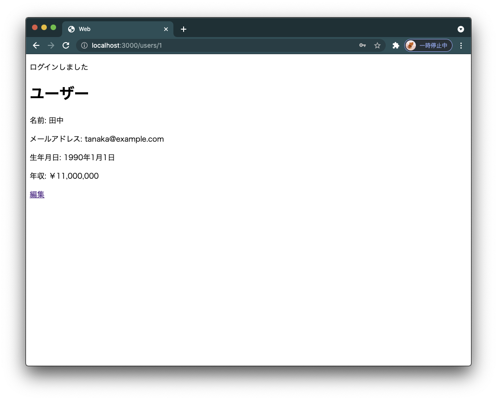

ログインすると、田中さんの詳細画面にリダイレクトされました。

誤ったパスワードを入力すると、失敗しましたと表示されるはずです。

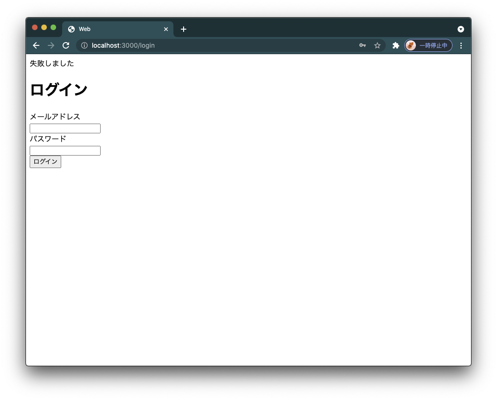

## ログアウト機能

では、続いてログアウト機能を実装しましょう。

`app/controllers/sessions_controller.rb`を下記のように修正してください。

```diff
  class SessionsController < ApplicationController
    def new
    end

    def create
      user = User.find_by(email_address: session_params[:email_address])

      if user&.authenticate(session_params[:password])
        session[:user_id] = user.id
        flash[:success] = "ログインしました"
        redirect_to user
      else
        flash[:error] = "失敗しました"
        render :new
      end
    end
+
+   def destroy
+     reset_session
+     flash[:error] = "ログアウトしました"
+     redirect_to login_url
+   end
+
    private

    def session_params
      params.require(:session).permit(:email_address, :password)
    end
  end
```

以前説明したように、`session[:user_id]`に値が入っていない(`nil`)のときはログアウトしている状態として取り扱います。

つまり、`session[:user_id] = nil`とするだけでもログアウトを表現できます。

しかし、`session`はログイン以外でも使用できます。

今後の開発で別の値を入れる可能性があるため、すべての要素を削除する特殊なメソッド`reset_session`を使って削除しましょう。

Flashメッセージの設定をしてから、ログインページにリダイレクトします。

とりあえず、ユーザー詳細画面からログアウトできるようにするために、`app/views/users/show.html.erb`を下記のように修正してください。

```diff
+ <nav>
+   <%= button_to 'ログアウト', logout_path, method: :delete %>
+ </nav>
  <% flash.each do |message_type, message| %>
    <p><%= message %></p>
  <% end %>
  <h1>ユーザー</h1>
  <p>名前: <%= @user.name %></p>
  <p>メールアドレス: <%= @user.email_address %></p>
  <p>生年月日: <%= @user.date_of_birth.strftime("%Y年%-m月%-d日") %></p>
  <p>年収: <%= number_to_currency(@user.annual_income, unit: "￥", strip_insignificant_zeros: true) %></p>
  <p><%= link_to '編集', edit_user_path %></p>
```

確認しましょう。

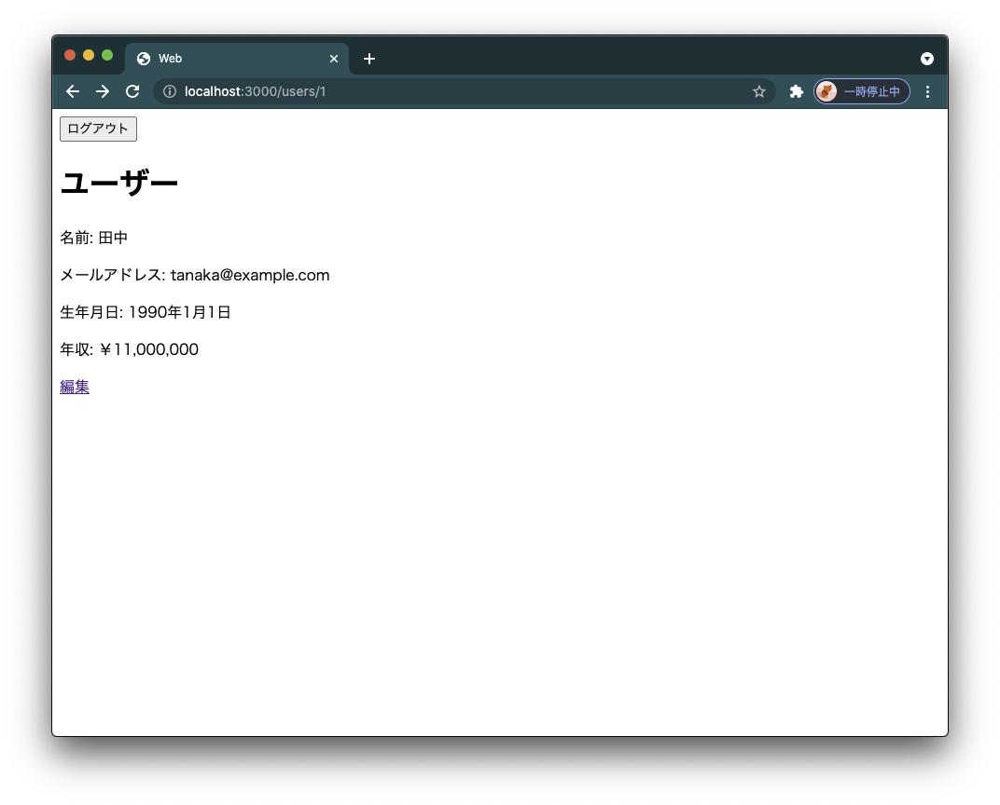


ログアウトボタンを押下すると、ログイン画面に遷移し、ログアウトしましたと表示されるはずです。

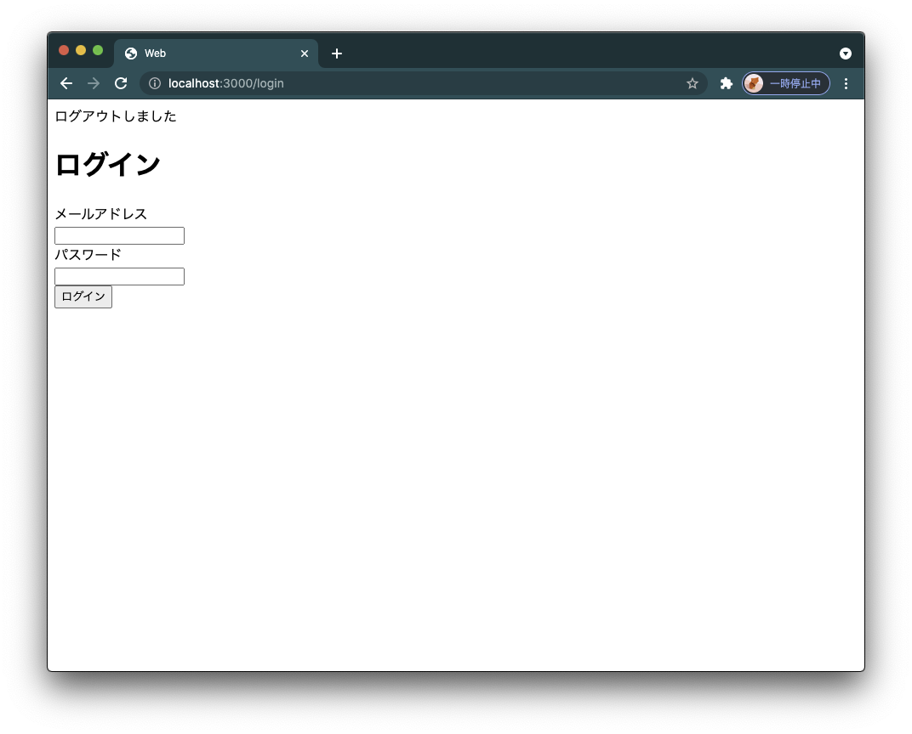

## ログインユーザーのみに機能を制限する

では、ログインしているユーザーのみが、自身のデータにアクセスできるようにしましょう。

まず、どんな機能があったか、あらためて確認しましょう。

`rails routes`を実行してください。

```sh
$ docker compose exec web bin/rails routes
       Prefix Verb   URI Pattern                  Controller#Action
        login GET    /login(.:format)             sessions#new
              POST   /login(.:format)             sessions#create
       logout DELETE /logout(.:format)            sessions#destroy
        users POST   /users(.:format)             users#create
     new_user GET    /users/new(.:format)         users#new
    edit_user GET    /users/:id/edit(.:format)    users#edit
         user GET    /users/:id(.:format)         users#show
              PATCH  /users/:id(.:format)         users#update
              PUT    /users/:id(.:format)         users#update
bank_accounts GET    /bank_accounts(.:format)     bank_accounts#index
 bank_account GET    /bank_accounts/:id(.:format) bank_accounts#show
```

これらのうち、ログインしているユーザーだけに機能を制限する必要があるのは、下記です。

```sh
    edit_user GET    /users/:id/edit(.:format)    users#edit
         user GET    /users/:id(.:format)         users#show
              PATCH  /users/:id(.:format)         users#update
              PUT    /users/:id(.:format)         users#update
bank_accounts GET    /bank_accounts(.:format)     bank_accounts#index
 bank_account GET    /bank_accounts/:id(.:format) bank_accounts#show
```

下記はログインしていなくても、実行可能なルーティングです。

```sh
        login GET    /login(.:format)             sessions#new
              POST   /login(.:format)             sessions#create
       logout DELETE /logout(.:format)            sessions#destroy
        users POST   /users(.:format)             users#create
     new_user GET    /users/new(.:format)         users#new
```

本人だけが、データにアクセスできるよう上記を修正しましょう。

## ApplicationController

ユーザー、銀行口座それぞれのアクションでログイン状況を判定する必要があります。

そのためには、`session`変数にアクセスして、idを取得し、ユーザーモデルを取得する処理をそれぞれのコントローラーに記述する必要があります。

下記のようなメソッドになるでしょう。

```ruby
def logged_in?
  !session[:user_id].nil?
end
```

`!`は真偽値を反転させます。`nil?`は`nil`のときに`true`を返しますので、`session[:user_id]`が`nil`のときに`!session[:user_id].nil?`は`false`を返します。

逆に`session[:user_id]`にidが入っている場合は`!session[:user_id].nil?`は`ture`を返します。

ちなみに、Rubyでは真偽値を返すメソッドは末尾に`?`をつけることが慣例です。

このようなメソッドをあらゆる箇所で記載するのは以前紹介した**DRY原則**に反しています。

なので、共通で利用するメソッドを使い回すようにする必要があります。

このために、`Application Controller`を使用します。

`app/controllers/users_controller.rb`を開いてください。

```rb
class UsersController < ApplicationController
...
end
```

`app/controllers/sessions_controller.rb`を開いてください。

```rb
class BankAccountsController < ApplicationController
...
end
```

`app/controllers/bank_accounts.rb`を開いてください。

```rb
class SessionsController < ApplicationController
...
end
```

すべてのコントローラーが`ApplicationController`を継承しているのがわかると思います。

`ApplicationController`に共通で使い回すメソッドを定義することで、それぞれのコントローラーで使い回すことができるようになります。

それでは、`app/controllers/application_controller.rb`を開いてください。

```rb
class ApplicationController < ActionController::Base
end
```

まだ、何も定義されていません。下記のように修正しましょう。

```diff
  class ApplicationController < ActionController::Base
+   before_action :require_login
+
+   def require_login
+     @current_user ||= User.find_by(id: session[:user_id]) if session[:user_id]
+     unless @current_user
+       flash[:error] = "ログインしてください"
+       redirect_to login_url
+     end
+   end
  end
```

`before_action: require_login`ですべてのアクションの実行前に`require_login`メソッドを実行します。

使用したくないアクションをコントローラー側で設定できますので、あとで設定します。

```rb
def require_login
  @current_user ||= User.find_by(id: session[:user_id]) if session[:user_id]
  unless @current_user
    flash[:error] = "ログインしてください"
    redirect_to login_url
  end
end
```

少しずつ分解して理解します。

```rb
@current_user || User.find_by(id: session[:user_id]) if session[:user_id]
```

この行でログインしているユーザーか確認しています。

`||=`は`||`と`=`を組み合わせた演算子です。

`||`は`a || b`のように使い、`a`が真の場合`a`を返し、`a`が偽なら`b`を返します。

`a ||= b`は`a`が真の場合、何もせず、`a`が偽の場合`b`を`a`に代入します。

```rb
@current_user || User.find_by(id: session[:user_id]) if session[:user_id]
```

これは、`@current_user`が真の場合、何もせず、偽の場合に`User.find_by(id: session[:user_id]) if session[:user_id]`を`@current_user`に代入します。

```rb
User.find_by(id: session[:user_id]) if session[:user_id]
```

これは`session[:user_id]`が真であれば、`User.find_by(id: session[:user_id])`の結果を返却します。

そして、`session[:user_id]`が偽であれば、`nil`を返却します。

```rb
unless @current_user
  flash[:error] = "ログインしてください"
  redirect_to login_url
end
```

`unless`は`if`の逆の意味なので、これは、`@current_user`が偽のときに`login_url`にリダイレクトします。

これで、全アクションの実行前に`require_login`が実行されます。

## skip_before_action

下記のルーティングは実行してほしくないので、`skip_before_action`メソッドを使用して、`before_action: require_login`を実行させないようにします。

```sh
        login GET    /login(.:format)             sessions#new
              POST   /login(.:format)             sessions#create
       logout DELETE /logout(.:format)            sessions#destroy
        users POST   /users(.:format)             users#create
     new_user GET    /users/new(.:format)         users#new
```

`app/controllers/sessions_controller.rb`を開いて下記のように修正してください。

```diff
  class SessionsController < ApplicationController
+   skip_before_action :require_login
+
    def new
    end
...
  end
```

これで、下記のルーティングの前に`login_before_required`が実行されなくなります。

```sh
        login GET    /login(.:format)             sessions#new
              POST   /login(.:format)             sessions#create
       logout DELETE /logout(.:format)            sessions#destroy
```

続いて、`app/controllers/users_controller.rb`を下記のように修正してください。

```diff
  class UsersController < ApplicationController
+   skip_before_action :require_login, only: [:new, :create]
+
    def show
    end
...
  end
```

`users#create`と`users#new`のみログインしていなくても実行できるようにしたいので、`only`で指定します。

それでは、動作を確認してみましょう。

ログインしてるときは、ユーザーのデータや、銀行口座にアクセスできます。

しかし、ログアウトしているときは、ログイン画面にリダイレクトされます。

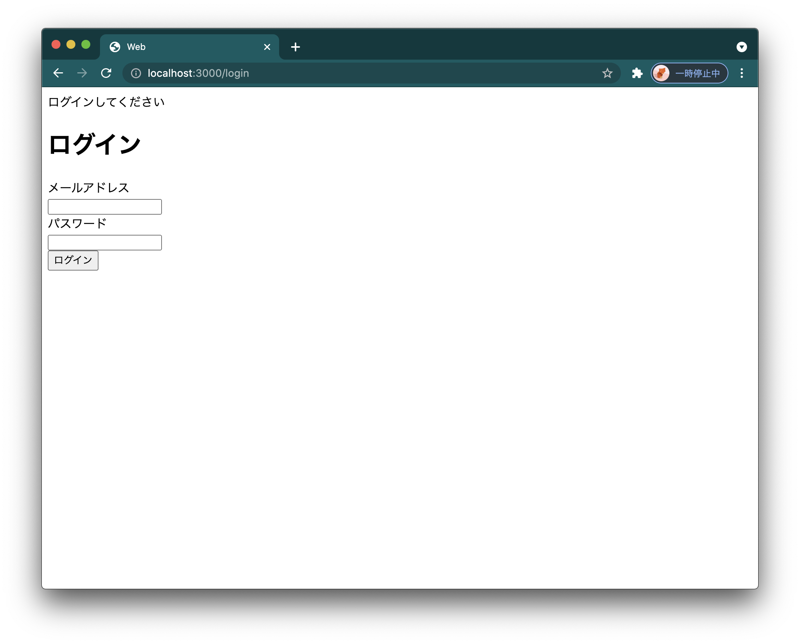

## 本人のデータのみ表示できるようにする

田中さんでログインした状態で、<http://localhost:3000/users/2>にアクセスしてみましょう。

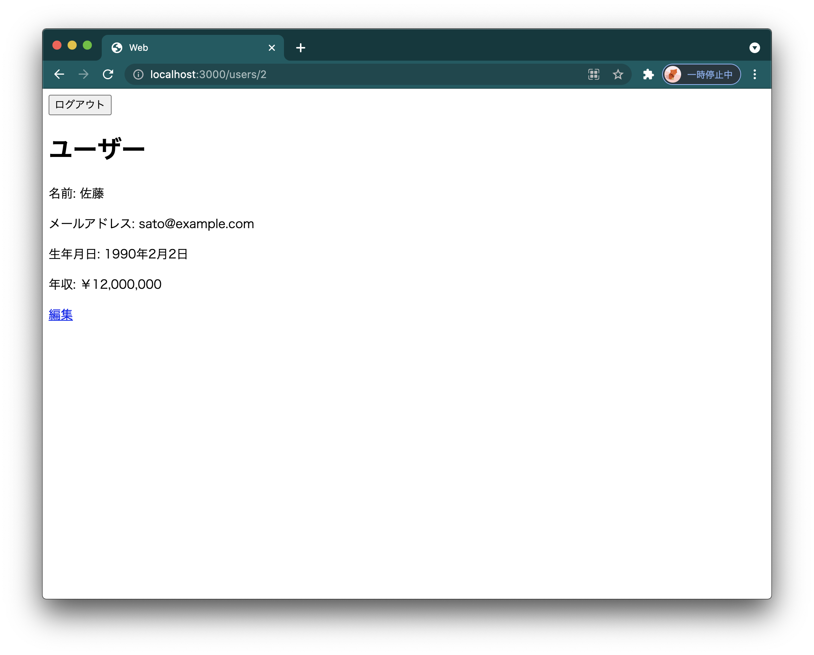

アクセスできてしまいます！これは良くないので、本人のデータでなければ、ユーザー詳細画面にリダイレクトするようにしましょう。

このような処理を**アクセス制御**といいます。

`app/controllers/users_controller.rb`を開いて、下記のように修正してください。

```diff
  class UsersController < ApplicationController
    skip_before_action :require_login, only: [:new, :create]
+   before_action :ensure_correct_user, except: [:new, :create]
    before_action :set_user, except: [:new, :create]
...
    private

    def set_user
      @user = User.find(params[:id])
    end

+   def ensure_correct_user
+     unless @current_user.id == params[:id].to_i
+       flash[:error] = "権限がありません"
+       redirect_to @current_user
+     end
+   end
+
...
  end
```

```rb
before_action :ensure_correct_user, except: [:new, :create]
```

`ensure_correct_user`は閲覧しているデータがログインしているユーザーのものか判定します。

`new`および`create`アクションでは、この確認は不要なので、`except`で除外しています。

```rb
def ensure_correct_user
  unless @current_user.id == params[:id].to_i
    flash[:error] = "権限がありません"
    redirect_to @current_user
  end
end
```

`set_user`は`id`からユーザーデータ取得する処理なので、作成を行なうための`new`、`create`には不要です。

なので、`except: [:new, :create]`と記述することで、`before_action`を実行するアクションから除外しています。

```rb
def ensure_correct_user
  unless @current_user.id == params[:id].to_i
    flash[:error] = "権限がありません"
    redirect_to @current_user
  end
end
```

`@current_user`は`require_login`によって設定されているので`UsersController`でも使用できます。

`params[:id]`と`@current_user.id`が同一でなければユーザー詳細ページにリダイレクトさせます。

`params[:id].to_i`の`to_i`は数字の文字列を整数に変換するためのメソッドです。

`params[:id]`は`'1'`のようにユーザーのidが格納されているので変換が必要です。

それでは、動作を確認してみましょう。

田中さんでログインして、<http://localhost:3000/users/3>にアクセスしてください。

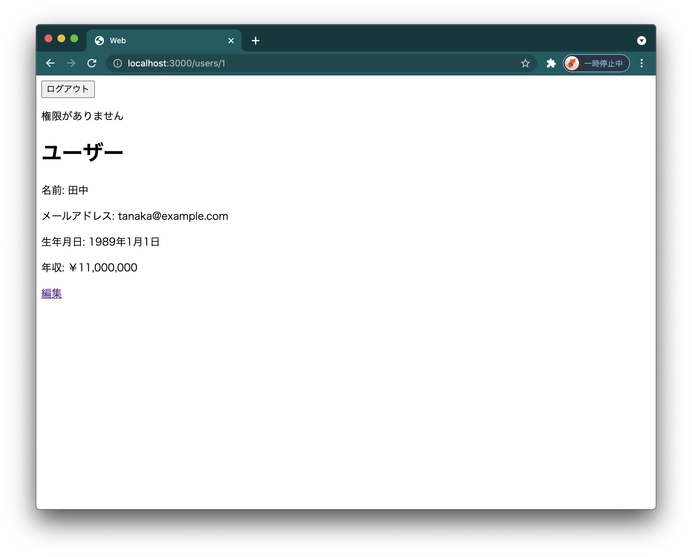

アクセスがブロックされて、自分のユーザー詳細ページにリダイレクトしました。

`app/controllers/bank_accounts_controller.rb`も修正しましょう。

下記のように修正してください。

```diff
  class BankAccountsController < ApplicationController
+   before_action :set_bank_account, only: [:show]
+   before_action :ensure_correct_user, only: [:show]

    def index
-     @bank_accounts = BankAccount.all.includes(:user, :bank)
+     @bank_accounts = @current_user.bank_accounts.includes(:user, :bank)
    end

    def show
-     @bank_account = BankAccount.find(params[:id])
    end
+
+   private
+
+   def set_bank_account
+     @bank_account = BankAccount.find(params[:id])
+   end
+
+   def ensure_correct_user
+     unless @current_user.id == @bank_account.user.id
+       flash[:error] = "権限がありません"
+       redirect_to @current_user
+     end
+   end
  end
```

`before_action`で`set_bank_account`と`ensure_correct_user`を実行しています。

実行の順序は上に記述したものからされるので、`set_bank_account` => `ensure_correct_user`の順です。

`show`アクションのみに制限しています。

`ensure_correct_user`は`app/controllers/bank_accounts_controller.rb`に記述したものが実行されるので注意してください。

`app/controllers/users_controller.rb`の`ensure_correct_user`は実行されません。

```rb
def set_bank_account
  @bank_account = BankAccount.find(params[:id])
end
```

@bank_accountに銀行口座を代入します。

```rb
def ensure_correct_user
  unless @current_user.id == @bank_account.user.id
    flash[:error] = "権限がありません"
    redirect_to @current_user
  end
end
```

`set_bank_account`で代入した`@bank_account`のユーザーidとログインユーザーのidが異なる場合にユーザー詳細ページにリダイレクトします。

```rb
def index
  @bank_accounts = @current_user.bank_accounts.includes(:user, :bank)
end
```

すべての銀行口座を取得するのではなく、ログインユーザーの銀行口座のみを取得するように修正しています。

アクセス制御の設定ができたので、確認しましょう。

田中さんでログインして、<http://localhost:3000/bank_accounts>

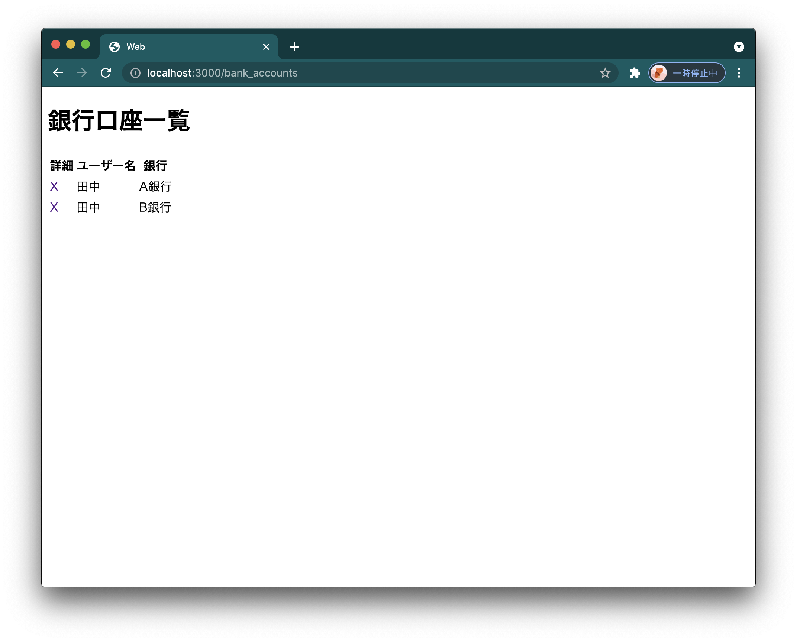

田中さんの銀行口座のみが、表示されるようになりました。

田中さんの銀行口座ではないデータにアクセスしてみましょう。

<http://localhost:3000/bank_accounts/3>


アクセスがブロックされて、自分のユーザー詳細ページにリダイレクトしました。

ログイン、ログアウトおよび、アクセス制御の実行が完了しました。

## おわりに

ログイン機能が実装されて、アプリらしくなってきたのではないでしょうか。

ログインには`has_secure_password`を使用しましたが、実装はサービスによってまちまちです。

自分で実装したり、外部サービスやgemに任せたりさまざまです。

[Devise](https://github.com/heartcombo/devise)等です。

ぜひ調べてみてください。

(VS Codeで立ち上げたコンテナは以前やったように左下の`Dev Container: Existing Docker Compose (...`をクリックし、`Close Remote Connection`で閉じておきましょう。)

途中でコード全体がよくわからなくなってしまった場合は[finish](https://github.com/burning-tech-dev/model2-training/tree/finish)ブランチに最後の状態のコードがあるので見てみてください。
