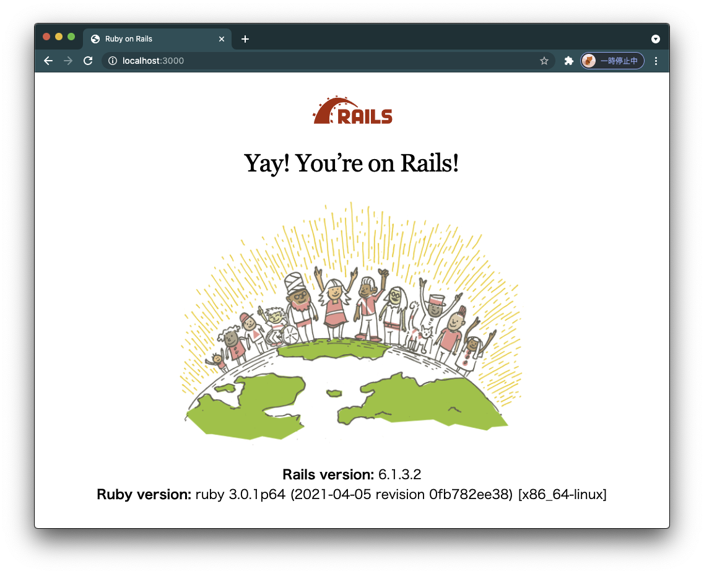
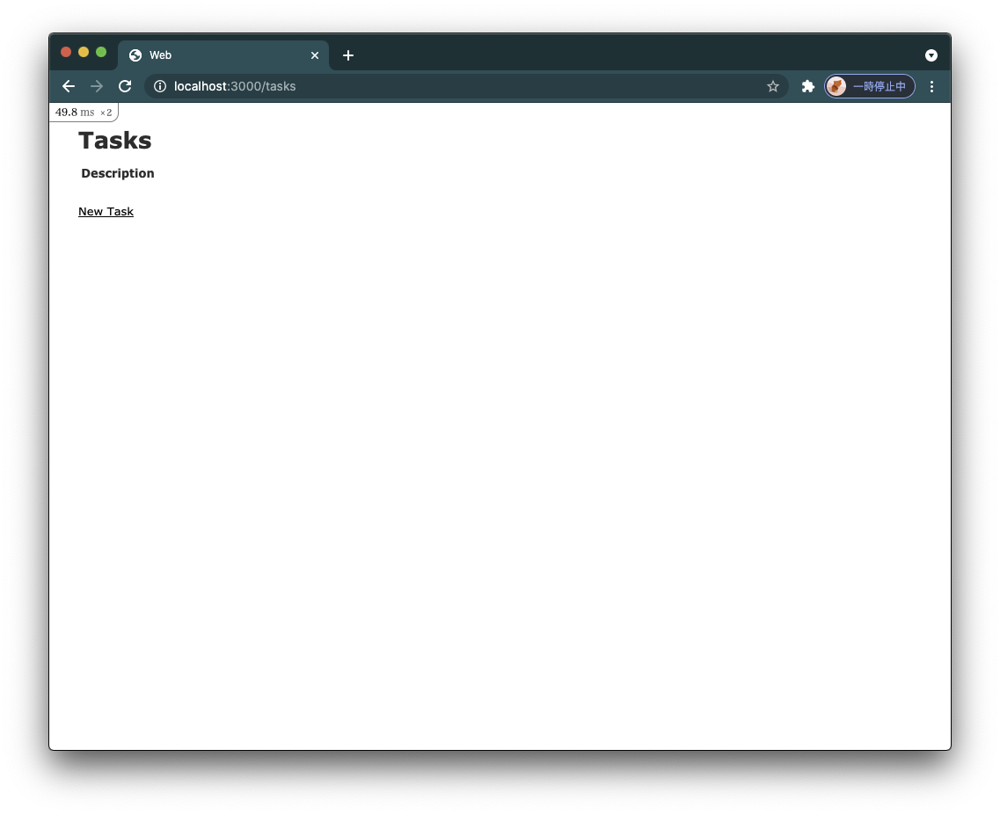
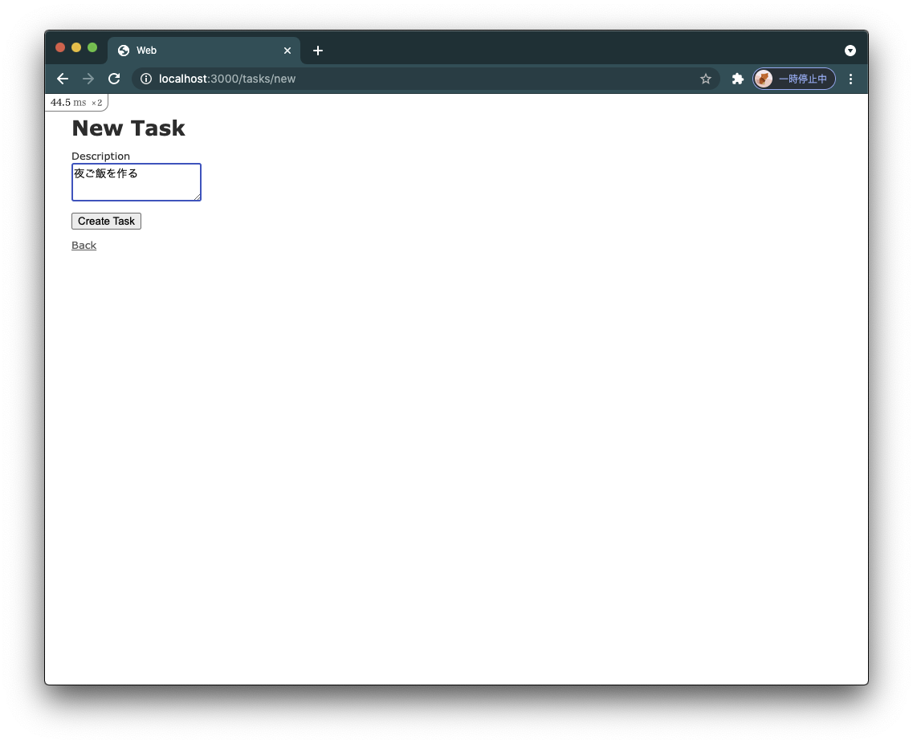
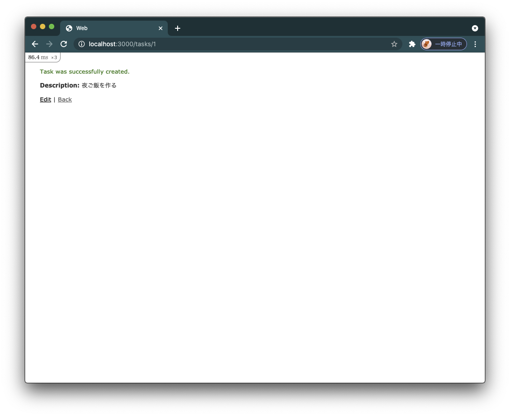
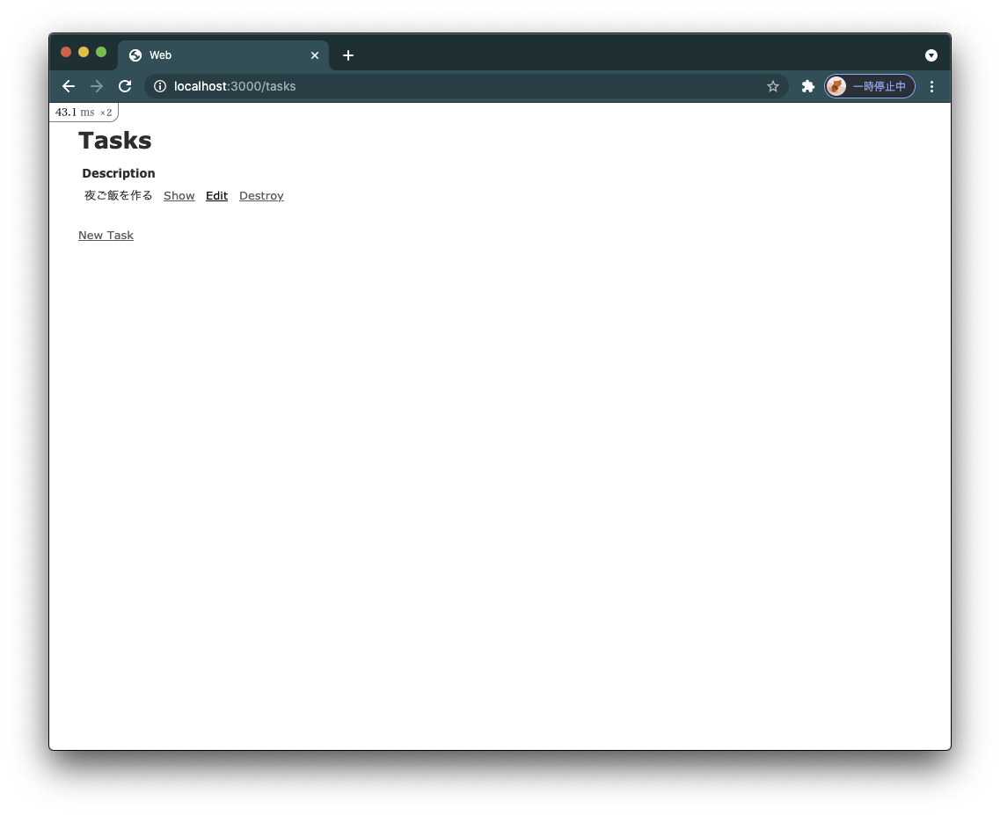
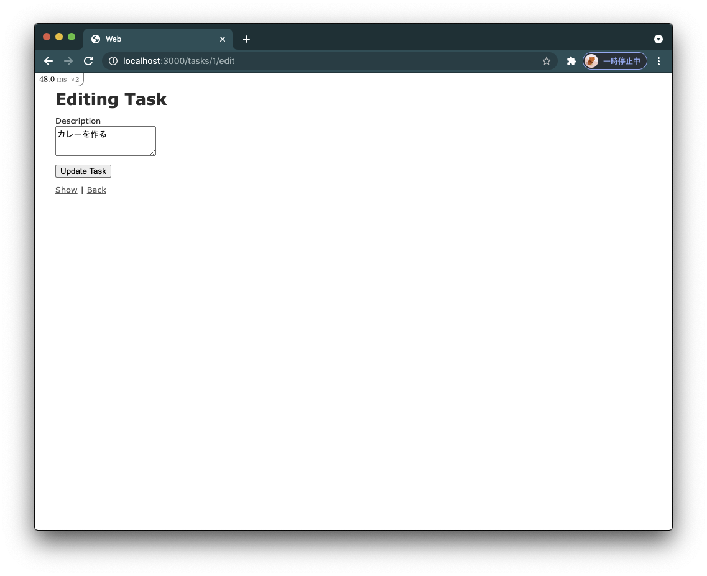
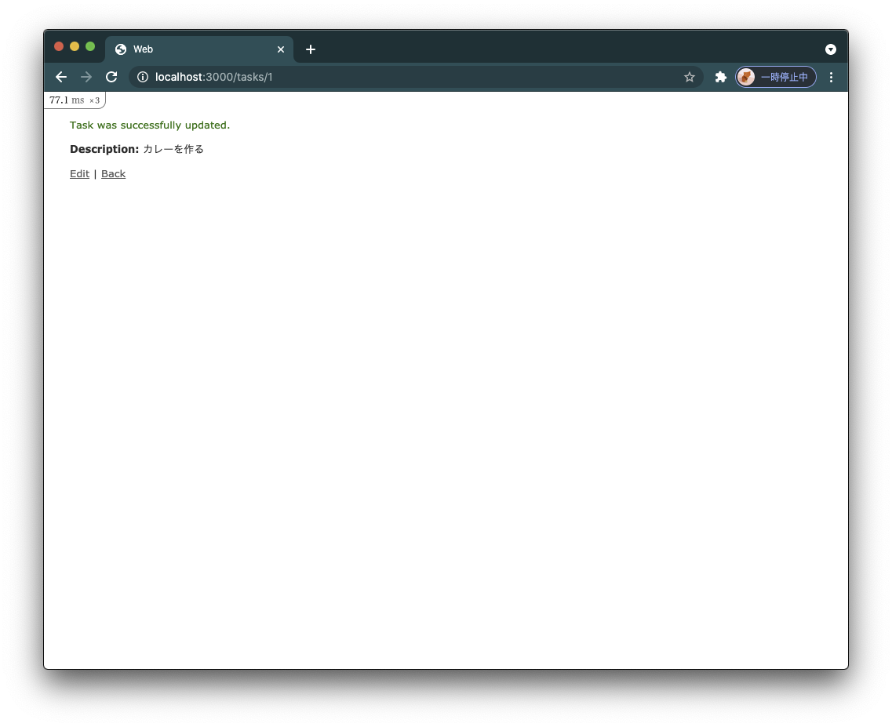
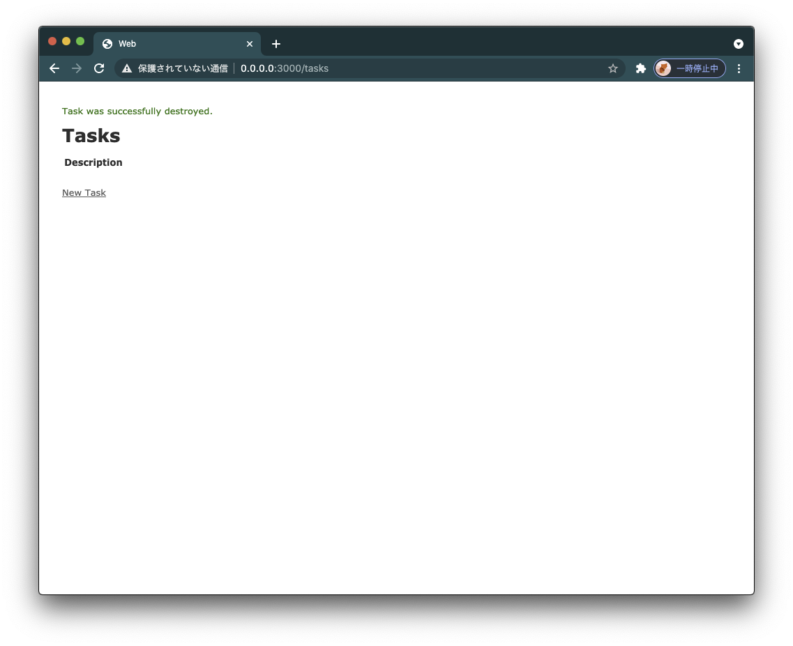

# Ruby on Rails

本チャプターからRuby on Railsを使用してWebアプリケーションの開発に入っていきます。

本チャプターではとにかく以下のポイントのみに絞って学習していきます。

- Ruby on Railsとは何なのか
- どのようなものをつくることができるのか
- どのように開発していくのか

上記を完全に理解することのみに注力してください。

## Ruby on Railsとは

Ruby on Railsとは[DHH](https://twitter.com/dhh)が開発したWebアプリケーションフレームワークです。

Ruby製で、オープンソースで開発が進められています。

Ruby on Rails製の日本のサービスは非常に多くあります。

- [Cookpad](https://cookpad.com/)
- [Freee](https://www.freee.co.jp)

世界でも使われています。

 - [Airbnb](https://www.airbnb.jp/)
 - [Hulu](https://www.hulu.jp/static/5/)

ここでは2つずつ紹介しましたが、調べてみると無数にあります。

「Webサービスを作りたい」と思ったら大概のものが作れると思って構わないでしょう。

## Ruby on Railsが担うもの

`Ruby on Rails`はさまざまなアプリケーションを作ることができます。

その中でももっとも基本的なものが**アプリケーションサーバー**としての機能です。

アプリケーションサーバーとは**Webサーバー**の一種です。

WebサーバーとはHTMLドキュメントやそれに付随するCSS、JavaScriptファイル等を格納するコンピュータ上のソフトウェアです。

WebサイトのURLからインターネットを返して、それらのコンテンツをブラウザ等を通して提供します。

それらのWebサーバーの中でもデータベースに格納されたデータや、ブラウザ上の操作によって提供するコンテンツを変化させるサーバーをアプリケーションサーバーといいます。

このチャプターではアプリケーションサーバーとしての`Ruby on Rails`の機能を理解していきましょう。

## セットアップ

いつものようにリポジトリのセットアップをしましょう。

この章では、リポジトリを一から作っていきます。

`~/code/burning-tech`に移動してください。

```sh
$ cd ~/code/burning-tech
```

教材リポジトリをクローンします。

```sh
$ git clone https://github.com/burning-tech/rails-training.git
$ cd rails-training
```

最終的な成果物は[rails-training](https://github.com/burning-tech/rails-training.git)にありますので動かなかったり、わからない箇所があれば参考にしてみてください。

本チャプターでもいつものように適宜、`git`管理をしてください。

```sh
$ git init
```

そして`~/code/burning-tech/rails-training`をワークスペースとしてVS Codeで開いてください。

## Railsアプリに必要な4つのファイルの作成

まず、Railsアプリを構成するために必要なDockerイメージを作成するために4つのファイルを作成します。

- Dockerfile
- docker-compose.yml
- Gemfile
- Gemfile.lock

下記コマンドで4つのファイルを作成してください。

VS Codeで作成しても構いません。

```sh
$ touch Dockerfile
$ touch docker-compose.yml
$ touch Gemfile
$ touch Gemfile.lock
```

<https://github.com/burning-tech-dev/rails-training/tree/first>に4つのファイルをおいてあります。

わからなければ参考にしてください。

### Dockerfile

まず、`Dockerfile`を下記のように編集してください。

```Dockerfile
FROM ruby:3.0.1

RUN apt-get update -qq
RUN apt-get install -y build-essential default-mysql-client

RUN mkdir /web
WORKDIR /web

COPY Gemfile /web/Gemfile
COPY Gemfile.lock /web/Gemfile.lock

RUN bundle install

COPY . /web
```

`FROM ruby:3.0.1`で`ruby`のバージョン`3.0.1`をビルドイメージとして設定しています。

```Dockerfile
RUN apt-get update -qq
RUN apt-get install -y build-essential default-mysql-client
```

`apt-get`コマンドは`Ubuntu`のパッケージ管理ツールです。このコマンドを通して別のコマンドをインストールします。

`apt-get update`はインストールできるコマンドのリストを最新化します。

`--qq`コマンドラインフラグはエラー以外を非表示にします。

`apt-get install`でコマンドをインストールします。

`build-essential`は複数のベーシックなパッケージをインストールします。

どんなパッケージがインストールされるかはあまり意識する必要ありません。

`default-mysql-client`はMySQLサーバーの状態を確認するためのMySQLクライアントです。

`-y`コマンドラインフラグは`apt-get install`コマンドの途中で`Yes`か`No`を問われることがあるのですが、すべて、`Yes`を選択するようにします。

```Dockerfile
RUN mkdir /web
WORKDIR /web
```

作業用のディレクトリを作成し、ワーキングディレクトリとして設定をしています。

```Dockerfile
COPY Gemfile /web/Gemfile
COPY Gemfile.lock /web/Gemfile.lock
```

`Gemfile`と`Gemfile.lock`を作業用のディレクトリにコピーします。

```Dockerfile
RUN bundle install
```

`Gemfile`を元に`bundle install`で`Ruby gem`をインストールします。

```Dockerfile
COPY . /web
```

ローカルのカレントディレクトリをDockerイメージ内の作業用のディレクトリにコピーしています。

### docker-compose.yml

まず、`docker-compose.yml`を下記のように編集してください。

```yml
version: '3.4'

services:
  web:
    build: .
    command: bin/rails server -b '0.0.0.0'
    volumes:
        - ./:/web:delegated
    ports:
      - "3000:3000"
    depends_on:
      - db

  db:
    image: mysql:5.7.25
    environment:
      MYSQL_ALLOW_EMPTY_PASSWORD: "true"
    volumes:
    - mysql-data:/var/lib/mysql:delegated

volumes:
  mysql-data:
    driver: local
```

Dockerのチャプターと重複する内容もありますが、復習も兼ねて説明していきます。

本チャプターから`docker-compose.yml`で2つの`Docker`コンテナを作成していきます。

`services`の直下にある`web`と`db`という2つです。これらを**サービス**といいます。

サービスとはコンテナと同じと考えてもらえればよいです。

- `web` => `Rails`アプリケーション用
- `db` => `MySQL`用

それぞれ`web`、`db`は私が決めただけでどんな名前をつけても構いません。

```yml
volumes:
  mysql-data:
    driver: local
```

ボリュームとはDockerコンテナ内で生成されたデータをコンテナが破棄されたあとも保持するためのものです。

`mysql-data`というボリュームを作成しています。

ではサービスを見ていきましょう。

まず、シンプルな`db`を見ていきます。

```yml
  db:
    image: mysql:5.7.25
    environment:
      MYSQL_ALLOW_EMPTY_PASSWORD: "true"
    volumes:
    - mysql-data:/var/lib/mysql:delegated
```

`image`で`MySQL`のバージョン`5.7.25`を指定しています。

このように`Dockerfile`を使用せず、公開されている`Docker`イメージを直接指定できます。

`environment`は環境変数を設定するオプションです。

> 環境変数とはOSがよく使う値を自由に使えるように準備してくれている便利機能

と説明しましたが、もう少しだけ説明すると、OSが動いているときに使える変数です。

つまり、実行ごとに変更できます。

ここでは`MYSQL_ALLOW_EMPTY_PASSWORD`という環境変数に`"true"`を設定しています。

これを設定しておくとパスワードを設定する必要がなくなります。

実際のサービスでは使用しないでください。

`volumes`では、`mysql-data`ボリュームとコンテナ内の`/var/lib/mysql`をマウントしています。

`/var/lib/mysql`とは実際にデータベースに格納されるデータの置き場です。

つまり`mysql-data`とマウントしておけば、コンテナを削除しても`mysql-data`にデータが残ります。

コンテナを再起動したときは`mysql-data`ボリュームがコンテナの中の`/var/lib/mysql`にマウントされるのでコンテナ削除前と同じ内容を使用できます。

このようにボリュームとコンテナ内の特定のディレクトリをマウントすることを**ボリュームマウント**といいます。

一方でローカルの特定のディレクトリとのマウントを**バインドマウント**といいます。

`delegated`をつけると、コンテナと、ボリュームの動機に遅延が発生する代わりに高速になります。

続いて、`web`を見ていきます。

```yml
  web:
    build: .
    command: bin/rails server -b '0.0.0.0'
    volumes:
        - ./:/web:delegated
    ports:
      - "3000:3000"
    depends_on:
      - db
```

`build: .`はカレントディレクトリから`Dockerfile`を探してビルドしてもらうための設定です。

`Dockerfile`という名前を使用しない場合は下記のように記述します。(下記では`docker`というディレクトリの`Dockerfile_hoge`を指定)

```yml
  web:
    build:
      context: docker
      dockerfile: Dockerfile_hoge
```

続いて`command`です。

```yml
    command: bin/rails server -b '0.0.0.0'
```

`docker compose up`で実行されるコマンドです。

`Rails`アプリケーションを起動します。ここでは理解する必要ありません。

続いて`volumes`です。

```yml
    volumes:
        - ./:/web:delegated
```

ローカルのカレントディレクトリとコンテナ内の`/web`をバインドマウントしています。

続いて`ports`です。
コンテナの内外のポート同士をつなげます。

`3000`番ポート同士をつなげます。

これにより、ローカルから`3000`番ポートを通してコンテナ内に接続できるようになります。

最後に`depends_on`です。

```yml
    depends_on:
      - db
```

`depends_on`に`db`を指定しています。これで`db`の起動後に`web`を起動するようになります。

起動順序をコントロールするための設定です。

### Gemfile

`Gemfile`を下記のように修正してください。

```Gemfile
source 'https://rubygems.org'
gem 'rails', '6.1.3.2'
```

`Ruby on Rails`の`gem`をバージョン`6.1.3.2`を指定しています。

### Gemfile.lock

`Gemfile.lock`は空のままで構いません。

## rails new

それでは`Ruby on Rails`アプリケーションの雛形を作成しましょう。

```sh
$ docker compose run --rm web rails new . --force --database=mysql --minimal
root@4154cfef9281:/web#
```

`docker compose run --rm web`以降が`rails`用のコマンドです。

`rails new . --force --database=mysql --minimal`です。

- `rails new`

`rails new`コマンドが`Rails`アプリケーションの雛形を生成するコマンドです。

どんな`Rails`アプリケーションもこのコマンドから作成されているはずです。

- `.`

`.`で現在のディレクトリに`Rails`アプリケーションに必要なファイルを自動生成してくれます。

新しいディレクトリを作ってそこに作成してほしい場合は`.`ではなく任意のディレクトリ名にしてください。

- `--force`

すでに同名のファイルが存在する場合でも上書きをします。`Gemfile`と`Gemfile.lock`を上書きしてほしいので指定しています。

- `--database=mysql`

指定して、データベースに`MySQL`を指定しています。

- `--minimal`

デフォルトだと機能が山盛りですので、このフラグでプリミティブな機能のみインストールされるようにします。

それでは生成されたファイル、`Bundler`管理の`gem`をDockerイメージに取り込みたいので再度ビルドします。

```sh
$ docker compose build
```

## Railsアプリケーションの構成

多くのディレクトリとファイルが生成されました。

いっぱいあるように感じると思いますが、一つ一つ役割は明確で、いつも触れるものはほんの一握りです。

主要なものだけ理解していきましょう。

| ディレクトリ/ファイル | -                                                 |
| -                     | -                                                 |
| app/                  | 実際に開発するアプリケーションのコード置き場　    |
| bin/                  | Railsアプリケーション開発のためのコマンド置き場   |
| config/               | アプリケーションの設定ファイル置き場              |
| db/                   | データベースに関する設定ファイル置き場            |
| lib/                  | 複数のアプリケーション間で共有するコード置き場    |
| log/                  | ログの出力先                                      |
| public/               | 画像などのファイル置き場                          |
| test/                 | テストコード置き場                                |
| .gitignore            | Git管理対象から外したいファイルを記載するファイル |

この中でいつも触れるものは`app`と`db`と`test`ぐらいです。

`bin`、`config`も重要なディレクトリなので一つ一つ説明していきます。

### app/

アプリケーションのコードはこの中に記述していくため、このディレクトリ内のコードを編集する時間がもっとも長くなるはずです。

主に下記の3つが重要なディレクトリです。

- controllers
- models
- views

この3つのディレクトリにコードを記述し、アプリケーションを開発していきます。

これらはそれぞれ、担う役割が異なり、`Controller`、`Model`、`View`という3つの役割のために存在します。

このようにアプリケーションコードを`Controller`、`Model`、`View`の3つの役割に分割するアプリケーションアーキテクチャを*MVCアーキテクチャ*といいます。

*MVCアーキテクチャ*は以降で詳細に説明します。

### bin/

このディレクトリは`Bundler`を通して実行できるコマンドを`bundle exec`をつけることなく実行できるようにするためのコマンドをおいておくディレクトリです。

このようなコマンドを`binstub`といいます。

その他、プロジェクト内で使用したいコマンドも保存します。

### config/

アプリケーションの起動時等に必要な設定を定義するディレクトリです。

データベースへの接続情報やURLとアプリケーションを結びつけるファイルが置かれています。

後ほど詳細な説明をします。

### db/

データベースのテーブル定義などを格納するディレクトリです。

テーブル定義はまだ準備していないので、ほとんど空です。

一つだけ`seeds.rb`があります。これは初期データを投入するためのファイルです。

使用する際に説明します。

## rails db:create

それでは、データベースの接続をしましょう。

`config/database.yml`を開いてください。

これがデータベースとの接続情報の設定ファイルです。

下記のように修正します。

```diff
  # MySQL. Versions 5.5.8 and up are supported.
  #
  # Install the MySQL driver
  #   gem install mysql2
  #
  # Ensure the MySQL gem is defined in your Gemfile
  #   gem 'mysql2'
  #
  # And be sure to use new-style password hashing:
  #   https://dev.mysql.com/doc/refman/5.7/en/password-hashing.html
  #
  default: &default
    adapter: mysql2
    encoding: utf8mb4
    pool: <%= ENV.fetch("RAILS_MAX_THREADS") { 5 } %>
    username: root
    password:
-   host: localhost
+   host: db
```

`docker-compose.yml`のサービス名を指定してください。

この詳細な説明は割愛しますが、知りたい場合はAppendixを参照してください。

Dockerが裏で色々やってくれるおかげで、`db`を指定できると考えてください。

`config/database.yml`の下記のような記述を見てください。

```yml
...
development:
  <<: *default
  database: web_development                                             <- ここ

# Warning: The database defined as "test" will be erased and
# re-generated from your development database when you run "rake".
# Do not set this db to the same as development or production.
test:
  <<: *default
  database: web_test                                                    <- ここ
...
```

上記の`web_development`は`development`つまり開発用のデータベースの名前です。
`web_test`は`test`用のデータベース名です。ディレクトリ名から自動的に決められています。
なので、`database: ~~~~~`の記載を修正すれば変更できます。
`web_development`および、`web_test`はまだ作られていません。作成しましょう。

```sh
$ docker compose run --rm web rails db:create
Created database 'web_development'
Created database 'web_test'
```

`web_development`と`web_test`が作成されました。

これでアプリケーションの準備が整いました。

## rails server

Railsアプリケーションサーバーを起動しましょう！

```sh
$ docker compose up
```

ブラウザで<localhost:3000>にアクセスしてください。

以下が表示されるはずです！



これで開発への準備が整いました！

最終的なコードは<https://github.com/burning-tech-dev/rails-training/tree/hello>で確認できます。

## Railsの開発を体感する

では、より`Rails`の開発について学んでいきましょう。

別のターミナルを`Cmd` + `N`キー等で開いてください。

実行しているコンテナを`docker compose down`で落としましょう。

```sh
$ docker compose down
[+] Running 3/3
 ⠿ Container rails-training_web_1  Removed                                                                                                                                      1.3s
 ⠿ Container rails-training_db_1   Removed                                                                                                                                      1.4s
 ⠿ Network rails-training_default  Removed                                                                                                                                      5.6s
```

そして、新しくコンテナを作り、中に入りましょう。

```sh
$ docker compose run --rm web bash
[+] Running 1/0
 ⠿ Container rails-training_db_1  Running                                                                                                                                       0.0s
root@cce22df7767f:/web#
```

では、開発の基軸となる`rails`コマンドがどのような機能があるか見てみましょう。

```sh
root@cce22df7767f:/web# bin/rails -h
The most common rails commands are:
 generate     Generate new code (short-cut alias: "g")
 console      Start the Rails console (short-cut alias: "c")
 server       Start the Rails server (short-cut alias: "s")
 test         Run tests except system tests (short-cut alias: "t")
 test:system  Run system tests
 dbconsole    Start a console for the database specified in config/database.yml
              (short-cut alias: "db")

 new          Create a new Rails application. "rails new my_app" creates a
              new application called MyApp in "./my_app"


All commands can be run with -h (or --help) for more information.
In addition to those commands, there are:
...
```

とてつもない量のコマンドが出てきて、圧倒されたと思います。

しかし、徐々になれていくので安心してください。

少しずつ覚えてきましょう。

`generate`から`new`までを確認します。


| コマンド    | ショートカット | -                              |
| -           | -              | -                              |
| generate    | g              | プログラムの雛形を生成         |
| console     | c              | `irb`を起動                    |
| server      | s              | アプリケーションサーバーを起動 |
| test        | t              | テストを実行                   |
| test:system | -              | システムテストを実行           |
| dbconsole   | db             | データベースコンソールを起動   |
| new         | -              | 新規アプリケーションを作成     |

ここに紹介しないコマンドでも使用頻度の高いコマンドもあります。

おいおい紹介していきます。

### rails generate

開発の中心となる`generate`を学びましょう。

`Ruby on Rails`には**Convention over Configuration**(**CoC**)という思想があります。

設定より規約という意味です。

`Rails`が定める規約に従うことで、生産性を最大限まで高めることができるという考え方です。

定めた規約に従うことで、大幅に記述量を削減できます。

この規約に従うために、`Rails`にはコードの自動生成を多く多用します。

自動生成されたコードの雛形の上でアプリケーションを作ることで無意識に規約に従うことができます。

それによって`Rails`のもたらす恩恵をフルに受けることができます。

なので`Rails`の開発は`rails generate` => コードを編集するというフローを繰り返すことになります。

`rails generate`の`help`を見てみましょう。

```sh
root@cce22df7767f:/web# rails generate -h
Running via Spring preloader in process 22
Usage: rails generate GENERATOR [args] [options]

General options:
  -h, [--help]     # Print generator's options and usage
  -p, [--pretend]  # Run but do not make any changes
  -f, [--force]    # Overwrite files that already exist
  -s, [--skip]     # Skip files that already exist
  -q, [--quiet]    # Suppress status output

Please choose a generator below.

Rails:
  application_record
  assets
  benchmark
  channel
  controller
  generator
  helper
  integration_test
  jbuilder
  job
  mailbox
  mailer
  migration
  model
  resource
  scaffold
  scaffold_controller
  system_test
  task
```

`rails generate サブコマンド名`で何を生成するのかを指定できます。

では、`Rails`のにおける開発を体感するために`generate scaffold`を使ってみましょう。

#### rails generate scaffold

To Do管理のアプリケーションを`generate scaffold`で作成しましょう。

scaffoldとは建築現場などの足場というような意味合いです。

このコマンドを実行することで、下記に関するコードが自動生成されます。

- `Model`
- `Model`のためのマイグレーション
- `Model`を操作するための`Controller`
- `Model`を操作・表示するための`View`
- それらのためのテスト一式

`Controller`、`Model`、`View`について少し触れていきましょう。

| MVC        | 役割                                                             |
| -          | -                                                                |
| Model      | データベースとの接続とデータに対する操作、およびビジネスロジック |
| View       | Modelの内容を参照しHTML等を生成する                              |
| Controller | Modelのロジック呼び出し、およびModelとViewの接続                 |

ビジネスロジックについては`Model`のチャプターで説明しますので、理解する必要はありません。

まずは`Model`に着目しましょう。

`Model`とはデータベース上のテーブルと1対1で定義されるRubyのクラスです。

 今から作成するToDo管理のアプリケーションでは`Task`モデルを用意します。

`Task`モデルはアプリで管理するタスクを表します。

`Task`モデルは`tasks`テーブルと1対1で表されます。下記のようなテーブルです。

```sql
+-------------+-------------+------+-----+---------+----------------+
| Field       | Type        | Null | Key | Default | Extra          |
+-------------+-------------+------+-----+---------+----------------+
| id          | bigint(20)  | NO   | PRI | NULL    | auto_increment |
| description | text        | YES  |     | NULL    |                |
| created_at  | datetime(6) | NO   |     | NULL    |                |
| updated_at  | datetime(6) | NO   |     | NULL    |                |
+-------------+-------------+------+-----+---------+----------------+
```

ではさっそく`generate scaffold`でToDo管理アプリケーションを作成しましょう。

自動生成でどんなファイルが生成されるかを確認するためにもぜひ、`git commit`をしておきましょう。

(＊`git commit`はローカルで実行してください。)

`rails generate scaffold Model名(小文字) カラム名:型`とコマンドを実行することで、`Model`およびその他のファイルを生成します。

```sh
root@cce22df7767f:/web# bin/rails generate scaffold task description:text
Running via Spring preloader in process 42
      invoke  active_record
      create    db/migrate/20210601135135_create_tasks.rb
      create    app/models/task.rb
      ...
```

多くのファイルが自動生成されました。

`git status`でもどんなファイルが生成されたか確認できます！こまめにコミットしましょう！

```sh
$ git status
On branch scaffold
Changes not staged for commit:
  (use "git add <file>..." to update what will be committed)
  (use "git restore <file>..." to discard changes in working directory)
        modified:   config/routes.rb

Untracked files:
  (use "git add <file>..." to include in what will be committed)
        app/assets/stylesheets/scaffolds.scss
        app/assets/stylesheets/tasks.scss
        app/controllers/tasks_controller.rb
        app/helpers/tasks_helper.rb
        app/models/task.rb
        app/views/tasks/
        db/migrate/
        test/controllers/tasks_controller_test.rb
        test/fixtures/tasks.yml
        test/models/task_test.rb

no changes added to commit (use "git add" and/or "git commit -a")
```

多くのファイルができましたが、ここではどのファイルがMVCのそれぞれに対応するか理解すれば良いでしょう。

| MVC        | ファイル                              |
| -          | -                                     |
| Model      | `app/models/tasks.rb`                 |
| View       | `app/views/tasks`                     |
| Controller | `app/controllers/tasks_controller.rb` |

加えて、データベースに`tasks`テーブルを作成するための定義が`db/migrate/20210601135135_create_tasks.rb`です。

`20210601135135`は皆さんが`generate scaffold`を実行した時間によって異なります。これを**Migration ID**といいます。

このようにデータベースにモデルと対応するテーブルの定義を反映するためのファイルをマイグレーションファイルといいます。

`db/migrate/20210601135135_create_tasks.rb`を見てみましょう。

```rb
class CreateTasks < ActiveRecord::Migration[6.1]
  def change
    create_table :tasks do |t|
      t.text :description

      t.timestamps
    end
  end
end
```

`rails generate scaffold`で`Model`とカラム定義を指定したことでコードが自動生成されています。

下記の`tasks`がテーブル名です。

```rb
create_table :tasks do |t|
```

`Rails`ではモデル名をスネークケースの複数形したものをテーブル名とするという規約があります。

ここでは`Task`モデル => `tasks`テーブルが一対一で対応することになります。

```rb
t.text :description
```

これは`description`カラムの型が`text`であることを示しています。

```rb
t.timestamps
```

これは`Rails`が自動で全テーブルに付与する`created_at`と`updated_at`というカラムです。

`created_at`はレコードの作成時を示し、`updated_at`はレコードの更新時を示します。

このマイグレーションファイルを`Rails`が読み込んで`SQL`に変換し、実行することでデータベースに変更を加えることができます。

マイグレーションファイルは自動生成されたものを編集することしかないので、`change`メソッドの中を修正するということだけ分かっていれば良いです。

それでは実際に、マイグレーションファイルを元にマイグレーションを実行してみましょう。

#### rails db:migrate

`rails db:migrate`コマンドでマイグレーションを実行します。

```sh
root@cce22df7767f:/web# bin/rails db:migrate
== 20210601135135 CreateTasks: migrating ======================================
-- create_table(:tasks)
   -> 0.0163s
== 20210601135135 CreateTasks: migrated (0.0164s) =============================
```

`tasks`テーブルが作成されました。

それでは、`tasks`テーブルが実際にデータベースに作成されたか確認してみましょう。

#### rails dbconsole

`rails dbconsole`でデータベースの様子を確認できます。

```sh
root@b05af3e46a3e:/web# bin/rails dbconsole
Reading table information for completion of table and column names
You can turn off this feature to get a quicker startup with -A

Welcome to the MariaDB monitor.  Commands end with ; or \g.
Your MySQL connection id is 5
Server version: 5.7.25 MySQL Community Server (GPL)

Copyright (c) 2000, 2018, Oracle, MariaDB Corporation Ab and others.

Type 'help;' or '\h' for help. Type '\c' to clear the current input statement.
```

MySQLクライアントが開き、`db`サービス上の`web_development`データベースの情報が表示されています。

テーブルを一覧してみましょう。

```sql
MySQL [web_development]> SHOW TABLES;
+---------------------------+
| Tables_in_web_development |
+---------------------------+
| ar_internal_metadata      |
| schema_migrations         |
| tasks                     |
+---------------------------+
3 rows in set (0.001 sec)
```

3つのテーブルが表示されました。

- ar_internal_metadata
- schema_migrations
- tasks

`ar_internal_metadata`は今は無視して大丈夫です。

`tasks`テーブルを見てみましょう。

```sql
MySQL [web_development]> DESC tasks;
+-------------+-------------+------+-----+---------+----------------+
| Field       | Type        | Null | Key | Default | Extra          |
+-------------+-------------+------+-----+---------+----------------+
| id          | bigint(20)  | NO   | PRI | NULL    | auto_increment |
| description | text        | YES  |     | NULL    |                |
| created_at  | datetime(6) | NO   |     | NULL    |                |
| updated_at  | datetime(6) | NO   |     | NULL    |                |
+-------------+-------------+------+-----+---------+----------------+
4 rows in set (0.001 sec)

MySQL [web_development]> SHOW CREATE TABLE tasks\G
*************************** 1. row ***************************
       Table: tasks
Create Table: CREATE TABLE `tasks` (
  `id` bigint(20) NOT NULL AUTO_INCREMENT,
  `description` text,
  `created_at` datetime(6) NOT NULL,
  `updated_at` datetime(6) NOT NULL,
  PRIMARY KEY (`id`)
) ENGINE=InnoDB DEFAULT CHARSET=utf8mb4
1 row in set (0.000 sec)

```

マイグレーションファイルが変換され、`CREATE TABLE`が実行されたことがわかります。

schema_migrationsとはマイグレーションをどこまで実行したかを管理するテーブルです。

```sql
MySQL [web_development]> DESC schema_migrations;
+---------+--------------+------+-----+---------+-------+
| Field   | Type         | Null | Key | Default | Extra |
+---------+--------------+------+-----+---------+-------+
| version | varchar(255) | NO   | PRI | NULL    |       |
+---------+--------------+------+-----+---------+-------+
1 row in set (0.001 sec)

MySQL [web_development]> SELECT * FROM schema_migrations;
+----------------+
| version        |
+----------------+
| 20210601135135 |
+----------------+
1 row in set (0.000 sec)
```

`20210601135135`のマイグレーションまで実行したことを記録しています。

これによって、次回マイグレーションをしたときにこのMigration IDよりも後に作成されたマイグレーションファイルのみが実行されるようになります。

`MySQL`クライアントを`Ctl` + `C`キーで閉じてから、もう一度マイグレーションを行って、何も実行されないこと確認しましょう。

```sh
MySQL [web_development]> Ctrl-C -- exit!
Aborted
root@d2014bbbd8c1:/web# bin/rails db:migrate
root@d2014bbbd8c1:/web#
```

何も表示されず、実行がされないことを確認できました。

### rails db:migrate:status

上記で確認した`schema_migrations`の状態はコマンドで確認できます。

```sh
root@d2014bbbd8c1:/web# bin/rails db:migrate:status

database: web_development

 Status   Migration ID    Migration Name
--------------------------------------------------
   up     20210601135135  Create tasks

```

いまは1行のみしか表示されていませんが、実行済みのマイグレーションファイルが表示されます。

`up`とは実行済みのマイグレーションファイルを意味します。

マイグレーションファイルだけ作成して、マイグレーションを実行していないと`down`と表示されます。

### 再起動

それでは`docker compose up`で`Rails`アプリケーションサーバーを再起動しましょう。

```sh
$ docker compose up
```

<localhost:3000/tasks>にアクセスしてください。

ToDoアプリケーションが表示されています!



色々触ってみましょう。

`New Task`を押して、タスク作成画面に遷移できます。

URLが`/tasks/new`になっていることを確認してください。

`Description`に何かを入力して`Create Task`を押下してください。



タスクが作成されました。

URLが`/tasks/1`になっていることを確認してください。



`Back`を押して、タスク一覧画面に戻りましょう。



URLが`/tasks/`に戻っていることを確認してください。

`Edit`を押して、タスク編集画面に遷移できます。

URLが`/tasks/1/edit`になっていることを確認してください。



`Description`を編集して、`Update Task`を押してください。

タスクが更新されました。

URLが`/tasks/1`になっていることを確認してください。



`Back`を押して、タスク一覧画面に戻りましょう。

削除は`rails new`のときに`--minimal`をしているため`JavaScript`が使用できず、使うことができません。

削除を体感したいということであれば`app/views/tasks/index.html.erb`を下記のように修正してください。

```diff
  <% @tasks.each do |task| %>
    <tr>
      <td><%= task.description %></td>
      <td><%= link_to 'Show', task %></td>
      <td><%= link_to 'Edit', edit_task_path(task) %></td>
-     <td><%= link_to 'Destroy', task, method: :delete, data: { confirm: 'Are you sure?' } %></td>
+     <td><%= button_to 'Destroy', task, method: :delete %></td>
    </tr>
  <% end %>
```

`docker compose down`でコンテナを落として、`docker compose up`をもう一度実行してください。

削除が行えるようになります。



## HTTP通信/ルーティング

タスクの一覧画面、作成画面、作成、表示、編集画面、更新、削除それぞれに対してURLが設定されていたと思います。

- `New Task`を押して、タスク作成画面に遷移すると、URLが`/tasks/new`になっている
- `Edit`を押して、タスク編集画面に遷移すると、URLが`/tasks/1/edit`になっている

URLの遷移や、ボタンを押したとき、ブラウザから**HTTPリクエスト**が送信されています。

ブラウザから送信されたHTTPリクエストはコンテナ上で動いているアプリケーションサーバーに到達します。

するとHTTPリクエストに対応する処理(タスクの作成、更新、削除等々)を行い、**HTTP**レスポンスをブラウザに送信します。

`rails routes`コマンドで、アプリケーションがどんなHTTPリクエストを受付可能か確認できます。

`Cmd` + `N`キーで別のターミナルを開いて、下記のコマンドを実行してください。

```sh
$ docker compose run --rm web bin/rails routes
[+] Running 1/0
 ⠿ Container rails-training_db_1  Running                                                                                                                                       0.0s
   Prefix Verb   URI Pattern               Controller#Action
    tasks GET    /tasks(.:format)          tasks#index
          POST   /tasks(.:format)          tasks#create
 new_task GET    /tasks/new(.:format)      tasks#new
edit_task GET    /tasks/:id/edit(.:format) tasks#edit
     task GET    /tasks/:id(.:format)      tasks#show
          PATCH  /tasks/:id(.:format)      tasks#update
          PUT    /tasks/:id(.:format)      tasks#update
          DELETE /tasks/:id(.:format)      tasks#destroy
```

`URI Pattern`がURLです。

`Verb`は**HTTPメソッド**と呼ばれるものです。

HTTPメソッドは実行する処理が表す動詞か名詞です。

下記のようなものがあります。

| メソッド | 役割                     |
| -        | -                        |
| GET      | データをサーバーから取得 |
| POST     | データをサーバーに送信   |
| PUT      | データをサーバーに送信   |
| DELETE   | データを削除             |

これらHTTPメソッドとURLのペアが、HTTPリクエストを成します。

- `GET /tasks/1`
- `POST /tasks/1`
- `PUT /tasks/1`
- `DELETE /tasks/1`

という形です。

```sh
   Prefix Verb   URI Pattern               Controller#Action
    tasks GET    /tasks(.:format)          tasks#index
          POST   /tasks(.:format)          tasks#create
 new_task GET    /tasks/new(.:format)      tasks#new
edit_task GET    /tasks/:id/edit(.:format) tasks#edit
     task GET    /tasks/:id(.:format)      tasks#show
          PATCH  /tasks/:id(.:format)      tasks#update
          PUT    /tasks/:id(.:format)      tasks#update
          DELETE /tasks/:id(.:format)      tasks#destroy
```

`Controller#Action`はHTTPリクエストに対応する処理です。

- `GET /tasks` => `tasks#index`
- `POST /tasks` => `tasks#create`
- `GET /tasks/new` => `tasks#new`
- `GET /tasks/:id/edit` => `tasks#edit`

`Controller#Action`は`app/controllers`配下のファイルのメソッドを示します。

- `tasks#index` => `app/controllers/tasks_controller.rb`の`index`メソッド
- `tasks#create` => `app/controllers/tasks_controller.rb`の`create`メソッド
- `tasks#new` => `app/controllers/tasks_controller.rb`の`new`メソッド
- `tasks#edit` => `app/controllers/tasks_controller.rb`の`edit`メソッド

つまり下記のようになります。

- `GET /tasks`を実行すると`app/controllers/tasks_controller.rb`の`index`メソッドを実行する
- `POST /tasks`を実行すると`app/controllers/tasks_controller.rb`の`create`メソッドを実行する
- `GET /tasks/new`を実行すると`app/controllers/tasks_controller.rb`の`new`メソッドを実行する
- `GET /tasks/:id/edit`を実行すると`app/controllers/tasks_controller.rb`の`edit`メソッドを実行する

これらのマッピングは`config/routes.rb`にあります。

```rb
Rails.application.routes.draw do
  resources :tasks
  # For details on the DSL available within this file, see https://guides.rubyonrails.org/routing.html
end
```

このファイルの`resources :tasks`というのがHTTPメソッドとアクションのマッピングです。

1行のみで下記のすべてをマッピングしています。

```sh
   Prefix Verb   URI Pattern               Controller#Action
    tasks GET    /tasks(.:format)          tasks#index
          POST   /tasks(.:format)          tasks#create
 new_task GET    /tasks/new(.:format)      tasks#new
edit_task GET    /tasks/:id/edit(.:format) tasks#edit
     task GET    /tasks/:id(.:format)      tasks#show
          PATCH  /tasks/:id(.:format)      tasks#update
          PUT    /tasks/:id(.:format)      tasks#update
          DELETE /tasks/:id(.:format)      tasks#destroy
```

これも`Rails`の用意する規約です。

マッピング対象のアクション(コントローラーとメソッド)を用意すれば、`resources :モデル名`とするだけでHTTPリクエストとアクションをマッピングしてくれます。

このような`HTTPリクエスト`とアクションのマッピングを**ルーティング**といいます。

`/tasks/:id`の`:id`はタスクをユニークに特定するための識別子です。`Rails`アプリケーションを単純に開発する場合はテーブル上の`id`フィールドです。

## Controller/Model

では、`HTTP リクエスト`で実際に呼び出されるアクションを確認しましょう。

`app/controllers/tasks_controller.rb`を開いてください。

```rb
class TasksController < ApplicationController
  before_action :set_task, only: [:show, :edit, :update, :destroy]

  # GET /tasks
  def index
    @tasks = Task.all
  end

  # GET /tasks/1
  def show
  end

  # GET /tasks/new
  def new
    @task = Task.new
  end

  # GET /tasks/1/edit
  def edit
  end

  # POST /tasks
  def create
    @task = Task.new(task_params)

    if @task.save
      redirect_to @task, notice: 'Task was successfully created.'
    else
      render :new
    end
  end

  # PATCH/PUT /tasks/1
  def update
    if @task.update(task_params)
      redirect_to @task, notice: 'Task was successfully updated.'
    else
      render :edit
    end
  end

  # DELETE /tasks/1
  def destroy
    @task.destroy
    redirect_to tasks_url, notice: 'Task was successfully destroyed.'
  end

  private
    # Use callbacks to share common setup or constraints between actions.
    def set_task
      @task = Task.find(params[:id])
    end

    # Only allow a list of trusted parameters through.
    def task_params
      params.require(:task).permit(:description)
    end
end
```

`Controller`の役割はModelのロジック呼び出し、およびModelとViewの接続です。

その流れを一通り見てみましょう。

まず`index`メソッドです。

```rb
  def index
    @tasks = Task.all
  end
```

`index`は`/tasks`で実行されるアクションです。

`/tasks`はタスク一覧を表示しています。

なので`Controller`では、タスクをすべて取得しています。

`Task.all`を実行することで、データベースに対して下記のSQLを実行します。

```sql
SELECT `tasks`.* FROM `tasks`
```

その結果を`Task`モデルにマッピングします。

Railsが用意してくれたクラスのおかげで、RubyのオブジェクトにRDBMSのデータを簡単にマッピングできます。

このような仕組みを[**ORM**](https://ja.wikipedia.org/wiki/%E3%82%AA%E3%83%96%E3%82%B8%E3%82%A7%E3%82%AF%E3%83%88%E9%96%A2%E4%BF%82%E3%83%9E%E3%83%83%E3%83%94%E3%83%B3%E3%82%B0#:~:text=%E3%82%AA%E3%83%96%E3%82%B8%E3%82%A7%E3%82%AF%E3%83%88%E9%96%A2%E4%BF%82%E3%83%9E%E3%83%83%E3%83%94%E3%83%B3%E3%82%B0%EF%BC%88%E8%8B%B1%3A%20Object,%E3%82%AA%E3%83%96%E3%82%B8%E3%82%A7%E3%82%AF%E3%83%88%E9%96%A2%E9%80%A3%E3%83%9E%E3%83%83%E3%83%94%E3%83%B3%E3%82%B0%E3%81%A8%E3%82%82%E5%91%BC%E3%81%B6%E3%80%82)といいます。

`Task`にはオブジェクトにデータベースのデータをマッピングするためのメソッドを複数持っています。

`app/models/task.rb`を開いてください。

```rb
class Task < ApplicationRecord
end
```

何もメソッドが定義されていませんが、`ApplicationRecord`を継承しています。

この継承のおかげで、`all`のようなメソッドが使えるようになっています。

`app/controllers/tasks_controller.rb`に戻りましょう。

```rb
  def index
    @tasks = Task.all
  end
```

`Task.all`の結果を`@tasks`インスタンス変数に代入しています。

処理はこれだけです。

## Views

処理が終わると、`Controller`はブラウザにHTMLをHTTPレスポンスとして返却します。

そのHTMLは`app/views`以下にあります。

HTTPリクエストにマッピングされたアクションは`tasks_controller.rb`の`index`メソッドでした。

この場合は`app/views/tasks/index.html.erb`をHTMLに変換して返却します。

`app/viewss/Controller名/アクション名.html.erb`というフォーマットです。

これも`Rails`の規約です。この規約に合わせれば、`Rails`が勝手にやってくれます。

では`app/views/tasks/index.html.erb`を見てみましょう。

```erb
<p id="notice"><%= notice %></p>

<h1>Tasks</h1>

<table>
  <thead>
    <tr>
      <th>Description</th>
      <th colspan="3"></th>
    </tr>
  </thead>

  <tbody>
    <% @tasks.each do |task| %>
      <tr>
        <td><%= task.description %></td>
        <td><%= link_to 'Show', task %></td>
        <td><%= link_to 'Edit', edit_task_path(task) %></td>
        <td><%= button_to 'Destroy', task, method: :delete %></td>
      </tr>
    <% end %>
  </tbody>
</table>

<br>

<%= link_to 'New Task', new_task_path %>
```

HTMLのようなに記法ですが、`.erb`という拡張子です。

HTMLの中に`Ruby`スクリプトを埋め込むためのライブラリ`ERB`によってHTMLに変換されます。

さきほど`Controller`の`index`メソッドの中で、`@tasks`インスタンス変数にタスク全件を代入していました。

```rb
  def index
    @tasks = Task.all
  end
```

これによって、`app/views/tasks/index.html.erb`の中で`@tasks`を使用できます。

```erb
  <tbody>
    <% @tasks.each do |task| %>
      <tr>
        <td><%= task.description %></td>
        <td><%= link_to 'Show', task %></td>
        <td><%= link_to 'Edit', edit_task_path(task) %></td>
        <td><%= button_to 'Destroy', task, method: :delete %></td>
      </tr>
    <% end %>
  </tbody>
```

`<%  %>`のタグは`Ruby`スクリプトを埋め込むための記法です。

`<% @tasks.each do |task| %>`のように配列オブジェクト等はループ処理を行なうこともできます。

これによって、`<tr>~</tr>`タグが複数に展開されます。

```erb
  <tbody>
      <tr>
        <td>カレーを作る</td>
        <td><a href="/tasks/3">Show</a></td>
        <td><a href="/tasks/3/edit">Edit</a></td>
        <td><form class="button_to" method="post" action="/tasks/3">...</form></td>
      </tr>
      <tr>
        <td>ラーメンを作る</td>
        <td><a href="/tasks/4">Show</a></td>
        <td><a href="/tasks/4/edit">Edit</a></td>
        <td><form class="button_to" method="post" action="/tasks/4">...</form></td>
      </tr>
      <tr>
        <td>寿司を作る</td>
        <td><a href="/tasks/5">Show</a></td>
        <td><a href="/tasks/5/edit">Edit</a></td>
        <td><form class="button_to" method="post" action="/tasks/5">...</form></td>
      </tr>
  </tbody>
```

このように変換された`HTML`が`Controller`からHTTPレスポンスとして返却されます。

これでHTTPリクエストが送信され、HTTPレスポンスが返却されるまでの流れです。

## MVCアーキテクチャ

このような`Model`、`View`、`Controller`という3つの明確な役割に分離されたアプリケーションアーキテクチャを`MVC`アーキテクチャといいます。

あらためて役割を記載します。

| MVC        | 役割                                                             |
| -          | -                                                                |
| Model      | データベースとの接続とデータに対する操作、およびビジネスロジック |
| View       | Modelの内容を参照しHTML等を生成する                              |
| Controller | Modelのロジック呼び出し、およびModelとViewの接続                 |

一連のフローを見てきたのでそれぞれの役割が理解できたと思います。

## MVCとHTTP通信

HTTPリクエストをブラウザが送信してからHTTPレスポンスを受け付けるまでの流れをあらためて確認しましょう。

タスク一覧画面をブラウザで表示したとします。

1. HTTPリクエスト `GET /tasks`を送信する
2. ルーティング(`config/routes.rb`)によって`GET /tasks`にマッピングされた`Controller`のアクション(`app/controllers/tasks_controller.rb`の`index`メソッド)が実行される
3. `index`メソッドの中で`Model`のメソッド(`Task.all`)を呼びだす
4. `Task.all`では``SELECT `tasks`.* FROM `tasks``が実行される
5. SQLの実行結果が`@task`インスタンス変数に代入される
6. `Controller`が`View`(`app/views/tasks/index.html.erb`)に`@tasks`インスタンス変数を受け渡す
7. `View`がHTMLを生成する
8. `Controller`がHTMLを`View`から受け取る
9. HTMLをHTTPレスポンスとして返却する

## おわりに

- Ruby on Railsとは何なのか
- どのようなものをつくることができるのか
- どのように開発していくのか

上記を理解できたでしょうか?

`Model`、`View`、`Controller`とルーティングのそれぞれの責務を理解してください。

次回から、より踏み込んで`Rails`アプリケーションを開発していきます。

最終的なコードは<https://github.com/burning-tech-dev/rails-training/tree/scaffold>で確認できます。
