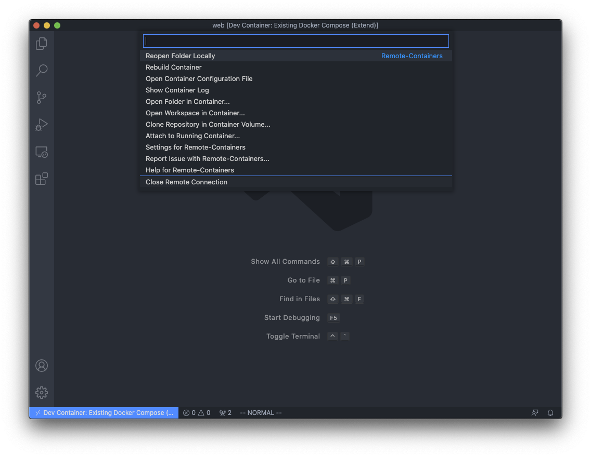

# Rails Routing

前チャプターではRailsの概要を学びました。

本チャプターからは機能ごとに解説していきます。

まずはルーティングからです。

## セットアップ

いつものようにリポジトリのセットアップをしましょう。

この章では、リポジトリを一から作っていきます。

`~/code/burning-tech`に移動してください。

```sh
$ cd ~/code/burning-tech
```

教材リポジトリをクローンします。

```sh
$ git clone https://github.com/burning-tech/routes-training.git
$ cd routes-training
```

本チャプターでもいつものように適宜、`git`管理をしてください。

```sh
$ git init
```

そして`~/code/burning-tech/routes-training`をワークスペースとしてVS Codeで開いてください。

すると、下記のように右下にウィンドウが表示されますので`Reopen in Container`を開いてください。


コンテナが立ち上がります。

データベースがまだ作成されていないので下記のコマンドで作成しましょう。(覚えていますか？)

```sh
$ docker compose run --rm web bin/rails db:create
```

マイグレーションも実行してください。(これも覚えていますか??)

```
$ docker compose run --rm web bin/rails db:migrate
```

## ルーティング

Railsのルーティングについてもう一度おさらいしましょう。

前のチャプターではHTTPリクエストとコントローラーのメソッドをマッピングするためのものであると学びました。

`rails routes`を実行して、振り返ってみましょう。

```sh
$ docker compose run --rm web bin/rails routes
[+] Running 1/0
 ⠿ Container routes-training_db_1  Running                                                                                                                                      0.0s
   Prefix Verb   URI Pattern               Controller#Action
    users GET    /users(.:format)          users#index
          POST   /users(.:format)          users#create
 new_user GET    /users/new(.:format)      users#new
edit_user GET    /users/:id/edit(.:format) users#edit
     user GET    /users/:id(.:format)      users#show
          PATCH  /users/:id(.:format)      users#update
          PUT    /users/:id(.:format)      users#update
          DELETE /users/:id(.:format)      users#destroy
```

サンプルリポジトリのルーティングには`/users`に対しての操作が定義されています。

より正しくルーティングを理解するためには、このRailsの規約にも組み込まれている`Restful API`について知る必要があります。

[**Representational State Transfer**(**REST**)](https://ja.wikipedia.org/wiki/Representational_State_Transfer)

`Restful API`とはWebにおけるプログラムの呼び出し規約です。

この規約には`リソース`と呼ばれる概念があります。

## リソース(Resources)

リソースとはプログラム上で取り扱う情報を指します。サンプルでは`users`(ユーザー)の情報です。

つまり、`Restful API`では、それぞれのリソースに対しては`URL`(`URI`)が対応します。

`/users/`や、`/users/1`のようにHTTPリクエストを送信することは`users`リソース(ユーザー情報)に対する何かしらの操作を行なうこと指します。

このリソースに対する操作がどのようなものなのかは`HTTP`メソッドで表現されます。

- `GET /users` => `users`を全件取得する
- `GET /users/1` => idが1の`users`を取得する
- `DELETE /users/1` => idが1の`users`を削除する

上記のように操作とリソース(`HTTP`メソッドと`URL`)で何に対してどんな操作をするかを表現できます。

そのため、リソースは基本的に、名詞を使用します。

`GET /get-users`のようなものは`Restful API`とは言えません。

今までも出てきていたようにある特定のリソースを特定するためには`users/1`のようにリソースの名詞の後ろに識別子を指定します。

識別子とはユニークにデータを特定するための名前や符号、数字です。

なので、データの識別子が文字列である場合は、`/users/B2837ECB-3A3E-46BC-BF99-4F8DCF7D9D2E`のような形を取ることもあります。

このような規約によって、下記のような恩恵を受けることができます。

- どのリソースに対してどんな操作を行なうのかをひと目で把握できる
- ステートレスにすることできる(というより、それも`Restful API`の規約)

ステートレスとは文字通り、状態を保持しないことを意味します。

サーバーはURLとHTTPメソッドによって、何のに対してどんな操作を行なうかをユニークに特定できます。

そのため、クライアント(ブラウザ)を覚えている必要がありません。これがステートレスな状態です。

これによって、サーバーは負荷を大幅に軽減でき、性能や機能を向上させることができます。

もう一度、`rails routes`の結果を見てみましょう。

```sh
$ docker compose run --rm web bin/rails routes
[+] Running 1/0
 ⠿ Container routes-training_db_1  Running                                                                                                                                      0.0s
   Prefix Verb   URI Pattern               Controller#Action
    users GET    /users(.:format)          users#index
          POST   /users(.:format)          users#create
 new_user GET    /users/new(.:format)      users#new
edit_user GET    /users/:id/edit(.:format) users#edit
     user GET    /users/:id(.:format)      users#show
          PATCH  /users/:id(.:format)      users#update
          PUT    /users/:id(.:format)      users#update
          DELETE /users/:id(.:format)      users#destroy
```

`/users`に対して、7つのHTTPリクエストが定義されています。

| HTTPメソッド | パス        | コントローラ#メソッド | 何にどんな操作をするか             |
| -            | -           | -                     | -                                  |
| GET          | /users      | users#index           | users一覧を表示する                |
| POST         | /users      | users#create          | usersを作成する                    |
| GET          | /users/new  | users#new             | users作成フォームを表示            |
| GET          | /users/edit | users#edit            | users編集フォームを表示            |
| GET          | /users      | users#show            | 1つめのusersリソースを表示する |
| PATCH PUT    | /users      | users#update          | 1つめのusersリソースを更新する |
| DELETE       | /users      | users#destroy         | usersリソースを削除する            |

`HTTP`メソッドはそれぞれ下記の操作を表します。

| HTTPメソッド | 操作         |
| -            | -            |
| POST         | 作成(Create) |
| GET          | 取得(Read)   |
| PATCH PUT    | 更新(Update) |
| DELETE       | 削除(Delete) |

これらの操作(Create、Read、Update、Delete)の頭文字を取って、`CRUD`といいます。

下記と対応します。

| HTTPメソッド | パス        | コントローラ#メソッド | 何にどんな操作をするか             |
| -            | -           | -                     | -                                  |
| POST         | /users      | users#create          | usersを作成する                    |
| GET          | /users      | users#show            | 1つしかないusersリソースを表示する |
| PATCH PUT    | /users      | users#update          | 1つしかないusersリソースを更新する |
| DELETE       | /users      | users#destroy         | usersリソースを削除する            |

`PATCH`と`PUT`は共にUpdateを表現します。が、Railsでは基本的に`PATCH`を利用します。

`PUT`は情報をまるごとおきかえるようなときに使用し、一部だけ更新するような場合は`PATCH`を使用します。

ケースとしては更新が多いので`PATCH`を使用するのが基本ということになります。

下記の3つは`CRUD`の補助をする画面用のルーティングです。

| HTTPメソッド | パス        | コントローラ#メソッド | 何にどんな操作をするか             |
| -            | -           | -                     | -                                  |
| GET          | /users      | users#index           | users一覧を表示する                |
| GET          | /users/new  | users#new             | users作成フォームを表示            |
| GET          | /users/edit | users#edit            | users編集フォームを表示            |

Railsのルーティングは`CRUD`操作4つと補助画面3つの合計7つのルーティングを基本のルーティングとして定めています。

`config/routes.rb`を見てみましょう。

```rb
Rails.application.routes.draw do
  resources :users
  # For details on the DSL available within this file, see https://guides.rubyonrails.org/routing.html
end
```

```rb
  resources :users
```

上記のように記載することで、7つのルーティングを1行で書くことができます。

`users#create`のような要求するメソッド名(ここでは`create`メソッド)はRailsの規約で固定です。

そのため、`Rails`のコントローラーに定義されているメソッド名は別のコントローラーでもほとんど同一名です。

`resources`を使用せずに定義すると下記になります。

```rb
Rails.application.routes.draw do
    get 'users' => 'users#index'
    post 'users' => 'users#create'
    get 'users/new' => 'users#new'
    get 'users/:id/edit' => 'users#edit'
    get 'users/:id' => 'users#show'
    patch 'users/:id'  => 'users#update'
    delete 'users/:id' => 'users#destroy'
end
```

これらの定義を一行で記述できるのは非常に強力な規約です。

上記のように修正し、`rails routes`を実行してみましょう。

```sh
$ docker compose run --rm web bin/rails routes
[+] Running 1/0
 ⠿ Container routes-training_db_1  Running                                                                                                                                      0.0s
   Prefix Verb   URI Pattern               Controller#Action
    users GET    /users(.:format)          users#index
          POST   /users(.:format)          users#create
users_new GET    /users/new(.:format)      users#new
          GET    /users/:id/edit(.:format) users#edit
          GET    /users/:id(.:format)      users#show
          PATCH  /users/:id(.:format)      users#update
          DELETE /users/:id(.:format)      users#destroy
```

どのように記載するとどのようなルーティングの定義になるかを確認してください。

prefixが微妙に違いますが、このチャプターでは取り扱わないので気にする必要はありません。

`config/routes.rb`を元に戻してください。

```rb
Rails.application.routes.draw do
  resources :users
  # For details on the DSL available within this file, see https://guides.rubyonrails.org/routing.html
end
```

## シンボル

`:users`のような`:`から始まる記述を何度かしてきましたが、これは**シンボル**というクラスのオブジェクトのリテラルです。

[**シンボル**](https://docs.ruby-lang.org/ja/3.0.0/class/Symbol.html)

`rails console`で`irb`を起動できます。`irb`でシンボルについて学びましょう。

```sh
$ docker compose exec web bin/rails console
Loading development environment (Rails 6.1.3.2)
irb(main):001:0>
```

シンボルは`Symbol`クラスのオブジェクトです。

```rb
irb(main):001:0> :users.class
=> Symbol
```

シンボルは`:シンボルの名前`というように記述します。

シンボルは**イミュータブル**という特徴があります。

イミュータブルとは、状態を変更できないことを意味します。

確認してみましょう。

まず文字列はイミュータブルの反対で、ミュータブルなので状態を変更できます。

```rb
irb(main):002:0> str_user = "users"
=> "users"
irb(main):003:0> str_user.capitalize!
=> "Users"
```

しかし、シンボルは変更できません。

```rb
irb(main):004:0> sym_user = :users
=> :users
irb(main):005:0> sym_user.capitalize!
(irb):2:in `<main>': undefined method `capitalize!' for :users:Symbol (NoMethodError)
Did you mean?  capitalize
```

エラーメッセージの通り、`capitalize`は使用できます。

```rb
irb(main):006:0> sym_user.capitalize
=> :Users
```

`capitalize`は新しいオブジェクトを作成し、返却します。元のオブジェクトは変更されないので、使用できるのです。

このイミュータブルという特徴から、Rubyでは、何かの名前に使われることがほとんどです。

例えばメソッド名です。

```rb
irb(main):005:1* def hoge
irb(main):006:1*   puts "hello hoge"
irb(main):007:0> end
=> :hoge
```

メソッドを定義すると`irb`で`:hoge`というメソッド名と同名のシンボルが出力されました！

シンボルであるため、メソッドの名前が途中で変更されることはありません。

実はメソッドをただ実行するのではなく、シンボルを指定して実行できます。

```rb
irb(main):018:0> Kernel.send :hoge
hello hoge
=> nil
```

`Kernel.send`というのはメソッドをシンボルを引数として実行するメソッドです。具体的に理解する必要はありません。

シンボルはイミュータブルなので、なにかの名前に使われることが多いと覚えておいてください。

`resources :users`というのも`users`リソースという名前に使われています。

変更されることで、URLが変わってしまうようなことがないというイミュータブルの恩恵を受けていますね。

## 複数のルーティング

では、複数のルーティングを追加してみましょう。

ここでは適当に`groups`と`companies`を追加しています。

```diff
  Rails.application.routes.draw do
    resources :users
+   resources :groups
+   resources :companies
    # For details on the DSL available within this file, see https://guides.rubyonrails.org/routing.html
  end
```

`gruops`と`companies`に対してのルーティングが定義されていることを確認してみましょう。

`rails routes`を実行してください。

```sh
docker compose run --rm web bin/rails routes
[+] Running 1/0
 ⠿ Container routes-training_db_1  Running                                                                                                                                      0.0s
      Prefix Verb   URI Pattern                   Controller#Action
       users GET    /users(.:format)              users#index
             POST   /users(.:format)              users#create
    new_user GET    /users/new(.:format)          users#new
   edit_user GET    /users/:id/edit(.:format)     users#edit
        user GET    /users/:id(.:format)          users#show
             PATCH  /users/:id(.:format)          users#update
             PUT    /users/:id(.:format)          users#update
             DELETE /users/:id(.:format)          users#destroy
      groups GET    /groups(.:format)             groups#index
             POST   /groups(.:format)             groups#create
   new_group GET    /groups/new(.:format)         groups#new
  edit_group GET    /groups/:id/edit(.:format)    groups#edit
       group GET    /groups/:id(.:format)         groups#show
             PATCH  /groups/:id(.:format)         groups#update
             PUT    /groups/:id(.:format)         groups#update
             DELETE /groups/:id(.:format)         groups#destroy
   companies GET    /companies(.:format)          companies#index
             POST   /companies(.:format)          companies#create
 new_company GET    /companies/new(.:format)      companies#new
edit_company GET    /companies/:id/edit(.:format) companies#edit
     company GET    /companies/:id(.:format)      companies#show
             PATCH  /companies/:id(.:format)      companies#update
             PUT    /companies/:id(.:format)      companies#update
             DELETE /companies/:id(.:format)      companies#destroy
```

定義されています。

`groups`と`companies`はコントローラーとそのメソッドを作成していないのでそれぞれのHTTPリクエストを実行してもエラーになることに注意してください。

逆に、コントローラーとメソッドが定義されていても、ルーティングが定義されていなければ、HTTPリクエストをしてもエラーになります。

## ネストしたルーティング

ある特定のユーザーを`/users/1`のように特定するできることを理解できたと思います。

ユーザーの職歴一覧のような入れ子構造のリソースは下記のように表現できます。

`/users/1/histories`

ユーザーの職歴をユニークに特定するには下記のように表現します。

`/users/1/histories/1`

ではこれを`config/routes.rb`に定義してみましょう。

(`groups`と`companies`は邪魔なので消しておきましょう。)

```diff
  Rails.application.routes.draw do
-   resources :users
+   resources :users do
+     resources :histories
+   end
-   resources :groups
-   resources :companies
    # For details on the DSL available within this file, see https://guides.rubyonrails.org/routing.html
  end
```

`rails routes`を実行して確認してみましょう。

`docker compose exec`は`docker compose run`と異なり、すでに起動しているコンテナに対してコマンドを実行します。

そのため、コンテナの起動を伴わないので高速です。

反面、`docker compose up`等でコンテナを立ち上げていないと、使用できません。

いまは、VS CodeのRemoteコンテナですでにコンテナを立ち上げているので使用できます。

```sh
docker compose exec web bin/rails routes
           Prefix Verb   URI Pattern                                  Controller#Action
   user_histories GET    /users/:user_id/histories(.:format)          histories#index
                  POST   /users/:user_id/histories(.:format)          histories#create
 new_user_history GET    /users/:user_id/histories/new(.:format)      histories#new
edit_user_history GET    /users/:user_id/histories/:id/edit(.:format) histories#edit
     user_history GET    /users/:user_id/histories/:id(.:format)      histories#show
                  PATCH  /users/:user_id/histories/:id(.:format)      histories#update
                  PUT    /users/:user_id/histories/:id(.:format)      histories#update
                  DELETE /users/:user_id/histories/:id(.:format)      histories#destroy
            users GET    /users(.:format)                             users#index
                  POST   /users(.:format)                             users#create
         new_user GET    /users/new(.:format)                         users#new
        edit_user GET    /users/:id/edit(.:format)                    users#edit
             user GET    /users/:id(.:format)                         users#show
                  PATCH  /users/:id(.:format)                         users#update
                  PUT    /users/:id(.:format)                         users#update
                  DELETE /users/:id(.:format)                         users#destroy
```

ネストした構造を持ったルーティングを作成することがきました。

```sh
   user_histories GET    /users/:user_id/histories(.:format)          histories#index
                  POST   /users/:user_id/histories(.:format)          histories#create
 new_user_history GET    /users/:user_id/histories/new(.:format)      histories#new
edit_user_history GET    /users/:user_id/histories/:id/edit(.:format) histories#edit
     user_history GET    /users/:user_id/histories/:id(.:format)      histories#show
                  PATCH  /users/:user_id/histories/:id(.:format)      histories#update
                  PUT    /users/:user_id/histories/:id(.:format)      histories#update
                  DELETE /users/:user_id/histories/:id(.:format)      histories#destroy
```

## only

`resources`を`config/routes.rb`で利用することで、7つのベーシックなルーティングが定義できることを学びました。

ここで、ユーザーのデータは作成、更新、削除はできず、見ることができないようにしたい場合を考えてみましょう。

その場合は、下記だけが必要です。

- `GET /users`
- `GET /users/1`

下記のルーティングは不要です。

- `POST /users`
- `GET /users/new`
- `GET /users/:id/edit`
- `PATCH /users/:id`
- `PUT /users/:id`
- `DELETE /users/:id`

`:only`オプションを指定することで、特定のルーティングだけに絞ることができます。

`config/routes.rb`を下記のように修正してください。(`histories`リソースは削除しましょう。)

```diff
  Rails.application.routes.draw do
+   resources :users, only: [:index, :show]
-   resources :users do
-     resources :histories
-   end
  end
```

`rails routes`で確認すると、`index`と`show`のみが使用できるようになっているのがわかります。

```sh
$ docker compose exec web bin/rails routes
Prefix Verb URI Pattern          Controller#Action
 users GET  /users(.:format)     users#index
  user GET  /users/:id(.:format) users#show
```

## except

`except`オプションを使用すると、指定されたルーティングのみ、除外できます。

```diff
except
  Rails.application.routes.draw do
-   resources :users, only: [:index, :show]
+   resources :users, except: [:index, :show]
  end
```

```sh
 $ docker compose exec web bin/rails routes
   Prefix Verb   URI Pattern               Controller#Action
    users POST   /users(.:format)          users#create
 new_user GET    /users/new(.:format)      users#new
edit_user GET    /users/:id/edit(.:format) users#edit
     user PATCH  /users/:id(.:format)      users#update
          PUT    /users/:id(.:format)      users#update
          DELETE /users/:id(.:format)      users#destroy
```

下記が除外されていることを確認してください。

- `GET /users`
- `GET /users/1`

## おわりに

ルーティングは学習内容が少ないですが、おろそかにしないでください。

ルーティングはRailsの高い生産性を支える重要な要素の一つです。

複雑なルーティングになってしまうことは絶対に避けて、Railsの規約に従うことを意識しましょう。

複雑になってきたら、設計が間違っていることを疑いましょう。

本チャプターが終了したら、VS Codeの左下の青色のボタンを押してください。


Remote Containerのメニューが表示されます。

`Close Remote Connection`を押してコンテナを落としましょう。



