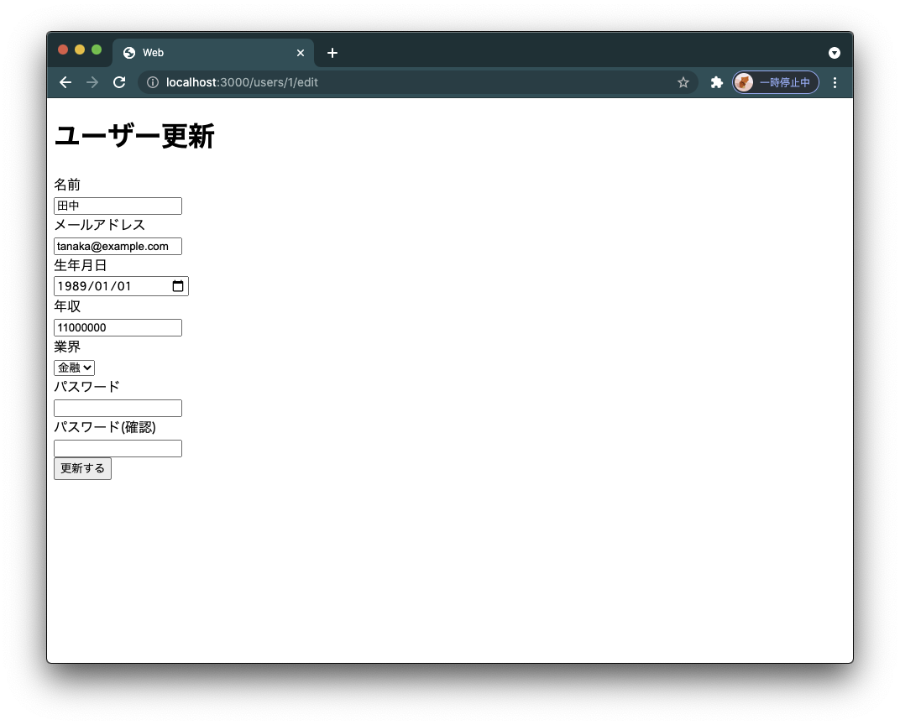
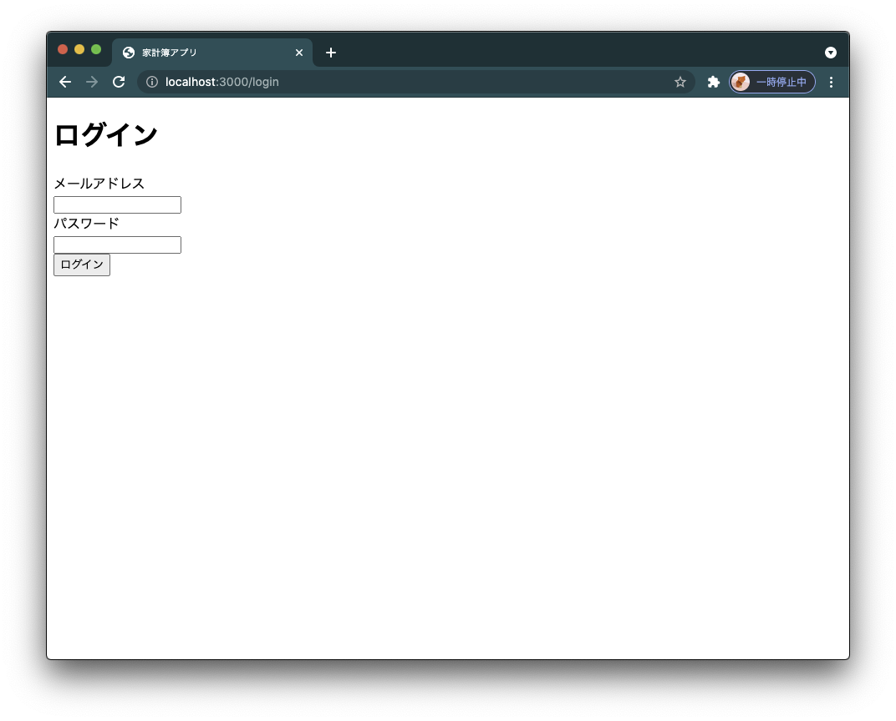
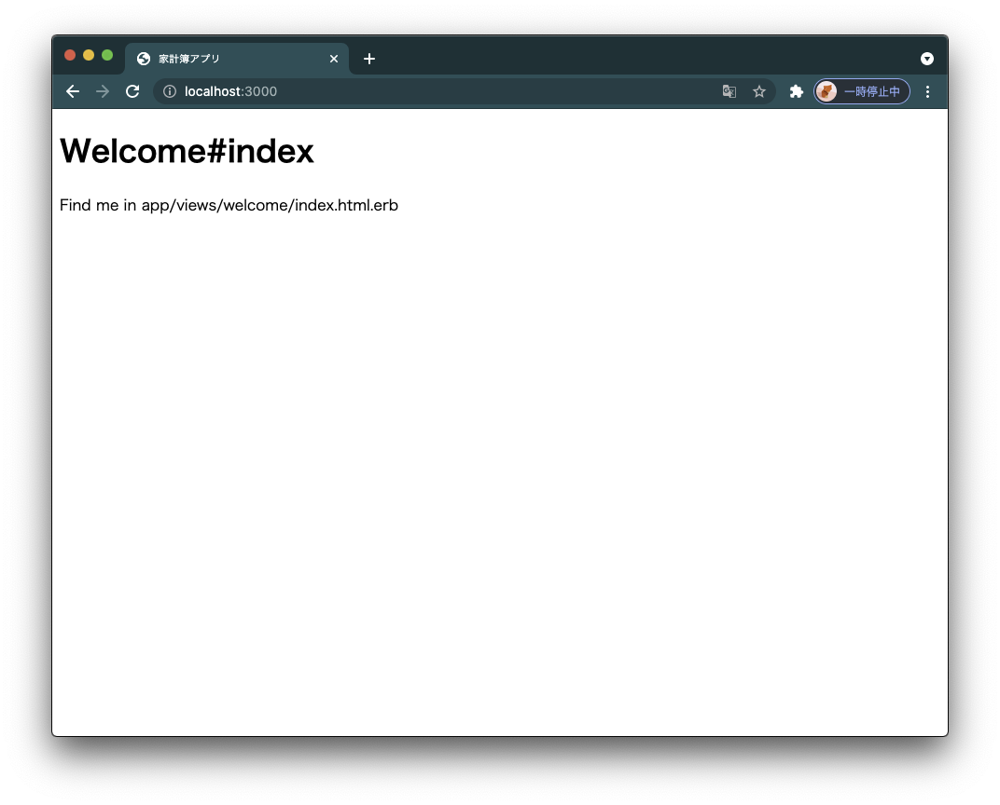
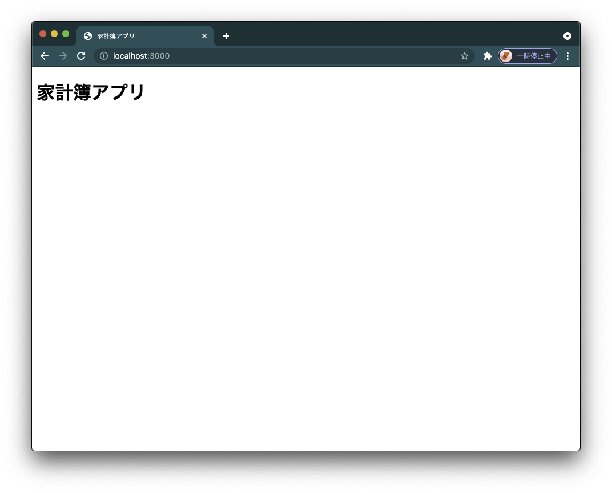
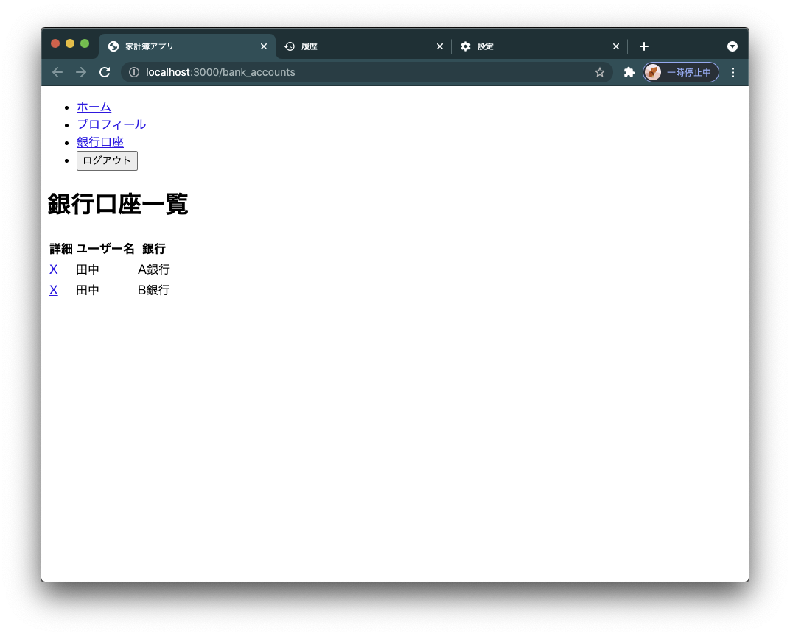
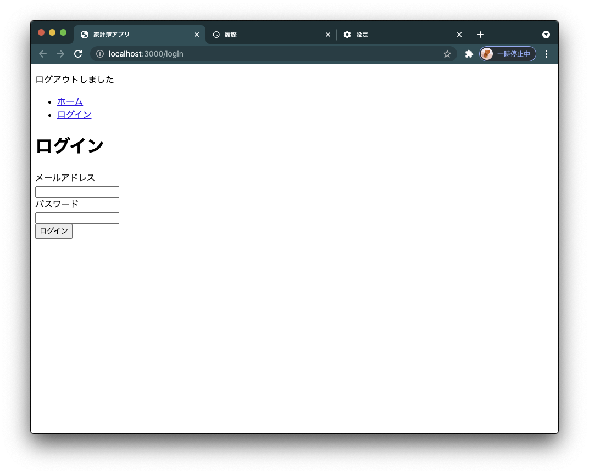

# View

いままで、ビューテンプレートは最低限の機能しか利用してきませんでした。

複雑になってきた家計簿アプリをDRYにするビューテンプレートの機能を学習しましょう。

## セットアップ

いつものようにリポジトリのセットアップをしましょう。

この章では、リポジトリを一から作っていきます。

`~/code/burning-tech`に移動してください。

```sh
$ cd ~/code/burning-tech
```

教材リポジトリをクローンします。

```sh
$ git clone https://github.com/burning-tech/view-training.git
$ cd view-training
```

本チャプターでもいつものように適宜、`git`管理をしてください。

```sh
$ git init
```

そして`~/code/burning-tech/view-training`をワークスペースとしてVS Codeで開いてください。

すると、右下にウィンドウが表示されますので前チャプター同様`Reopen in Container`を開いてください。

コンテナが立ち上がります。

データベースも作成しておきましょう。

```sh
$ docker compose exec web bin/rails db:create
Created database 'web_development'
Created database 'web_test'
```

この教材リポジトリは[前チャプターで使用した教材リポジトリの最終成果物](https://github.com/burning-tech-dev/model2-training/tree/finish)と同一内容です。

マイグレーションを実行しておきましょう。

```sh
$ docker compose exec web bin/rails db:migrate
```

シードデータも投入しましょう。

```sh
docker compose exec web bin/rails db:seed
```

## 部分テンプレート

いままで、書いたビューテンプレートには、重複している部分があります。確認してみましょう。

`app/views/users/new.html.erb`を開いてください。

```erb
<% flash.each do |message_type, message| %>
  <div><%= message %></div>
<% end %>
<h1>ユーザー登録</h1>
<%= form_with(model: @user, local: true) do |form| %>
<div>
  <%= form.label :name, "名前" %><br>
  <%= form.text_field :name %>
</div>

<div>
  <%= form.label :email_address, "メールアドレス" %><br>
  <%= form.text_field :email_address %>
</div>

<div>
  <%= form.label :date_of_birth, "生年月日" %><br>
  <%= form.date_field(:date_of_birth, value: Date.new(1989, 1, 1)) %>
</div>

<div>
  <%= form.label :annual_income, "年収" %><br>
  <%= form.number_field :annual_income, step: "1000000" %>
</div>

<div>
  <%= form.label :industry_id, "業界" %><br>
  <%= form.collection_select :industry_id, Industry.all, :id, :name %>
</div>

<div>
  <%= form.label :password, "パスワード" %><br>
  <%= form.password_field :password %>
</div>
<div>
  <%= form.label :password_confirmation, "パスワード(確認)" %><br>
  <%= form.password_field :password_confirmation %>
</div>
<div><%= form.submit "登録する" %></div>
<% end %>
```

`app/views/users/edit.html.erb`を開いてください。

```erb
<% flash.each do |message_type, message| %>
  <div><%= message %></div>
<% end %>
<h1>ユーザー更新</h1>
<%= form_with(model: @user, local: true) do |form| %>
<div>
   <%= form.label :name, "名前" %><br>
   <%= form.text_field :name %>
</div>

<div>
   <%= form.label :email_address, "メールアドレス" %><br>
   <%= form.text_field :email_address %>
</div>

<div>
  <%= form.label :date_of_birth, "生年月日" %><br>
  <%= form.date_field(:date_of_birth, value: Date.new(1989, 1, 1)) %>
</div>

<div>
  <%= form.label :annual_income, "年収" %><br>
  <%= form.number_field :annual_income, step: "1000000" %>
</div>

<div>
  <%= form.label :industry_id, "業界" %><br>
  <%= form.collection_select :industry_id, Industry.all, :id, :name %>
</div>

<div>
   <%= form.label :password, "パスワード" %><br>
   <%= form.password_field :password %>
</div>
<div>
   <%= form.label :password_confirmation, "パスワード(確認)" %><br>
   <%= form.password_field :password_confirmation %>
</div>
<div><%= form.submit "更新する" %></div>
<% end %>
```

これら２つのファイルは差分が下記の2箇所しかありません。

1. h1タグ
  - `<h1>ユーザー登録</h1>`
  - `<h1>ユーザー更新</h1>`

2. submitボタン
  - `<div><%= form.submit "登録する" %></div>`
  - `<div><%= form.submit "更新する" %></div>`

これらを共通化できるようにしましょう。

そのためには、ビューテンプレートの**部分テンプレート**という機能を使います。

部分テンプレートはそれぞれのビューテンプレートから呼び出せます。

まずは、部分テンプレートを作成しましょう。

`app/views/users/_form.html.erb`を作成してください。

今回共通化したいのはフォームなので`_form.html.erb`という名前で作成します。

部分テンプレートの名前は`_`で始まる必要があります。

この部分テンプレートは下記のように呼び出せます。

```rb
<%= render 'form' %>
```

`app/views/users`配下においた部分テンプレートは`app/views/users`からしか呼び出せません。

それでは、`app/views/users/_form.html.erb`を下記のように修正してください。

```erb
<%= form_with(model: user, local: true) do |form| %>
<div>
  <%= form.label :name, "名前" %><br>
  <%= form.text_field :name %>
</div>

<div>
  <%= form.label :email_address, "メールアドレス" %><br>
  <%= form.text_field :email_address %>
</div>

<div>
  <%= form.label :date_of_birth, "生年月日" %><br>
  <%= form.date_field(:date_of_birth, value: Date.new(1989, 1, 1)) %>
</div>

<div>
  <%= form.label :annual_income, "年収" %><br>
  <%= form.number_field :annual_income, step: "1000000" %>
</div>

<div>
  <%= form.label :industry_id, "業界" %><br>
  <%= form.collection_select :industry_id, Industry.all, :id, :name %>
</div>

<div>
  <%= form.label :password, "パスワード" %><br>
  <%= form.password_field :password %>
</div>
<div>
  <%= form.label :password_confirmation, "パスワード(確認)" %><br>
  <%= form.password_field :password_confirmation %>
</div>
<div><%= form.submit message %></div>
<% end %>
```

`new.html.erb`と`edit.html.erb`のフォームの部分とほとんど同じです。

少し異なるのが、下記です。

```erb
<%= form_with(model: user, local: true) do |form| %>
```

`model: @user`とインスタンス変数を使用していましたが、`new.html.erb`と`edit.html.erb`から`@user`をこの`user`変数に引数として渡すようにします。

下記のように渡すことになるでしょう。

```erb
<%= render 'form', user: @user %>
```

もう一点は下記の行です。

```erb
<div><%= form.submit message %></div>
```

もともと、`登録する`、`更新する`というメッセージを記述していた箇所も`message`という引数で渡すようにします。

下記のように渡すことになります。

```erb
<%= render 'form', user: @user, message: '登録する' %>
```

それでは`new.html.erb`と`edit.html.erb`を修正しましょう。

`app/views/users/new.html.erb`を下記のように修正してください。

```diff
  <% flash.each do |message_type, message| %>
    <div><%= message %></div>
  <% end %>
  <h1>ユーザー登録</h1>
+ <%= render 'form', user: @user, message: '登録する' %>
- <%= form_with(model: @user, local: true) do |form| %>
- <div>
-   <%= form.label :name, "名前" %><br>
-   <%= form.text_field :name %>
- </div>
-
- <div>
-   <%= form.label :email_address, "メールアドレス" %><br>
-   <%= form.text_field :email_address %>
- </div>
-
- <div>
-   <%= form.label :date_of_birth, "生年月日" %><br>
-   <%= form.date_field(:date_of_birth, value: Date.new(1989, 1, 1)) %>
- </div>
-
- <div>
-   <%= form.label :annual_income, "年収" %><br>
-   <%= form.number_field :annual_income, step: "1000000" %>
- </div>
-
- <div>
-   <%= form.label :industry_id, "業界" %><br>
-   <%= form.collection_select :industry_id, Industry.all, :id, :name %>
- </div>
-
- <div>
-   <%= form.label :password, "パスワード" %><br>
-   <%= form.password_field :password %>
- </div>
- <div>
-   <%= form.label :password_confirmation, "パスワード(確認)" %><br>
-   <%= form.password_field :password_confirmation %>
- </div>
- <div><%= form.submit "登録する" %></div>
- <% end %>
```

続いて`app/views/users/edit.html.erb`を下記のように修正してください。

```diff
  <% flash.each do |message_type, message| %>
    <div><%= message %></div>
  <% end %>
  <h1>ユーザー更新</h1>
+ <%= render 'form', user: @user, message: '更新する' %>
- <%= form_with(model: @user, local: true) do |form| %>
- <div>
-    <%= form.label :name, "名前" %><br>
-    <%= form.text_field :name %>
- </div>

- <div>
-    <%= form.label :email_address, "メールアドレス" %><br>
-    <%= form.text_field :email_address %>
- </div>

- <div>
-   <%= form.label :date_of_birth, "生年月日" %><br>
-   <%= form.date_field(:date_of_birth, value: Date.new(1989, 1, 1)) %>
- </div>

- <div>
-   <%= form.label :annual_income, "年収" %><br>
-   <%= form.number_field :annual_income, step: "1000000" %>
- </div>

- <div>
-   <%= form.label :industry_id, "業界" %><br>
-   <%= form.collection_select :industry_id, Industry.all, :id, :name %>
- </div>

- <div>
-    <%= form.label :password, "パスワード" %><br>
-    <%= form.password_field :password %>
- </div>
- <div>
-    <%= form.label :password_confirmation, "パスワード(確認)" %><br>
-    <%= form.password_field :password_confirmation %>
- </div>
- <div><%= form.submit "更新する" %></div>
- <% end %>
```

```erb
  <% flash.each do |message_type, message| %>
    <div><%= message %></div>
  <% end %>
```

これを部分テンプレートに含めない理由は、フォーム用の部分テンプレートに含めるべき要素ではないためです。

これも後ほど共通化します。

それでは、部分テンプレートを使用しても、実動作が変わらないことを確認してください。



## layoutテンプレート

部分テンプレートのように一部の共通化をする機能だけではなく、アプリケーションのレイアウトを共通化する機能もあります。

それが、**layout**テンプレートです。

`app/views/layouts/application.html.erb`を開いてください。

```erb
<!DOCTYPE html>
<html>
  <head>
    <title>Web</title>
    <meta name="viewport" content="width=device-width,initial-scale=1">
    <%= csrf_meta_tags %>
    <%= csp_meta_tag %>

    <%= stylesheet_link_tag 'application', media: 'all' %>
  </head>

  <body>
    <%= yield %>
  </body>
</html>
```

じつはRailsアプリでは、デフォルトでこの`application.html.erb`が使用されています。

`app/views/layouts/application.html.erb`を下記のように修正してください。

```diff
  <!DOCTYPE html>
  <html>
    <head>
-     <title>Web</title>
+     <title>家計簿アプリ</title>
      <meta name="viewport" content="width=device-width,initial-scale=1">
      <%= csrf_meta_tags %>
      <%= csp_meta_tag %>

      <%= stylesheet_link_tag 'application', media: 'all' %>
    </head>

    <body>
+     <% flash.each do |message_type, message| %>
+       <p><%= message %></p>
+     <% end %>
      <%= yield %>
    </body>
  </html>
```

これで、アプリケーションのタイトルが変更されます。



ブラウザのタブを確認してください。

そして、すべての画面で、Flashメッセージが表示されるようになりました。

それぞれのビューテンプレートからFlashメッセージを表示させる場所を削除しましょう。

`app/views/users/edit.html.erb`を下記のように修正してください。

```diff
- <% flash.each do |message_type, message| %>
-   <div><%= message %></div>
- <% end %>
  <h1>ユーザー更新</h1>
  <%= render 'form', user: @user, message: '更新する' %>
```

`app/views/users/new.html.erb`を下記のように修正してください。

```diff
- <% flash.each do |message_type, message| %>
-   <div><%= message %></div>
- <% end %>
  <h1>ユーザー登録</h1>
  <%= render 'form', user: @user, message: '登録する' %>
```

`app/views/users/show.html.erb`を下記のように修正してください。

```diff
  <nav>
    <%= button_to 'ログアウト', logout_path, method: :delete %>
  </nav>
- <% flash.each do |message_type, message| %>
-   <p><%= message %></p>
- <% end %>
  <h1>ユーザー</h1>
  <p>名前: <%= @user.name %></p>
  <p>メールアドレス: <%= @user.email_address %></p>
  <p>生年月日: <%= @user.date_of_birth.strftime("%Y年%-m月%-d日") %></p>
  <p>年収: <%= number_to_currency(@user.annual_income, unit: "￥", strip_insignificant_zeros: true) %></p>
  <p><%= link_to '編集', edit_user_path %></p>
```

`app/views/sessions/new.html.erb`を下記のように修正してください。

```diff
- <% flash.each do |message_type, message| %>
-   <div><%= message %></div>
- <% end %>
  <h1>ログイン</h1>
  <%= form_with(scope: :session, url: login_path, local: true) do |form| %>
  <div>
    <%= form.label :email_address, "メールアドレス" %><br>
    <%= form.email_field :email_address %>
  </div>
  <div>
    <%= form.label :password, "パスワード" %><br>
    <%= form.password_field :password %>
  </div>
  <div><%= form.submit "ログイン" %></div>
  <% end %>
```

すべて削除できました。

Flashメッセージが変わらず表示されるか確認してください。

このようにアプリケーション全体に渡る表示コントロールを得られるのがlayoutテンプレートの利点です。

## 独自のトップページを作成する

現状、<http://localhost:3000/>にアクセスすると、Railsアプリケーションのトップページが表示されます。

これを独自のページに変更しましょう。

まずは、コントローラーとビューテンプレートを作成します。

`rails controller`で作成しましょう。

`Welcome`という名前のリソースで作成しましょう。

```sh
$ docker compose exec web bin/rails g controller welcome index
      create  app/controllers/welcome_controller.rb
       route  get 'welcome/index'
      invoke  erb
      create    app/views/welcome
      create    app/views/welcome/index.html.erb
      invoke  test_unit
      create    test/controllers/welcome_controller_test.rb
      invoke  helper
      create    app/helpers/welcome_helper.rb
      invoke    test_unit
      invoke  assets
      invoke    scss
      create      app/assets/stylesheets/welcome.scss
```

`config/routes.rb`を下記のように修正してください。

```diff
  Rails.application.routes.draw do
-   get 'welcome/index'
+   root 'welcome#index'
    get 'login', to: 'sessions#new'
    post 'login', to: 'sessions#create'
    delete 'logout', to: 'sessions#destroy'
    resources :users , only: [:new, :create, :show, :edit, :update]
    resources :bank_accounts, only: [:index, :show]
  end
```

`root`と指定することで、`GET /`にマッピングできます。

ログアウトしていても、表示できるようにしましょう。

`app/controllers/welcome_controller.rb`を下記のように修正しましょう。

```diff
  class WelcomeController < ApplicationController
+   skip_before_action :require_login

    def index
    end
  end
```



表示を修正しましょう。

`app/views/welcome/index.html.erb`を開いて、下記のように修正してください。

```diff
- <h1>Welcome#index</h1>
- <p>Find me in app/views/welcome/index.html.erb</p>
+ <h1>家計簿アプリ</h1>
```



修正されました。

## helper

一般的なアプリ同様、ヘッダーを追加しましょう。

ログインしていれば、ログアウトリンクと、各画面へのリンクを表示し、ログアウトしていれば、ログイン画面へのリンクを表示するようにしましょう。

まず、ビューテンプレートで使用するためのメソッドを定義する必要があります。

1. ログイン中かどうか判定するメソッド
2. ユーザー詳細ページにリダイレクトするために、ログインユーザーのモデルを取得するメソッド

ビューテンプレートには便利なメソッドがいくつか用意されていましたが、**ヘルパー**を使用することで、ビューテンプレートで使用するメソッドを追加できます。

helperは`app/helpers`配下にあります。

コントローラーとは異なり、どのヘルパーに記載してもすべてのビューテンプレートで使用できるようになります。

用意するメソッドはログイン関連のものなのでセッションヘルパーに追加しましょう。

`app/helpers/sessions_helper.rb`を下記のように修正してください。

```diff
  module SessionsHelper
+   def current_user
+     @current_user ||= User.find_by(id: session[:user_id]) if session[:user_id]
+   end
+
+   def logged_in?
+     !current_user.nil?
+   end
  end
```

```rb
def current_user
  @current_user ||= User.find_by(id: session[:user_id]) if session[:user_id]
end
```

このメソッドでログインユーザーのモデルを取得します。

このメソッドの処理は`app/controllers/application_controller.rb`の`require_login`と重複しています。

```rb
def require_login
  @current_user ||= User.find_by(id: session[:user_id]) if session[:user_id]
  unless @current_user
    flash[:error] = "ログインしてください"
    redirect_to login_url
  end
end
```

あとでリファクタリングしましょう。

もう一つのメソッドはログイン中かどうか判定するメソッドです。

```rb
def logged_in?
  !current_user.nil?
end
```

`current_user`メソッドを実行して、結果が`nil`であればログイン中ではないと判定します。

それでは、ヘッダーのための部分テンプレートを作成しましょう。

ヘッダーはlayoutテンプレートから参照しますので、`app/views/layouts`配下に作成します。

`app/views/layouts/_header.html.erb`を作成して下記のように編集してください。

```erb
<header>
  <div>
    <nav>
      <ul>
        <li><%= link_to "ホーム", root_path %></li>
        <% if logged_in? %>
          <li><%= link_to 'プロフィール', current_user %></li>
          <li><%= link_to '銀行口座', bank_accounts_path %></li>
          <li><%= button_to 'ログアウト', logout_path, method: :delete %></li>
        <% else %>
          <li><%= link_to "ログイン", login_path %></li>
        <% end %>
      </ul>
    </nav>
  </div>
</header>
```

テンプレートには`if ~ else ~ end`を記述できます。

`logged_in? == true`であれば、プロフィールと銀行口座一覧へのリンクを表示し、`logged_in? == false`であればログインリンクを表示します。

`current_user`メソッドを`helper`に用意したため、`<%= link_to 'プロフィール', current_user %>`と記述できます。

`app/views/layouts/application.html.erb`を下記のように修正してください。

```diff
  <!DOCTYPE html>
  <html>
    <head>
      <title>家計簿アプリ</title>
      <meta name="viewport" content="width=device-width,initial-scale=1">
      <%= csrf_meta_tags %>
      <%= csp_meta_tag %>

      <%= stylesheet_link_tag 'application', media: 'all' %>
    </head>

    <body>
      <% flash.each do |message_type, message| %>
        <p><%= message %></p>
      <% end %>
+     <%= render 'layouts/header' %>
      <div>

      </div>
      <%= yield %>
    </body>
  </html>
```

これで、ヘッダーが表示されるようになります。

ログアウトリンクがユーザー詳細ページビューテンプレートとかぶるので削除しましょう。

`app/views/users/show.html.erb`を開いて、下記のように修正しましょう。

```diff
- <nav>
-   <%= button_to 'ログアウト', logout_path, method: :delete %>
- </nav>
  <h1>ユーザー</h1>
  <p>名前: <%= @user.name %></p>
  <p>メールアドレス: <%= @user.email_address %></p>
  <p>生年月日: <%= @user.date_of_birth.strftime("%Y年%-m月%-d日") %></p>
  <p>年収: <%= number_to_currency(@user.annual_income, unit: "￥", strip_insignificant_zeros: true) %></p>
  <p><%= link_to '編集', edit_user_path %></p>
```

表示を確認してみましょう。

ログイン時とログアウト時の表示が変更されることを確認してください。





(見た目はおいおい修正していきましょう。)

それでは、リファクタリングしましょう。

`app/controllers/application_controller.rb`を下記のように修正してください。

```diff
  class ApplicationController < ActionController::Base
+   include SessionsHelper
    before_action :require_login

    def require_login
+     unless current_user
+       flash[:error] = "ログインしてください"
+       redirect_to login_url
+     end
-     @current_user ||= User.find_by(id: session[:user_id]) if session[:user_id]
-     unless @current_user
-       flash[:error] = "ログインしてください"
-       redirect_to login_url
-     end
    end
  end
```

```rb
include SessionsHelper
```

ヘルパーをコントローラーで使用するためには、この一行を追加する必要があります。

```rb
def require_login
  unless current_user
    flash[:error] = "ログインしてください"
    redirect_to login_url
  end
end
```

`SessionsHelper`の`current_user`を変わりに使用するように修正します。

このようなリファクタリングをこまめに行なってコードを改善していく癖をつけてください。

## おわりに

ビューの分割についていくつか学習しました。

コントローラー同様、ビューも複雑化する可能性があります。

分割の方法を適切に使い分けて、アプリケーションを構築することを心がけてください。

(VS Codeで立ち上げたコンテナは以前やったように左下の`Dev Container: Existing Docker Compose (...`をクリックし、`Close Remote Connection`で閉じておきましょう。)

途中でコード全体がよくわからなくなってしまった場合は[finish](https://github.com/burning-tech-dev/view-training/tree/finish)ブランチに最後の状態のコードがあるので見てみてください。
